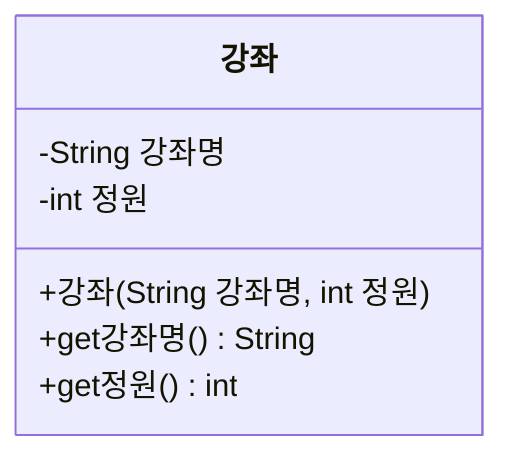
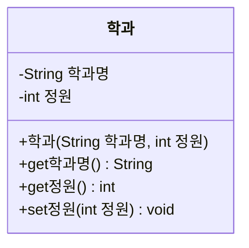

# Day 10. 클래스 - this, static, 캡슐화 - 실습

> 아래 문제는 교안에서 다룬 this, private/public, getter/setter, static, final만으로 풀 수 있습니다.

---

## 기본

### 문제 1. this로 필드 초기화하기
아래 다이어그램대로 `강좌` 클래스를 구현하세요. 생성자 매개변수 이름을 필드와 동일하게 지어서 `this`를 사용해야 합니다.



**Output**
```
강좌명: 자바프로그래밍, 정원: 30
```

---

### 문제 2. setter로 값 변경하기
문제 1의 `강좌` 클래스에 `set정원(int 정원)` 메서드를 추가하고, 정원을 40으로 변경한 뒤 다시 출력하세요.

**Output**
```
변경 전 정원: 30
변경 후 정원: 40
```

---

## 응용

### 문제 3. setter에 검증 로직 추가하기
`계좌` 클래스를 만드세요. `잔액`(private int) 필드가 있고, `set잔액(int 잔액)`은 음수가 들어오면 "잔액은 음수가 될 수 없습니다"를 출력하고 값을 바꾸지 않아야 합니다.

**Output**
```
잔액은 음수가 될 수 없습니다
현재 잔액: 10000
```

---

### 문제 4. static으로 전체 개수 세기
`상품` 클래스를 만들고, static 필드 `전체상품수`를 두어 객체가 생성될 때마다 1씩 증가하도록 생성자에서 처리하세요. 상품 객체 3개를 만든 후 전체 개수를 출력하세요.

**Output**
```
전체 상품 수: 3
```

---

## 도전

### 문제 5. final 상수 활용
`원` 클래스를 만드세요. `static final double PI = 3.14159;` 상수를 두고, 생성자에서 반지름을 받아 필드로 저장하고, `넓이구하기()` 메서드로 넓이를 계산해 반환하세요.

**Output**
```
넓이: 78.54
```
(반지름 5일 때, 소수점 둘째자리까지 출력)

---

### 문제 6. 종합 - 캡슐화된 학과 클래스 + static 카운터
아래 다이어그램대로 `학과` 클래스를 구현하세요. static 필드 `전체학과수`를 추가해 학과가 생성될 때마다 증가시키고, `정원`의 setter에는 정원이 0 이하면 값을 바꾸지 않는 검증 로직을 넣으세요.



학과 객체 2개(`"컴퓨터공학과", 40`과 `"경영학과", 50`)를 만들고, 첫 번째 학과의 정원을 `-10`으로 바꾸려 시도(실패해야 함)한 뒤, 전체 학과 수와 첫 번째 학과의 최종 정원을 출력하세요.

**Output**
```
정원은 0보다 커야 합니다
전체 학과 수: 2
컴퓨터공학과 정원: 40
```
