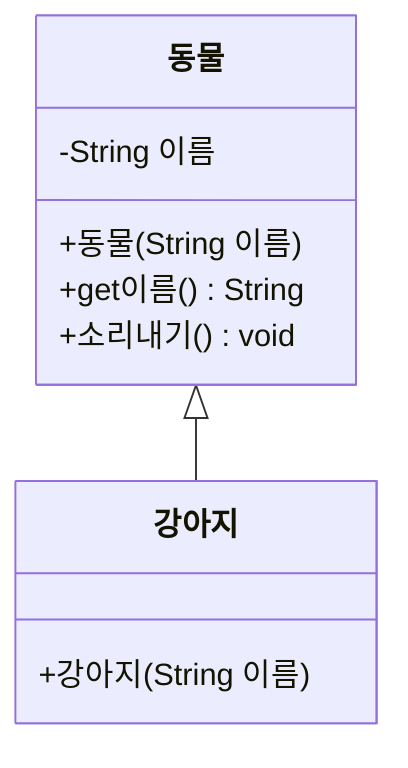
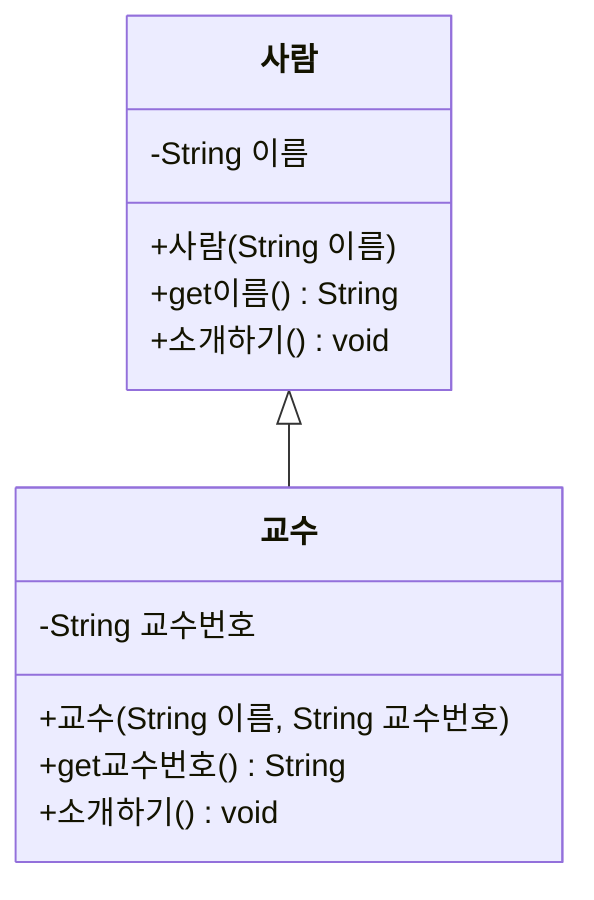

# Day 11. 상속 기초 - 실습

> 아래 문제는 교안에서 다룬 extends, super(), 오버라이딩만으로 풀 수 있습니다.

---

## 기본

### 문제 1. 부모 클래스 상속받기



`동물` 클래스를 만들고(`소리내기()`는 "동물이 소리를 냅니다" 출력), `강아지` 클래스가 이를 상속받도록 구현하세요. `강아지` 객체를 만들어 `get이름()`과 `소리내기()`를 호출하세요.

**Output**
```
이름: 초코
동물이 소리를 냅니다
```

---

### 문제 2. super()로 부모 생성자 호출
문제 1의 클래스에 `강아지`만의 필드 `품종`(String)을 추가하고, 생성자에서 `super()`로 이름을 초기화하도록 구현하세요.

**Output**
```
이름: 초코, 품종: 푸들
```

---

## 응용

### 문제 3. 메소드 오버라이딩
문제 1~2의 `강아지` 클래스에서 `소리내기()`를 오버라이딩해서 "멍멍!"을 출력하도록 재정의하세요.

**Output**
```
멍멍!
```

---

### 문제 4. 학사관리 도메인 - 사람과 교수
아래 다이어그램대로 `사람`과 `교수` 클래스를 구현하세요. `교수`는 `사람`을 상속받고, `소개하기()`를 오버라이딩해서 교수번호까지 포함해 소개하도록 만드세요.



**Output**
```
저는 교수번호 P001인 김교수입니다.
```

---

## 도전

### 문제 5. 여러 자식 클래스가 하나의 부모를 상속
문제 4의 `사람` 클래스를 `학생` 클래스도 함께 상속받도록 구현하세요. `학생`은 `학번` 필드를 가지고, `소개하기()`를 오버라이딩해서 학번을 포함해 소개합니다. `사람[]` 배열에 학생 객체와 교수 객체를 함께 담고, 향상된 for문으로 모두의 `소개하기()`를 호출하세요.

**Output**
```
저는 학번 S001인 홍길동입니다.
저는 교수번호 P001인 김교수입니다.
```

---

### 문제 6. 종합 - 오버라이딩 활용한 성적 처리
`사람` 클래스를 상속받는 `학생` 클래스에 점수(int) 필드를 추가하고, `소개하기()`를 오버라이딩해서 "저는 OOO이고 점수는 N점입니다"를 출력하도록 하세요. 학생 객체 3명을 만들어 배열에 담고, 반복문으로 모두 소개하기를 호출한 뒤, 평균 점수도 계산해 출력하세요.

**Output**
```
저는 홍길동이고 점수는 90점입니다.
저는 김철수이고 점수는 85점입니다.
저는 이영희이고 점수는 78점입니다.
평균 점수: 84.33
```
