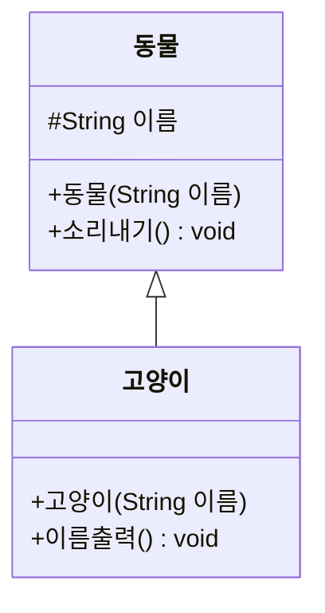
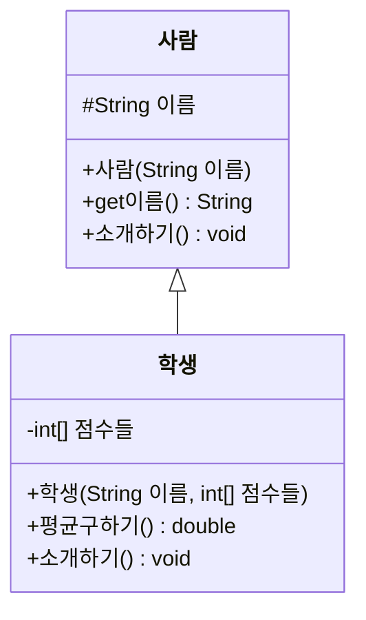

# Day 12. 상속 심화 & 전체 복습 - 실습

> 기본/응용 문제는 protected, 다형성, 추상 클래스를 다루고, 도전 문제는 Day 1~12 전체를 통합합니다.

---

## 기본

### 문제 1. protected로 자식 클래스에서 필드 접근하기



(`#`는 protected를 의미합니다) `동물`과 `고양이` 클래스를 구현하세요. `고양이`의 `이름출력()`에서 부모의 `이름` 필드에 **직접** 접근해서 출력해야 합니다(get 메서드 없이).

**Output**
```
초코
```

---

### 문제 2. 다형성 - 배열로 여러 자식 다루기
`동물`을 상속받는 `고양이`(소리내기: "야옹")와 `강아지`(소리내기: "멍멍")를 만들고, `동물[]` 배열에 둘 다 담아 반복문으로 `소리내기()`를 호출하세요.

**Output**
```
야옹
멍멍
```

---

## 응용

### 문제 3. 추상 클래스 만들기
`도형`이라는 추상 클래스를 만들고 추상 메서드 `넓이구하기()`(반환형 double)를 선언하세요. `사각형`(가로*세로)과 `원`(반지름*반지름*3.14159)이 이를 상속받아 각각 구현하도록 만드세요.

**Output**
```
사각형 넓이: 24.00
원 넓이: 78.54
```

---

### 문제 4. 다운캐스팅 활용
`동물`을 상속받은 `강아지`에 `강아지`만의 메서드 `꼬리흔들기()`를 추가하세요. `동물` 타입 변수에 `강아지` 객체를 담은 뒤, 다운캐스팅해서 `꼬리흔들기()`를 호출하세요.

**Output**
```
꼬리를 흔듭니다
```

---

## 도전 (Day 1~12 통합 종합 실습)

### 문제 5. 학사관리 종합 - 학생 성적 처리 시스템

아래 클래스 다이어그램대로 구현하세요.



요구사항:
1. `학생`은 `점수들`(정수 배열)을 받아 저장하고, `평균구하기()`는 배열의 평균을 반환합니다 (Day6~7 배열/메서드 복습)
2. `소개하기()`는 오버라이딩해서 "저는 OOO이고 평균 점수는 X.XX점입니다"를 출력합니다 (Day11 오버라이딩 복습)
3. `main`에서 학생 3명을 만들어 `사람[]` 배열에 담고, 반복문으로 모두 소개시킨 뒤, 전체 학생의 평균 중 가장 높은 학생의 이름을 출력하세요 (Day6 최댓값 찾기 + Day12 다운캐스팅 복습)

**Input (학생별 점수)**
```
홍길동: {90, 85, 88}
김철수: {70, 75, 80}
이영희: {95, 92, 98}
```

**Output**
```
저는 홍길동이고 평균 점수는 87.67점입니다.
저는 김철수이고 평균 점수는 75.00점입니다.
저는 이영희이고 평균 점수는 95.00점입니다.
최고 평균 학생: 이영희
```

---

### 문제 6. 종합 - 학과별 학생 관리 (배열 + 클래스 + 캡슐화 + 상속 총정리)

`학과`, `사람`(부모), `학생`(자식) 클래스를 직접 설계해서 다음을 구현하세요.
1. `학과`는 학과명(private)을 가지고 getter를 제공합니다.
2. `학생`은 `사람`을 상속받고, 이름 외에 소속 `학과` 객체와 점수(int)를 필드로 가집니다.
3. 학생 4명을 만들어 배열에 담고, 특정 학과(예: "컴퓨터공학과") 소속 학생만 필터링해서 이름과 점수를 출력하세요.
4. 필터링된 학생들의 평균 점수도 함께 출력하세요.

**Output 예시**
```
[컴퓨터공학과 소속 학생]
홍길동 - 90점
이영희 - 88점
평균: 89.00
```
