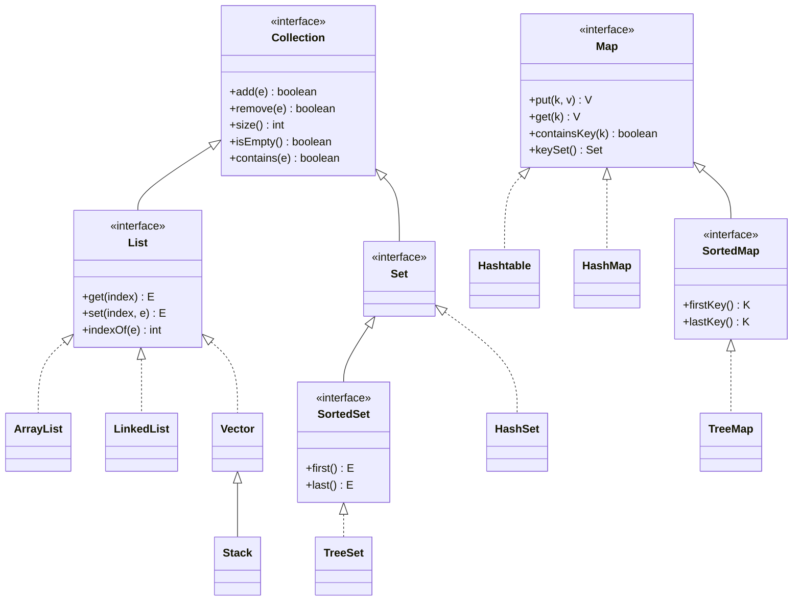

# Day 16. 컬렉션 프레임워크 (ArrayList, Set, HashMap)

| 항목 | 내용 |
|---|---|
| 선수 학습 | 인터페이스 (Day 13), Object 클래스 (Day 14), 제네릭 (Day 15) |
| 이번 챕터 | 배열의 불편함을 해결하는 `ArrayList`, `Set(HashSet)`, `Map(HashMap)` |

## 학습목표
- 배열의 한계(크기 고정 등)를 직접 경험하고 설명할 수 있다
- 컬렉션 프레임워크가 무엇이고, `List`/`Set`/`Map`이 그 안에서 각각 어디에 위치하는지 설명할 수 있다
- `ArrayList`로 순서가 있는 목록을 관리할 수 있다
- `HashSet`으로 중복을 허용하지 않는 집합을 관리할 수 있다
- `HashMap`으로 키-값 쌍 데이터를 관리할 수 있다

---

## 1. 배열로 학생 5명 관리하기 (복습)

Day9에서 배운 대로, 학생 객체 5명을 배열로 관리해봅니다.

```java
public class ArrayExample {
    public static void main(String[] args) {
        Student[] students = new Student[5]; // 크기 5로 고정
        students[0] = new Student("홍길동", "S001");
        students[1] = new Student("김철수", "S002");
        students[2] = new Student("이영희", "S003");
        students[3] = new Student("박민수", "S004");
        students[4] = new Student("최지우", "S005");

        for (Student Student : students) {
            System.out.println(Student.getName());
        }
    }
}
```

여기까지는 문제없이 잘 동작합니다. 하지만 다음 상황들을 생각해봅시다.

---

## 2. 배열의 불편함 확인하기

**상황 1: 학생이 한 명 더 들어왔다**

```java
// students[5] = new Student("정수아", "S006"); // 실행 에러! ArrayIndexOutOfBoundsException
// 배열은 크기가 5로 고정되어 있어서, 6번째 자리 자체가 존재하지 않음
```

배열은 처음 만들 때(`new Student[5]`) 크기가 고정됩니다. 학생이 늘어나면 배열 자체를 다시 만들어야 합니다.

```java
Student[] newArray = new Student[6]; // 크기 6짜리 새 배열을 만들고
for (int i = 0; i < students.length; i++) {
    newArray[i] = students[i]; // 기존 값을 일일이 복사
}
newArray[5] = new Student("정수아", "S006");
```

**상황 2: 중간에 있는 학생 한 명을 삭제하고 싶다**

배열에는 "삭제"라는 개념이 없습니다. 중간 값을 지우려면, 그 뒤의 모든 요소를 한 칸씩 앞으로 옮기고 마지막 자리를 비워야 합니다. 이런 작업을 직접 반복문으로 작성해야 합니다.

**정리**: 배열은 "몇 개가 들어올지 미리 알고 있고, 크기가 절대 안 바뀌는" 상황에는 적합하지만, 학사관리처럼 **학생이 계속 추가되고 빠지는 상황**에는 매번 이런 번거로운 코드를 반복해서 작성해야 합니다.

---

## 3. 컬렉션 프레임워크 - List는 전체 그림에서 어디 있을까

`List`는 `Collection`이라는 인터페이스(Day13 복습)를 상속받는 하위 인터페이스이고, `ArrayList`는 그 `List`를 실제로 구현한 클래스입니다. `Set`도 `Collection`의 형제 인터페이스입니다. `Map`은 같은 묶음(컬렉션 프레임워크)에 속하지만 `Collection`과는 상속 관계가 없는 별도의 인터페이스입니다.



**그림 읽는 법**: 실선 화살표(`--|>`)는 상속(`extends`), 점선 화살표(`..|>`)는 구현(`implements`)입니다(Day13 복습). `Stack`이 `Vector`를 상속받는 것만 클래스끼리의 상속이고, 나머지는 대부분 인터페이스를 구현하는 관계입니다.

**인터페이스 박스 안의 메서드가 핵심입니다.** `Collection`이 `add()`, `remove()`, `size()` 같은 메서드를 약속해두었기 때문에, `ArrayList`든 `LinkedList`든 `HashSet`이든 이 메서드들을 반드시 가지고 있다는 게 보장됩니다. `List`는 여기에 `get(index)`, `set(index, e)`처럼 "인덱스로 접근하는" 메서드를 추가로 약속합니다. 그래서 아래처럼 오른쪽 구현체만 바꿔도 나머지 코드는 한 글자도 바뀌지 않습니다.

```java
List<Student> students = new ArrayList<>();
// List<Student> students = new LinkedList<>(); // 구현체만 바꿔도 아래 코드는 그대로 동작
students.add(new Student("홍길동", "S001")); // Collection이 보장하는 메서드
students.get(0);                          // List가 보장하는 메서드
```

이번 챕터에서는 이 중 **`List(ArrayList)`, `Set(HashSet)`, `Map(HashMap)`** 을 순서대로 다룹니다.

**왜 List부터 배우는가**: 배열이 하던 일("순서대로 나열된 데이터, 중복 허용")을 가장 직접적으로 대체하는 것이 `List`이기 때문입니다. 지금까지 만든 `Student[]`, `int[]` 같은 배열 코드는 거의 대부분 `List<Student>`, `List<Integer>`로 자연스럽게 바꿀 수 있습니다.

---

## 4. List란? - 인터페이스와 구현체

`List`는 "크기가 자유롭게 늘어나고 줄어드는 목록"을 다루기 위한 **인터페이스**입니다(Day13 복습: 인터페이스는 구현 없이 규칙만 정의). `ArrayList`는 그 규칙을 실제로 구현한 대표적인 클래스입니다.

```java
import java.util.List;
import java.util.ArrayList;

List<Student> students = new ArrayList<>(); // 왼쪽은 인터페이스 타입, 오른쪽은 실제 구현체
```

**설명**: `List<Student>`에서 `<Student>`은 Day15에서 배운 제네릭입니다 — "이 List는 학생 객체만 담을 수 있다"는 뜻입니다. `List` 자체는 인터페이스이므로 `new List<>()`처럼 직접 객체를 만들 수 없고(Day13 복습: 인터페이스는 객체 생성 불가), 반드시 `ArrayList` 같은 구현체로 만들어야 합니다.

`import java.util.List;`, `import java.util.ArrayList;`를 파일 맨 위에 반드시 작성해야 사용할 수 있습니다.

---

## 5. 자주 쓰는 List 메서드

| 메서드 | 설명 | 예시 |
|---|---|---|
| `add(value)` | 리스트 맨 뒤에 값을 추가 | `students.add(new Student(...))` |
| `get(인덱스)` | 특정 위치의 값을 반환 (배열의 `[]`와 비슷) | `students.get(0)` |
| `size()` | 현재 담긴 요소의 개수 반환 (배열의 `.length`에 대응) | `students.size()` |
| `remove(인덱스)` | 특정 위치의 값을 삭제, 뒤 요소들이 자동으로 앞으로 당겨짐 | `students.remove(2)` |
| `contains(value)` | 특정 값이 리스트에 있는지 확인 (boolean 반환) | `students.contains(student1)` |
| `isEmpty()` | 리스트가 비어있는지 확인 (boolean 반환) | `students.isEmpty()` |

```java
import java.util.List;
import java.util.ArrayList;

public class ListExample {
    public static void main(String[] args) {
        List<Student> students = new ArrayList<>();

        students.add(new Student("홍길동", "S001"));
        students.add(new Student("김철수", "S002"));
        students.add(new Student("이영희", "S003"));

        System.out.println("현재 학생 수: " + students.size()); // 3

        students.add(new Student("정수아", "S006")); // 배열과 달리 크기 걱정 없이 그냥 추가!
        System.out.println("추가 후 학생 수: " + students.size()); // 4

        Student firstStudent = students.get(0); // 인덱스로 값 꺼내기 (배열과 동일한 방식)
        System.out.println(firstStudent.getName()); // 홍길동

        students.remove(1); // 인덱스 1(김철수)을 삭제, 뒤 요소들이 자동으로 앞으로 당겨짐
        System.out.println("삭제 후 학생 수: " + students.size()); // 3

        for (Student Student : students) { // List도 향상된 for문으로 순회 가능 (배열과 동일)
            System.out.println(Student.getName());
        }
    }
}
```

**설명**: `add()`는 배열처럼 크기를 미리 정해둘 필요 없이 그냥 추가하면 됩니다. 내부적으로 `ArrayList`가 공간이 부족해지면 자동으로 더 큰 배열을 만들어 옮기는 작업을 대신 처리해줍니다(Day16에서는 이 내부 동작을 몰라도 되고, "알아서 늘어난다"는 사실만 알면 충분합니다). `remove(1)`도 배열이었다면 직접 반복문으로 뒤 요소들을 당겨야 했지만, List는 이 과정을 메서드 호출 한 번으로 대신해줍니다.

---

## 6. 배열 vs List 비교

| 구분 | 배열 | List |
|---|---|---|
| 크기 | 고정 (처음 정한 크기에서 못 바뀜) | 자유롭게 늘어나고 줄어듦 |
| 값 추가 | 정해진 인덱스에만 대입 가능 | `add()`로 끝에 추가, 크기 신경 안 써도 됨 |
| 값 삭제 | 직접 반복문으로 요소를 당겨야 함 | `remove()` 한 번으로 처리 |
| 길이 확인 | `array.length` (필드) | `리스트.size()` (메서드) |
| 선언 방식 | `자료형[] 변수 = new 자료형[크기];` | `List<타입> 변수 = new ArrayList<>();` |
| 기본형 저장 | `int[]`처럼 기본형 직접 가능 | `List<Integer>`처럼 래퍼 클래스 필요 (Day15 복습) |

---

## 7. Set과 HashSet - 중복을 허용하지 않는 집합

`Set`도 `Collection`의 하위 인터페이스입니다(3번 다이어그램 복습). `List`와 다른 점은 **순서를 보장하지 않고, 같은 값을 중복해서 넣을 수 없다**는 것입니다. `HashSet`은 `Set`을 구현한 가장 대표적인 클래스입니다.

**학사관리 상황**: 강좌 신청이 중복으로 들어오지 않도록, 이미 신청한 학번을 `Set`으로 관리해봅니다.

```java
import java.util.Set;
import java.util.HashSet;

public class SetExample {
    public static void main(String[] args) {
        Set<String> registeredIds = new HashSet<>();

        boolean result1 = registeredIds.add("S001");
        boolean result2 = registeredIds.add("S002");
        boolean result3 = registeredIds.add("S001"); // 이미 있는 값 -> 추가되지 않음

        System.out.println(result1); // true (새로 추가됨)
        System.out.println(result3); // false (중복이라 추가되지 않음)

        System.out.println("신청 인원: " + registeredIds.size()); // 2 (S001 중복은 무시됨)
        System.out.println(registeredIds.contains("S001"));       // true

        for (String studentId : registeredIds) { // 순서를 보장하지 않으므로 향상된 for문으로만 순회
            System.out.println(studentId);
        }
    }
}
```

**설명**: `add()`는 `Collection`이 약속한 메서드로 List에서도 썼지만(5번 복습), `Set`에서는 동작이 다릅니다 — 이미 들어있는 값을 다시 `add()`하면 **추가되지 않고 `false`를 반환**합니다. 이 반환값을 이용해 "중복 신청인지 아닌지"를 바로 판별할 수 있습니다. `Set`에는 `List`의 `get(인덱스)`, `indexOf()` 같은 메서드가 없습니다 — 순서가 없으므로 "몇 번째 값"이라는 개념 자체가 성립하지 않기 때문입니다. 그래서 `Set`은 항상 향상된 for문으로만 순회합니다.

| 메서드 | 설명 |
|---|---|
| `add(value)` | 값을 추가, 이미 있으면 추가하지 않고 `false` 반환 |
| `contains(value)` | 값이 있는지 확인 |
| `remove(value)` | 값을 삭제 |
| `size()` | 담긴 요소 개수 |

---

## 8. Map과 HashMap - 키-값 쌍으로 데이터 관리

`Map`은 `Collection`과 상속 관계가 없는 별도의 인터페이스입니다(3번 다이어그램 복습). "키(key)"와 "값(value)"을 한 쌍으로 저장하며, **키는 중복될 수 없습니다**. `HashMap`은 `Map`을 구현한 가장 대표적인 클래스입니다.

**학사관리 상황**: `List<Student>`에서 특정 학번의 학생을 찾으려면 반복문으로 하나씩 비교해야 했습니다. `Map`을 쓰면 학번(키)으로 학생(값)을 바로 찾을 수 있습니다.

```java
import java.util.Map;
import java.util.HashMap;

public class MapExample {
    public static void main(String[] args) {
        Map<String, Student> studentMap = new HashMap<>(); // <키타입, 값타입> (Day15 제네릭 복습)

        studentMap.put("S001", new Student("홍길동", "S001"));
        studentMap.put("S002", new Student("김철수", "S002"));
        studentMap.put("S003", new Student("이영희", "S003"));

        Student result = studentMap.get("S001"); // 반복문 없이 바로 찾음
        System.out.println(result.getName()); // 홍길동

        System.out.println(studentMap.containsKey("S999")); // false
        studentMap.remove("S002");
        System.out.println("남은 학생 수: " + studentMap.size()); // 2

        for (String studentId : studentMap.keySet()) { // 모든 키를 순회
            System.out.println(studentId + " -> " + studentMap.get(studentId).getName());
        }
    }
}
```

**설명**: `Map<String, Student>`은 제네릭 타입 파라미터가 2개입니다(Day15에서 배운 K, V 관례 복습) — 첫 번째는 키의 타입(`String`), 두 번째는 값의 타입(`Student`)입니다. `put(키, value)`으로 저장하고, `get(키)`로 즉시 꺼냅니다. `List`처럼 인덱스를 몰라도, `Map`은 "학번을 알고 있으면" 바로 그 학생을 찾을 수 있다는 점이 핵심 장점입니다.

**같은 키로 다시 put()하면?** 새 값으로 덮어씌워집니다(추가가 아니라 교체).
```java
studentMap.put("S001", new Student("홍길동", "S001"));
studentMap.put("S001", new Student("홍길똥", "S001")); // 같은 키("S001")이므로 덮어씀
System.out.println(studentMap.size()); // 1 (여전히 하나, 값만 바뀜)
```

**Map을 순회하려면 keySet()이 필요합니다.** `Map`은 `Collection`이 아니므로(3번 다이어그램 복습: `Map`은 별도 계열) `List`나 `Set`처럼 바로 향상된 for문을 쓸 수 없습니다. `keySet()`으로 모든 키를 `Set<String>`으로 꺼낸 뒤, 그 키들을 순회하면서 `get()`으로 값을 찾는 방식을 사용합니다.

| 메서드 | 설명 |
|---|---|
| `put(키, value)` | 키-값 쌍을 저장 (같은 키가 있으면 값을 덮어씀) |
| `get(키)` | 키에 해당하는 값을 반환 |
| `containsKey(키)` | 해당 키가 있는지 확인 |
| `remove(키)` | 키-값 쌍을 삭제 |
| `keySet()` | 모든 키를 `Set`으로 반환 (순회할 때 사용) |
| `size()` | 저장된 키-값 쌍의 개수 |

---

## 9. List, Set, Map 비교

| 구분 | List | Set | Map |
|---|---|---|---|
| 순서 | 있음 (넣은 순서 유지) | 보장 안 함 | 보장 안 함 |
| 중복 | 허용 | 허용 안 함 | 키는 허용 안 함(값은 중복 가능) |
| 접근 방법 | `get(인덱스)` | `contains(value)`으로 확인만 | `get(키)`로 즉시 조회 |
| 대표 구현체 | `ArrayList` | `HashSet` | `HashMap` |
| 순회 방법 | 향상된 for, `get(i)` | 향상된 for만 | `keySet()` 순회 후 `get()` |


1. **List를 인터페이스 타입으로 직접 생성하려 시도**
   ```java
   List<Student> students = new List<>(); // 컴파일 에러! List는 인터페이스라 직접 객체 생성 불가
   List<Student> students = new ArrayList<>(); // 올바른 표현
   ```

2. **길이 확인 시 .length와 .size() 혼동**
   ```java
   students.length;   // 컴파일 에러! List는 size() 메서드를 사용해야 함 (배열의 .length가 아님)
   students.size();   // 올바른 표현
   ```

3. **List에 기본 자료형을 직접 사용하려 시도**
   ```java
   List<int> scores = new ArrayList<>(); // 컴파일 에러! 제네릭은 기본형 불가 (Day15 복습)
   List<Integer> scores = new ArrayList<>(); // 올바른 표현
   ```

4. **remove() 호출 후 인덱스가 바뀐 것을 잊고 이전 인덱스로 접근**
   ```java
   students.remove(1); // 인덱스 1 삭제
   students.get(3); // 삭제로 인해 전체 크기가 줄어들었으므로, 이 인덱스가 더 이상 존재하지 않을 수 있음
   ```

5. **Set에 get(인덱스)를 시도**
   ```java
   Set<String> studentIds = new HashSet<>();
   studentIds.get(0); // 컴파일 에러! Set은 순서가 없어 인덱스로 접근하는 메서드 자체가 없음
   ```

6. **Set에 중복 값을 넣고도 size()가 늘었을 거라 착각**
   ```java
   Set<String> studentIds = new HashSet<>();
   studentIds.add("S001");
   studentIds.add("S001"); // 중복이므로 무시됨
   System.out.println(studentIds.size()); // 2가 아니라 1
   ```

7. **Map을 향상된 for문으로 바로 순회하려 시도**
   ```java
   for (String studentId : studentMap) { // 컴파일 에러! Map은 Collection이 아니라 향상된 for문에 바로 못 씀
       ...
   }
   for (String studentId : studentMap.keySet()) { // 올바른 방법: keySet()으로 꺼낸 뒤 순회
       ...
   }
   ```

8. **Map에 같은 키로 put()하면 "추가"될 거라 착각**
   ```java
   studentMap.put("S001", StudentA);
   studentMap.put("S001", StudentB); // 추가가 아니라 StudentA가 StudentB로 덮어씌워짐
   ```

---

## 핵심 요약

| 항목 | 핵심 내용 |
|---|---|
| 배열의 한계 | 크기 고정, 삭제 시 직접 요소를 당겨야 함 |
| 컬렉션 프레임워크 | Collection(List, Set, Queue)과 Map으로 구성된 자바 표준 데이터 저장 도구 모음 |
| List / ArrayList | 순서 있고 중복 허용, `get(인덱스)`로 접근, `add·get·size·remove·contains` |
| Set / HashSet | 순서 없고 중복 불허, `add()`가 중복이면 `false` 반환, 인덱스 접근 불가 |
| Map / HashMap | 키-값 쌍 저장, 키 중복 불허(같은 키 put은 덮어씀), `put·get·containsKey·keySet` |
| 제네릭과의 연결 | `List<E>`, `Map<K,V>` — Day15에서 배운 타입 파라미터 관례 그대로 사용 |
| 순회 방법 | List/Set은 향상된 for 바로 사용, Map은 `keySet()`을 거쳐야 함 |

여기까지 오시면 인터페이스(Day13) → Object 클래스(Day14) → 제네릭(Day15) → 컬렉션 프레임워크(Day16)가 서로 어떻게 맞물려 있는지, 그리고 `List`/`Set`/`Map`이 각각 어떤 상황에 적합한지 전체 그림을 이해하신 것입니다. 학사관리 프로그램에서 "순서대로 나열된 목록"은 `List`, "중복 없이 존재 여부만 확인하면 되는 데이터"는 `Set`, "특정 값으로 빠르게 조회해야 하는 데이터"는 `Map`으로 상황에 맞게 골라 쓸 수 있습니다. 다음 단계로는 예외 처리(Exception Handling)를 학습하는 것을 추천합니다.
