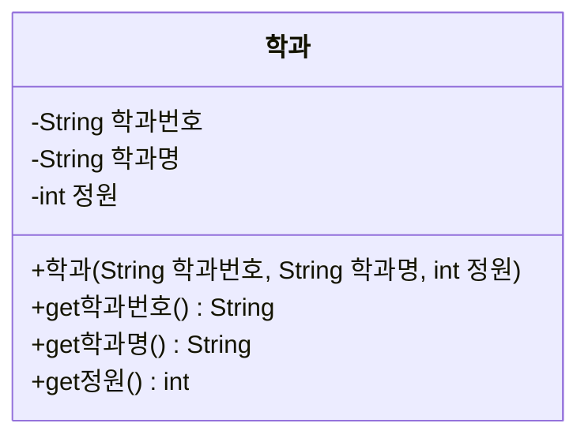

# Day 9. 클래스 - 객체와 생성자

> 참고 교재: 이것이 자바다 CHAPTER 6(클래스) 일부 범위
> 이전 챕터: Day 7~8에서 메서드를 배웠습니다. 이번 챕터부터는 데이터(필드)와 기능(메서드)을 하나로 묶는 객체지향 프로그래밍을 시작합니다.

## 학습목표
- 객체 지향 프로그래밍의 기본 개념(클래스와 객체)을 설명할 수 있다
- 클래스를 선언하고 필드를 정의할 수 있다
- 생성자의 역할을 이해하고 기본 생성자/사용자 정의 생성자를 작성할 수 있다
- 클래스 다이어그램을 읽고 그에 맞는 클래스를 구현할 수 있다

---

## 1. 객체 지향 프로그래밍이란?

지금까지는 데이터(변수)와 기능(메서드)이 따로 존재했습니다. 객체 지향 프로그래밍(OOP)은 **관련 있는 데이터와 기능을 하나로 묶어서** "객체"라는 단위로 다루는 방식입니다.

예를 들어 "학생"이라는 개념은 이름·학번 같은 **데이터**와, 자기소개를 하는 **기능**을 함께 가집니다. 이걸 각각의 변수와 메서드로 따로 관리하는 대신, `학생`이라는 하나의 틀(클래스)로 묶어서 관리하는 것이 OOP의 핵심입니다.

| 용어 | 설명 |
|---|---|
| 클래스(class) | 객체를 만들기 위한 설계도(틀) |
| 객체(object) / 인스턴스(instance) | 클래스를 바탕으로 실제로 만들어진 대상 |
| 필드(field) | 객체가 가지는 데이터(변수) |
| 메서드(method) | 객체가 할 수 있는 기능(동작) |

**비유**: "붕어빵 틀"이 클래스라면, 그 틀로 찍어낸 "붕어빵 하나하나"가 객체입니다. 틀은 하나지만 붕어빵은 여러 개 만들 수 있는 것처럼, 클래스 하나로 여러 개의 객체를 만들 수 있습니다.

---

## 2. 클래스 선언과 필드

```java
public class 학생 {
    // 필드(객체가 가질 데이터)
    String 이름;
    int 나이;
}
```

**설명**: `학생` 클래스는 `이름`과 `나이`라는 두 개의 필드를 가집니다. 이 클래스 자체는 아직 실제 데이터가 아니라 "학생은 이름과 나이를 가진다"는 설계도일 뿐입니다.

---

## 3. 객체 생성과 클래스 변수

클래스로부터 실제 객체를 만들려면 `new` 키워드를 사용합니다.

```java
public class 학생예제 {
    public static void main(String[] args) {
        학생 학생1 = new 학생(); // 학생 객체 생성
        학생1.이름 = "홍길동";    // 필드에 값 대입 (객체.필드명)
        학생1.나이 = 20;

        학생 학생2 = new 학생(); // 또 다른 학생 객체 생성 (완전히 별개의 객체)
        학생2.이름 = "김철수";
        학생2.나이 = 22;

        System.out.println(학생1.이름 + ", " + 학생1.나이); // 홍길동, 20
        System.out.println(학생2.이름 + ", " + 학생2.나이); // 김철수, 22
    }
}
```

**설명**: `new 학생()`은 힙 메모리(Day4 복습)에 새로운 학생 객체를 만들고, 그 주소를 `학생1`이라는 참조 변수에 저장합니다. `학생1.이름`처럼 `.`(점)을 이용해 객체가 가진 필드에 접근할 수 있습니다. `학생1`과 `학생2`는 같은 `학생` 클래스로 만들어졌지만, 서로 다른 독립된 객체이므로 각자 다른 값을 가질 수 있습니다.

---

## 4. 생성자 (Constructor)

매번 객체를 만들고 나서 필드를 하나하나 대입하는 것은 번거롭고 실수하기 쉽습니다. **생성자**는 객체가 생성되는 시점에 필드를 자동으로 초기화해주는 특별한 메서드입니다.

```java
public class 학생 {
    String 이름;
    int 나이;

    // 사용자 정의 생성자: 클래스명과 이름이 같고, 반환형이 없음
    public 학생(String 이름, int 나이) {
        this.이름 = 이름;   // this는 Day10에서 자세히 다룸. 지금은 "이 객체의 필드"라고 이해
        this.나이 = 나이;
    }
}
```

```java
public class 생성자예제 {
    public static void main(String[] args) {
        학생 학생1 = new 학생("홍길동", 20); // 생성자에 값을 전달하며 객체 생성과 동시에 초기화
        학생 학생2 = new 학생("김철수", 22);

        System.out.println(학생1.이름 + ", " + 학생1.나이);
        System.out.println(학생2.이름 + ", " + 학생2.나이);
    }
}
```

**설명**: 생성자는 메서드와 비슷하게 생겼지만 **이름이 클래스명과 완전히 같고, 반환형이 없다**는 점이 다릅니다(`void`조차 쓰지 않음). `new 학생("홍길동", 20)`처럼 객체를 생성하면서 값을 함께 넘기면, 생성자가 즉시 실행되어 필드를 초기화해줍니다.

---

## 5. 기본 생성자 vs 사용자 정의 생성자

| 구분 | 설명 |
|---|---|
| 기본 생성자(default constructor) | 클래스에 생성자를 하나도 작성하지 않으면, 자바가 매개변수 없는 생성자를 자동으로 만들어줌 |
| 사용자 정의 생성자 | 개발자가 직접 매개변수를 지정해 작성한 생성자 |

```java
public class 학과 {
    String 학과명;
    // 생성자를 하나도 작성하지 않음 → 자바가 자동으로 매개변수 없는 기본 생성자를 만들어줌
}

public class 기본생성자예제 {
    public static void main(String[] args) {
        학과 학과1 = new 학과(); // 기본 생성자 사용 가능
        학과1.학과명 = "컴퓨터공학과"; // 생성 후 필드에 직접 대입
        System.out.println(학과1.학과명);
    }
}
```

**중요한 규칙**: 클래스에 **사용자 정의 생성자를 하나라도 작성하면**, 자바는 더 이상 기본 생성자를 자동으로 만들어주지 않습니다. 이 경우 매개변수 없는 `new 학과()` 형태로 객체를 만들고 싶다면, 매개변수 없는 생성자도 직접 작성해야 합니다.

```java
public class 학과 {
    String 학과명;

    public 학과() { } // 매개변수 없는 생성자를 직접 작성 (사용자 정의 생성자가 있으므로 필요)

    public 학과(String 학과명) {
        this.학과명 = 학과명;
    }
}
```

---

## 6. 클래스 다이어그램 읽고 구현하기

앞으로는 클래스를 만들 때 **클래스 다이어그램**을 먼저 보고 그에 맞춰 구현하는 방식으로 진행합니다. 아래는 학사관리 도메인의 `학과` 클래스 다이어그램입니다.



**다이어그램 읽는 법**
- `-` 로 시작하는 항목: `private` 필드 (Day 10에서 접근제한자를 자세히 다룰 예정이라, 이번 챕터에서는 필드로만 우선 구현)
- `+` 로 시작하는 항목: `public` 생성자/메서드
- `+학과(String 학과번호, String 학과명, int 정원)` : 매개변수 3개를 받는 생성자
- `+get학과번호() String` : 매개변수 없이 `String`을 반환하는 메서드 (getter는 Day10에서 본격적으로 다룸)

이 다이어그램을 보고 구현한 클래스입니다.

```java
public class 학과 {
    String 학과번호;
    String 학과명;
    int 정원;

    public 학과(String 학과번호, String 학과명, int 정원) {
        this.학과번호 = 학과번호;
        this.학과명 = 학과명;
        this.정원 = 정원;
    }

    public String get학과번호() {
        return 학과번호;
    }

    public String get학과명() {
        return 학과명;
    }

    public int get정원() {
        return 정원;
    }
}
```

**설명**: 다이어그램의 `-` 필드는 클래스 내부의 필드로, `+` 항목은 생성자와 메서드로 그대로 옮겨 작성합니다. 필드 자체는 이번 챕터에서 아직 `private`를 붙이지 않았는데, 이는 Day 10에서 캡슐화를 배우며 정식으로 적용할 예정입니다.

---

## 자주 하는 실수

1. **생성자에 반환형을 실수로 붙임**
   ```java
   public void 학생(String 이름) { ... } // 컴파일은 되지만, 이건 생성자가 아니라 일반 메서드가 됨
   public 학생(String 이름) { ... }      // 올바른 생성자 (반환형 없음)
   ```

2. **사용자 정의 생성자를 만든 후 기본 생성자가 사라진 것을 모름**
   ```java
   public class 학생 {
       public 학생(String 이름) { ... } // 사용자 정의 생성자 작성
   }
   학생 s = new 학생(); // 컴파일 에러! 매개변수 없는 생성자가 더는 존재하지 않음
   ```

3. **객체 생성(new)을 빠뜨리고 필드 접근 시도**
   ```java
   학생 학생1; // 아직 객체가 생성되지 않음 (null 상태)
   학생1.이름 = "홍길동"; // NullPointerException (Day4 복습)
   ```

---

## 핵심 요약

| 항목 | 핵심 내용 |
|---|---|
| 클래스 | 객체를 만들기 위한 설계도 |
| 객체(인스턴스) | 클래스로 실제 생성된 대상, `new`로 생성 |
| 필드 | 객체가 가지는 데이터 |
| 생성자 | 클래스명과 동일한 이름, 반환형 없음, 객체 생성 시 자동 실행되어 필드 초기화 |
| 기본 생성자 | 생성자를 하나도 안 만들면 자바가 자동 제공, 사용자 정의 생성자를 하나라도 만들면 사라짐 |
| 클래스 다이어그램 | `-`는 private 필드, `+`는 public 생성자/메서드를 의미 |
