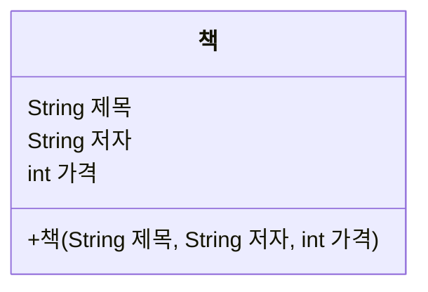
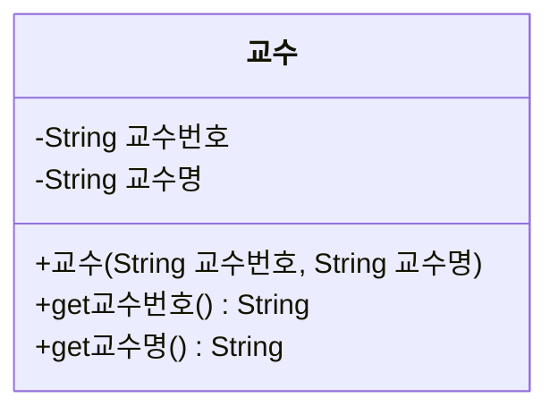
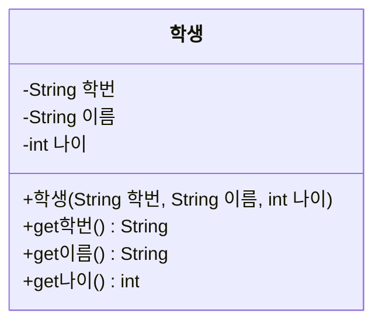
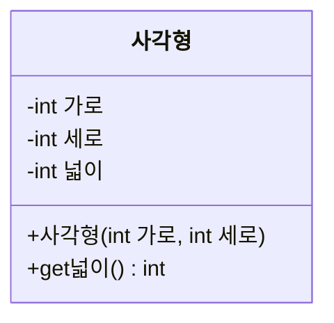

# Day 9. 클래스 - 객체와 생성자 - 실습

> 아래 문제는 클래스 다이어그램을 보고 그에 맞춰 클래스를 구현하는 방식입니다.
> 교안에서 다룬 클래스 선언, 필드, 생성자 문법만으로 풀 수 있습니다.

---

## 기본

### 문제 1. 다이어그램 보고 클래스 구현하기



위 다이어그램대로 `책` 클래스를 구현하고, `main`에서 `new 책("자바의 정석", "남궁성", 30000)` 객체를 만들어 제목/저자/가격을 출력하세요.

**Output**
```
제목: 자바의 정석
저자: 남궁성
가격: 30000
```

---

### 문제 2. 여러 객체 만들기
문제 1의 `책` 클래스를 이용해 서로 다른 책 객체 2개를 만들고, 각각의 정보를 출력하세요.

**Output**
```
책1 - 제목: 이것이 자바다, 저자: 신용권
책2 - 제목: 자바의 정석, 저자: 남궁성
```

---

## 응용

### 문제 3. 다이어그램 보고 get 메서드까지 구현하기



위 다이어그램대로 `교수` 클래스를 구현하고, 객체를 하나 만들어 get 메서드로 값을 꺼내 출력하세요.

**Input (생성자에 넘길 값)**
```
"P001", "김교수"
```

**Output**
```
교수번호: P001
교수명: 김교수
```

---

### 문제 4. 기본 생성자와 사용자 정의 생성자 함께 만들기
`학과` 클래스에 매개변수 없는 생성자(학과명을 "미정"으로 초기화)와, 학과명을 받는 생성자를 각각 만들어서, 두 방식으로 객체를 생성해 학과명을 출력하세요.

**Output**
```
학과1: 미정
학과2: 컴퓨터공학과
```

---

## 도전

### 문제 5. 다이어그램 보고 클래스 구현 + 여러 객체를 배열로 관리



위 다이어그램대로 `학생` 클래스를 구현하고, `학생` 객체 3개를 만들어 `학생[]` 배열에 담은 뒤, 향상된 for문(Day5 복습)으로 전체 학생 정보를 출력하세요.

**Output**
```
학번: S001, 이름: 홍길동, 나이: 20
학번: S002, 이름: 김철수, 나이: 21
학번: S003, 이름: 이영희, 나이: 22
```

---

### 문제 6. 종합 - 생성자 안에서 필드 간 계산
`사각형` 클래스를 만드는데, 생성자에서 가로와 세로를 받아 필드로 저장하고, 생성자 내부에서 넓이를 미리 계산해 `넓이`라는 필드에도 저장하도록 구현하세요. (다이어그램은 아래 참고)



**Output**
```
넓이: 24
```
