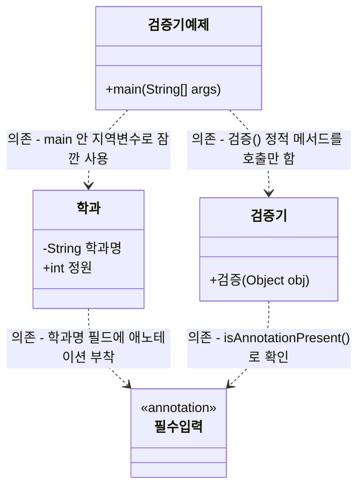

# 부록 2. 리플렉션과 애노테이션 처리

> 이전 챕터: 부록1에서 `@필수입력` 같은 커스텀 애노테이션을 정의하는 법을 배웠지만, 아직 그 표시를 읽어서 활용하지는 못했습니다. 이번 챕터에서 그 방법(리플렉션)을 배웁니다.

## 학습목표
- 리플렉션이 무엇이고 왜 필요한지 설명할 수 있다
- `Class`, `Field` 객체로 클래스의 구조를 코드로 조사할 수 있다
- 리플렉션으로 객체의 private 필드 값을 읽고 쓸 수 있다
- 리플렉션으로 애노테이션의 존재를 확인하고, 이를 활용한 검증기를 만들 수 있다

---

## 1. 리플렉션이란?

**리플렉션(reflection)** 은 "프로그램이 실행되는 도중에, 자기 자신(또는 다른 클래스)의 구조를 스스로 들여다보고 조작하는 기능"입니다. 평소에는 `학과학과1 = new 학과(...)`처럼 클래스를 미리 알고 코드를 작성하지만, 리플렉션을 쓰면 "이 객체는 어떤 클래스인지, 어떤 필드를 가졌는지, 그 필드에 어떤 애노테이션이 붙어있는지"를 **런타임에(실행 중에)** 코드로 알아낼 수 있습니다.

부록1에서 `@필수입력`을 필드에 붙였지만, 그 표시를 프로그램이 "읽지" 않으면 아무 의미가 없습니다. 리플렉션이 바로 그 "읽는" 역할을 합니다.

---

## 2. Class 객체로 클래스 정보 조사하기

모든 자바 객체는 `getClass()` 메서드로 자신의 클래스 정보를 담은 `Class` 객체를 얻을 수 있습니다. 그런데 `Class` 객체를 얻는 방법은 이것 말고 하나가 더 있습니다 — 바로 클래스 이름 뒤에 `.class`를 붙이는 것입니다.

| 얻는 방법 | 문법 | 특징 |
|---|---|---|
| 객체에서 얻기 | `객체.getClass()` | 객체(인스턴스)가 있어야 함, 실행 중인 실제 타입을 얻음 |
| 클래스 이름에서 바로 얻기 | `클래스이름.class` | 객체 없이도 사용 가능, 코드 작성 시점(컴파일 타임)에 정해짐 |

```java
학과 학과1 = new 학과("컴퓨터공학과", 40);

Class<?> clazzA = 학과1.getClass(); // 객체가 있어야 호출 가능
Class<?> clazzB = 학과.class;       // 객체 없이, 클래스 이름만으로 바로 얻음

System.out.println(clazzA == clazzB); // true! 같은 클래스를 가리키므로 결과는 항상 같음
```

**설명**: `학과1.getClass()`는 `학과1`이라는 **객체가 실제로 만들어진 뒤에만** 호출할 수 있습니다. 반면 `학과.class`는 객체를 만들지 않고도, 클래스 이름만 알면 바로 쓸 수 있는 문법입니다. 아래 표의 `학과.class.getDeclaredFields()`처럼, "굳이 객체를 만들지 않고 클래스 정보만 필요할 때" 자주 사용합니다. 둘 다 결과적으로 같은 `Class` 객체를 가리키므로, `==`으로 비교하면 `true`가 나옵니다.

| 메서드/문법 | 설명 | 예시 |
|---|---|---|
| `객체.getClass()` | 객체의 클래스 정보를 담은 Class 객체 반환 | `학과1.getClass()` |
| `Class.getSimpleName()` | 클래스의 이름을 문자열로 반환 (패키지 경로 제외) | `clazz.getSimpleName()` |
| `클래스.getDeclaredFields()` | 그 클래스가 선언한 모든 필드(Field 배열) 반환 | `학과.class.getDeclaredFields()` |
| `Field.getName()` | 필드의 이름을 문자열로 반환 | `field.getName()` |
| `Field.getType()` | 필드의 자료형 정보 반환 | `field.getType()` |
| `Field.getModifiers()` | 필드의 접근제한자 등 제어자 정보를 정수(int)로 반환 | `field.getModifiers()` |
| `Modifier.toString(int)` | 그 정수를 "private", "public" 같은 문자열로 변환 | `Modifier.toString(field.getModifiers())` |

```java
public class 학과 {
    private String 학과명;
    public int 정원;

    public 학과(String 학과명, int 정원) {
        this.학과명 = 학과명;
        this.정원 = 정원;
    }
}
```

```java
import java.lang.reflect.Field;
import java.lang.reflect.Modifier;

public class 리플렉션예제 {
    public static void main(String[] args) {
        학과 학과1 = new 학과("컴퓨터공학과", 40);

        Class<?> clazz = 학과1.getClass(); // 학과1이 어떤 클래스인지 알아냄
        System.out.println("클래스 이름: " + clazz.getSimpleName());

        Field[] fields = clazz.getDeclaredFields(); // 학과 클래스가 가진 모든 필드 목록
        for (Field field : fields) {
            String modifier = Modifier.toString(field.getModifiers()); // 정수를 "private" 같은 문자열로 변환
            System.out.println(modifier + " " + field.getType() + " " + field.getName());
        }
    }
}
```

**출력 결과**
```
클래스 이름: 학과
private class java.lang.String 학과명
public int 정원
```

**설명**: 코드 어디에도 "`학과명`이라는 필드가 있다"고 직접 적지 않았는데도, 리플렉션이 그 정보를 실행 중에 알아냈습니다. 이것이 리플렉션의 핵심 — **클래스 구조를 코드가 아니라 데이터처럼 다룰 수 있다**는 점입니다. `getModifiers()`가 반환하는 값은 사람이 바로 읽기 힘든 정수(예: `private`는 `2`, `public`은 `1`)라서, `Modifier.toString(...)`으로 감싸서 "private", "public" 같은 읽기 좋은 문자열로 바꿔 사용합니다.

**참고**: `Modifier` 클래스에는 `toString(int)` 외에도 `Modifier.isPrivate(int)`, `Modifier.isPublic(int)`, `Modifier.isStatic(int)`처럼 특정 제한자인지 `boolean`으로 바로 확인하는 메서드도 있습니다. 예를 들어 "이 필드가 private인 것만 검사하고 싶다"면 `Modifier.isPrivate(field.getModifiers())`를 조건문에 바로 사용할 수 있습니다.

**참고**: `Class`에는 `getSimpleName()` 외에 `getName()`도 있습니다. `getSimpleName()`은 `학과`처럼 클래스 이름만 반환하지만, `getName()`은 패키지 경로까지 포함한 전체 이름(예: `com.example.학과`)을 반환합니다. 화면에 보여줄 때는 보통 `getSimpleName()`을 사용합니다.

---

## 3. 리플렉션으로 필드 값 읽고 쓰기

`private` 필드라도, 리플렉션을 쓰면 (허가를 받아) 값을 읽거나 바꿀 수 있습니다.

| 메서드 | 설명 |
|---|---|
| `field.setAccessible(true)` | private 필드에도 접근할 수 있도록 허용 |
| `field.get(객체)` | 해당 객체의 그 필드 값을 읽음 |
| `field.set(객체, 값)` | 해당 객체의 그 필드에 값을 대입 |

```java
import java.lang.reflect.Field;

public class 필드접근예제 {
    public static void main(String[] args) throws Exception {
        학과 학과1 = new 학과("컴퓨터공학과", 40);

        Field field = 학과1.getClass().getDeclaredField("학과명"); // "학과명"이라는 이름의 필드를 찾음
        field.setAccessible(true); // private 필드도 접근 가능하게 허용

        Object value = field.get(학과1); // 학과1 객체의 학과명 값을 읽어옴
        System.out.println("학과명 값: " + value); // 컴퓨터공학과

        field.set(학과1, "소프트웨어학과"); // 학과1 객체의 학과명 값을 바꿈
        System.out.println("변경 후: " + field.get(학과1)); // 소프트웨어학과
    }
}
```

**설명**: 평소라면 `private` 필드는 클래스 밖에서 절대 직접 접근할 수 없었는데(Day10 캡슐화 복습), 리플렉션은 이 규칙을 우회할 수 있는 특별한 방법입니다. `getDeclaredField(...)`는 `Field`를 찾지 못하면 예외를 던지므로, `main` 메서드에 `throws Exception`을 붙여 처리했습니다.

**주의**: 리플렉션으로 캡슐화를 우회하는 것은 강력하지만 위험할 수 있는 기능입니다. 실무에서는 스프링, JPA 같은 **프레임워크가 내부적으로만** 이런 방식을 사용하고, 일반적인 비즈니스 로직에서는 여전히 getter/setter를 사용하는 것이 원칙입니다.

---

## 4. 리플렉션으로 애노테이션 확인하기

이제 부록1에서 만든 `@필수입력`을 리플렉션으로 읽어봅니다.

| 메서드 | 설명 |
|---|---|
| `field.isAnnotationPresent(애노테이션.class)` | 이 필드에 특정 애노테이션이 붙어있는지 확인 (boolean 반환) |

```java
import java.lang.reflect.Field;

public class 애노테이션확인예제 {
    public static void main(String[] args) {
        학과 학과1 = new 학과("컴퓨터공학과", 40);

        Field[] fields = 학과1.getClass().getDeclaredFields();
        for (Field field : fields) {
            if (field.isAnnotationPresent(필수입력.class)) {
                System.out.println(field.getName() + " 필드는 @필수입력이 붙어있습니다.");
            }
        }
    }
}
```

**출력 결과**
```
학과명 필드는 @필수입력이 붙어있습니다.
```

**설명**: `isAnnotationPresent(필수입력.class)`는 "이 필드에 `@필수입력`이 붙어있는가?"를 확인합니다. `정원` 필드는 애노테이션이 없으므로 출력되지 않습니다. **주의**: 부록1에서 `@Retention(RetentionPolicy.RUNTIME)`을 지정하지 않았다면, 프로그램이 실행되는 시점에는 이미 애노테이션 정보가 사라진 상태라서 `isAnnotationPresent`가 항상 `false`를 반환합니다.

---

## 5. 종합: 애노테이션 기반 검증기 만들기

`@필수입력`이 붙은 필드가 비어있는지(`null`인지) 자동으로 검사하는 검증기를 만들어봅니다.

```java
import java.lang.reflect.Field;

public class 검증기 {
    public static void 검증(Object obj) throws Exception {
        Class<?> clazz = obj.getClass();

        for (Field field : clazz.getDeclaredFields()) {
            if (field.isAnnotationPresent(필수입력.class)) {
                field.setAccessible(true);
                Object value = field.get(obj);

                if (value == null) {
                    System.out.println(field.getName() + "은(는) 필수 입력값입니다.");
                }
            }
        }
    }
}
```

```java
public class 검증기예제 {
    public static void main(String[] args) throws Exception {
        학과 학과1 = new 학과(null, 40); // 학과명을 일부러 비워둠

        검증기.검증(학과1); // "학과명은(는) 필수 입력값입니다." 출력
    }
}
```

**설명**: `검증()` 메서드는 어떤 객체가 들어와도(`학과`든, `학생`이든) 그 클래스의 필드를 순회하면서 `@필수입력`이 붙은 필드만 골라 `null` 여부를 확인합니다. 이 메서드는 `학과`나 `학생`이라는 구체적인 클래스 이름을 코드에 전혀 적지 않았는데도 동작합니다 — **어떤 클래스든 리플렉션 하나로 처리할 수 있는 범용 코드**가 된 것입니다. 이것이 실무에서 리플렉션을 쓰는 가장 큰 이유입니다.

### 5-1. 클래스 다이어그램으로 보기



주목할 점: 네 클래스 사이 관계가 전부 **의존(`..>`)**입니다. `검증기`는 `학과`라는 이름을 코드 어디에도 적지 않았고(`Object obj`로만 받음), `검증기예제`도 `검증기` 인스턴스를 필드로 들고 있지 않고 `검증기.검증(...)`처럼 정적 메서드만 잠깐 호출합니다. **필드로 오래 참조를 들고 있는 관계(연관)가 하나도 없다는 것 자체가, "리플렉션으로 어떤 클래스든 범용으로 처리한다"는 이번 장의 핵심을 구조로 보여주는 증거**입니다.

---

## 자주 하는 실수

1. **setAccessible(true)를 빠뜨려서 private 필드 접근 시 예외 발생**
   ```java
   Field field = clazz.getDeclaredField("학과명");
   Object value = field.get(학과1); // 예외 발생! private 필드는 접근 허용이 필요
   ```

2. **부록1에서 @Retention(RUNTIME)을 빠뜨려 isAnnotationPresent가 항상 false**
   ```java
   @Retention(RetentionPolicy.CLASS) // RUNTIME이 아니면
   public @interface 필수입력 { }
   // field.isAnnotationPresent(필수입력.class)가 항상 false를 반환함
   ```

3. **getFields()와 getDeclaredFields() 혼동**
   ```java
   clazz.getFields();         // public 필드만 가져옴 (private 필드는 안 잡힘)
   clazz.getDeclaredFields(); // private 포함 모든 필드를 가져옴 (보통 이걸 사용)
   ```

---

## 핵심 요약

| 항목 | 핵심 내용 |
|---|---|
| 리플렉션 | 실행 중에 클래스의 구조(필드, 메서드 등)를 코드로 조사·조작하는 기능 |
| getClass() | 객체의 Class 정보를 얻음 |
| getDeclaredFields() | private 포함 모든 필드 목록을 얻음 |
| setAccessible(true) | private 필드에도 접근 가능하도록 허용 |
| field.get(obj) / field.set(obj, 값) | 리플렉션으로 필드 값을 읽고 씀 |
| isAnnotationPresent(...) | 특정 애노테이션이 붙어있는지 확인 |
| 검증기 패턴 | 클래스 이름을 코드에 적지 않고도, 애노테이션 표시만으로 범용 로직을 만드는 방식 |

다음 챕터(부록3)에서는 이 원리를 확장해서, `@Autowired`처럼 객체와 객체를 자동으로 연결해주는 "미니 DI(의존성 주입) 컨테이너"를 직접 만들어봅니다.