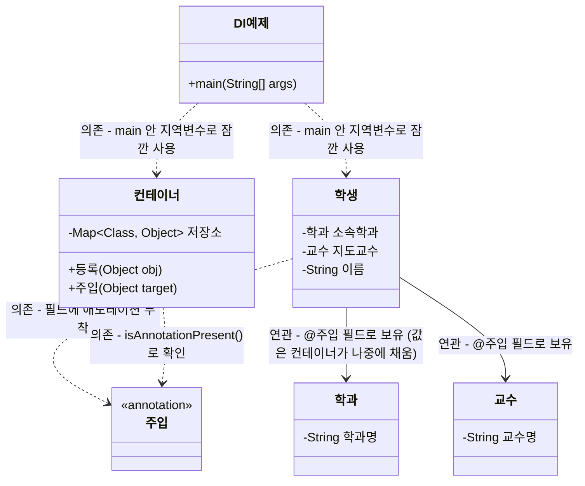

# 부록 3. 수동 DI 컨테이너 만들기 (@Autowired의 원리)

> 이전 챕터: 부록2에서 리플렉션으로 애노테이션을 읽어 검증기를 만들었습니다. 이번 챕터에서는 같은 원리로, 스프링의 `@Autowired`가 내부적으로 하는 일을 직접 구현해봅니다.
> 이 챕터를 마치면, 실제 스프링의 `@Autowired`를 배울 때 "아, 이게 그 원리구나"라고 이해할 수 있게 됩니다.

## 학습목표
- 의존성 주입(DI, Dependency Injection)이 무엇인지 설명할 수 있다
- 생성자로 직접 객체를 연결하는 방식과, 컨테이너가 자동으로 연결해주는 방식의 차이를 이해할 수 있다
- 커스텀 `@주입` 애노테이션과 리플렉션으로 간단한 DI 컨테이너를 구현할 수 있다

---

## 1. 의존성 주입(DI)이란?

Day11에서 `학생` 클래스가 `학과`, `교수` 객체를 필드로 참조하는 구조를 만들었습니다. 지금까지는 이렇게 생성자로 직접 연결했습니다.

```java
학과 컴공 = new 학과("컴퓨터공학과");
교수 김교수 = new 교수("김교수");
학생 학생1 = new 학생("홍길동", 컴공, 김교수); // 생성자에 직접 넣어서 연결
```

이 방식은 "`학생1`이 필요한 `학과`, `교수` 객체를 `학생1`을 만드는 코드가 직접 준비해서 넣어준다"는 뜻입니다. `학생1`은 자기가 필요한 것을 스스로 찾지 않고, **외부에서 넣어주는 대로** 받습니다. 이 "외부에서 필요한 객체를 넣어주는 것"을 **의존성 주입(DI)** 이라고 합니다.

지금은 우리가 직접 `main`에서 순서대로 `new`하고 있지만, 실무 프로젝트가 커지면 객체가 수백 개가 되고, 서로 복잡하게 얽혀서 "누가 누구를 먼저 만들어서 넣어줘야 하는지" 손으로 관리하기 어려워집니다. 이때 **컨테이너**라는 것이 이 과정을 자동화해줍니다. 스프링의 `@Autowired`가 바로 이 컨테이너 역할을 하는 도구입니다.

---

## 2. 커스텀 @주입 애노테이션 정의하기

부록1에서 배운 방식대로, "이 필드는 컨테이너가 자동으로 채워줘야 한다"는 표시를 만듭니다.

```java
import java.lang.annotation.ElementType;
import java.lang.annotation.Retention;
import java.lang.annotation.RetentionPolicy;
import java.lang.annotation.Target;

@Retention(RetentionPolicy.RUNTIME)
@Target(ElementType.FIELD)
public @interface 주입 {
}
```

```java
public class 학생 {
    @주입
    private 학과 소속학과; // "이 필드는 컨테이너가 알아서 채워줄 것이다"라는 표시

    @주입
    private 교수 지도교수;

    private String 이름;

    public 학생(String 이름) {
        this.이름 = 이름;
        // 소속학과, 지도교수는 여기서 초기화하지 않음 (컨테이너가 나중에 채워줄 것이므로)
    }
}
```

**설명**: 생성자에서 `소속학과`, `지도교수`를 초기화하지 않은 점에 주목하세요. 이 필드들은 `학생` 객체가 만들어진 **이후에**, 컨테이너가 리플렉션으로 값을 채워 넣을 것입니다. 이것이 스프링의 `@Autowired`가 동작하는 방식과 같은 원리입니다.

---

## 3. 미니 DI 컨테이너 만들기

컨테이너는 두 가지 역할을 합니다: (1) 사용 가능한 객체들을 등록해두고, (2) `@주입`이 붙은 필드를 찾아서 등록된 객체 중 타입이 맞는 것을 자동으로 넣어줍니다.

| 메서드 | 설명 |
|---|---|
| `등록(Object obj)` | 컨테이너가 나중에 꺼내 쓸 수 있도록 객체를 저장 (타입을 key로 사용) |
| `주입(Object target)` | target 객체의 `@주입` 필드를 찾아, 등록된 객체 중 타입이 맞는 것을 채워 넣음 |

```java
import java.lang.reflect.Field;
import java.util.HashMap;
import java.util.Map;

public class 컨테이너 {
    private Map<Class<?>, Object> 저장소 = new HashMap<>(); // 타입별로 객체 하나씩 보관

    public void 등록(Object obj) {
        저장소.put(obj.getClass(), obj); // 예: 학과.class -> 컴공 객체
    }

    public void 주입(Object target) throws Exception {
        Class<?> clazz = target.getClass();

        for (Field field : clazz.getDeclaredFields()) {
            if (field.isAnnotationPresent(주입.class)) {
                Class<?> 필요한타입 = field.getType();     // 이 필드가 어떤 타입을 필요로 하는지 확인
                Object 준비된객체 = 저장소.get(필요한타입);  // 저장소에서 그 타입의 객체를 찾음

                if (준비된객체 != null) {
                    field.setAccessible(true);
                    field.set(target, 준비된객체); // 찾은 객체를 필드에 채워 넣음
                }
            }
        }
    }
}
```

**설명**: `Map<Class<?>, Object>`는 "타입"을 key로, 그 타입의 객체를 value로 저장하는 자료구조입니다(Map은 배운 적 없지만, "타입 → 객체" 짝을 저장하는 저장소 정도로 이해하면 충분합니다). `등록()`은 사용 가능한 객체를 이 저장소에 넣어두고, `주입()`은 `@주입`이 붙은 필드를 발견할 때마다 "이 필드는 어떤 타입이 필요하지?"를 확인한 뒤, 저장소에서 같은 타입의 객체를 찾아 리플렉션으로 채워 넣습니다.

---

## 4. 전체 동작 확인하기

```java
public class DI예제 {
    public static void main(String[] args) throws Exception {
        컨테이너 컨테이너 = new 컨테이너();

        학과 컴공 = new 학과("컴퓨터공학과");
        교수 김교수 = new 교수("김교수");

        컨테이너.등록(컴공);  // "학과 타입이 필요하면 이 객체를 써라"
        컨테이너.등록(김교수); // "교수 타입이 필요하면 이 객체를 써라"

        학생 학생1 = new 학생("홍길동"); // 소속학과, 지도교수는 아직 비어있음(null)
        컨테이너.주입(학생1);            // 컨테이너가 @주입 필드를 자동으로 채워줌

        System.out.println(학생1.get소속학과().get학과명()); // 컴퓨터공학과
        System.out.println(학생1.get지도교수().get교수명()); // 김교수
    }
}
```

**설명**: `학생1`을 생성할 때는 `소속학과`, `지도교수`가 전혀 채워지지 않았습니다. 하지만 `컨테이너.주입(학생1)`을 호출하는 순간, 컨테이너가 리플렉션으로 `학생1`의 필드를 조사해서 `@주입`이 붙은 필드들에 알맞은 타입의 객체를 자동으로 채워 넣습니다. `학생` 클래스는 "누가 자신의 `소속학과`, `지도교수`를 채워줄지"를 전혀 모르는 채로 작성되었는데도 정상 동작합니다. 이것이 바로 `@Autowired`의 핵심 원리입니다 — **스프링 컨테이너가 이 예제의 "컨테이너" 역할을, `@Autowired`가 "@주입" 역할을 정교하게 확장한 버전**입니다.

### 4-1. 클래스 다이어그램으로 보기



이 다이어그램에서 눈여겨볼 두 가지:

- `학생 --> 학과`, `학생 --> 교수`는 **연관**입니다. `소속학과`/`지도교수`가 `학생`의 **필드**이기 때문이죠 — `@주입`이 붙어서 값이 나중에(생성자가 아니라 컨테이너가) 채워질 뿐, 필드로 오래 보유한다는 사실 자체는 그대로입니다. 지난 시간 `01_GoF디자인패턴.md` 4-4절에서 다룬 "`@Autowired`도 이름과 달리 UML상으로는 연관"이라는 내용이 여기 그대로 적용됩니다.
- 반대로 `컨테이너`는 `등록(Object obj)`, `주입(Object target)` 어디에도 `학생`/`학과`/`교수`라는 이름을 코드에 적지 않습니다(전부 `Object`). 그래서 `컨테이너` 클래스 자체는 이 셋과 **아무 관계도 없습니다** — 구체적인 타입들이 등장하는 건 오직 `DI예제`(클라이언트) 안에서, 그것도 지역변수로 잠깐 쓰이는 **의존** 관계뿐입니다. "컨테이너가 어떤 타입이든 범용으로 다룰 수 있다"는 이번 장의 핵심이 다이어그램에도 그대로 드러납니다.

> 💻 이 다이어그램을 그대로 코드로 옮긴, 바로 실행 가능한 전체 예제가 첨부된 `DI예제.java`입니다. `학과`/`교수`/`학생`/`주입`/`컨테이너`가 한 파일에 들어있으니 `javac DI예제.java && java DI예제`로 직접 돌려보세요.

---

## 5. 지금까지 배운 것과 실제 Spring의 대응 관계

| 우리가 만든 것 | 실제 Spring |
|---|---|
| `@주입` | `@Autowired` |
| `컨테이너.등록()` | `@Component`, `@Bean`으로 스프링이 객체를 자동 등록 |
| `컨테이너.주입()` | 스프링 컨테이너(ApplicationContext)가 앱 시작 시 자동으로 수행 |
| `Map<Class, Object> 저장소` | 스프링 내부의 빈(Bean) 저장소 |

**차이점**: 실제 스프링은 여기서 훨씬 더 많은 일을 합니다 — 같은 타입의 객체가 여러 개 있을 때 이름으로 구분하기, 순환 참조 감지하기, 생성자 주입/setter 주입 지원, 객체 생성 순서 자동 결정 등. 하지만 **핵심 원리(애노테이션 표시 + 리플렉션으로 자동 연결)** 는 지금 만든 것과 동일합니다.

---

## 자주 하는 실수

1. **등록 순서를 헷갈려서 필요한 객체가 저장소에 없음**
   ```java
   컨테이너.주입(학생1); // 아직 학과, 교수를 등록하지 않은 상태에서 먼저 주입 시도
   컨테이너.등록(컴공);  // 이미 늦음! 주입은 등록된 것만 채울 수 있음
   ```

2. **필드 타입과 등록된 객체 타입이 정확히 일치해야 함**
   ```java
   // 필드가 학과 타입인데
   @주입
   private 학과 소속학과;

   // 컨테이너에 학과의 자식 클래스(있다면) 객체만 등록하고 학과 자체는 등록 안 하면 못 찾음
   ```

3. **@Retention을 RUNTIME으로 하지 않아 주입이 항상 안 됨**
   ```java
   @Retention(RetentionPolicy.CLASS) // RUNTIME이 아니면
   public @interface 주입 { }
   // isAnnotationPresent(주입.class)가 항상 false → 아무 필드도 채워지지 않음
   ```

---

## 핵심 요약

| 항목 | 핵심 내용 |
|---|---|
| 의존성 주입(DI) | 객체가 필요한 다른 객체를 스스로 만들지 않고, 외부에서 넣어받는 방식 |
| @주입(커스텀) | "이 필드는 컨테이너가 자동으로 채워야 한다"는 표시 |
| 컨테이너.등록() | 사용 가능한 객체를 타입별로 저장해두는 과정 |
| 컨테이너.주입() | 리플렉션으로 `@주입` 필드를 찾아 저장소의 알맞은 타입 객체를 자동으로 채워 넣는 과정 |
| @Autowired와의 관계 | 원리는 동일: 애노테이션 표시 + 리플렉션 기반 자동 연결. 스프링은 이를 훨씬 정교하게 확장한 것 |

여기까지 오시면, 애노테이션이 단순한 "표시"가 아니라 **리플렉션과 결합해 프레임워크의 핵심 동작 원리를 이루는 도구**라는 것을 직접 경험하신 것입니다. 이후 실제 Spring, JPA를 배우실 때 `@Autowired`, `@Entity`, `@RequestMapping` 같은 애노테이션들을 만나면, "이것도 결국 리플렉션으로 읽어서 뭔가 자동으로 처리해주는 거겠구나"라는 감을 가지고 접근하실 수 있습니다.
