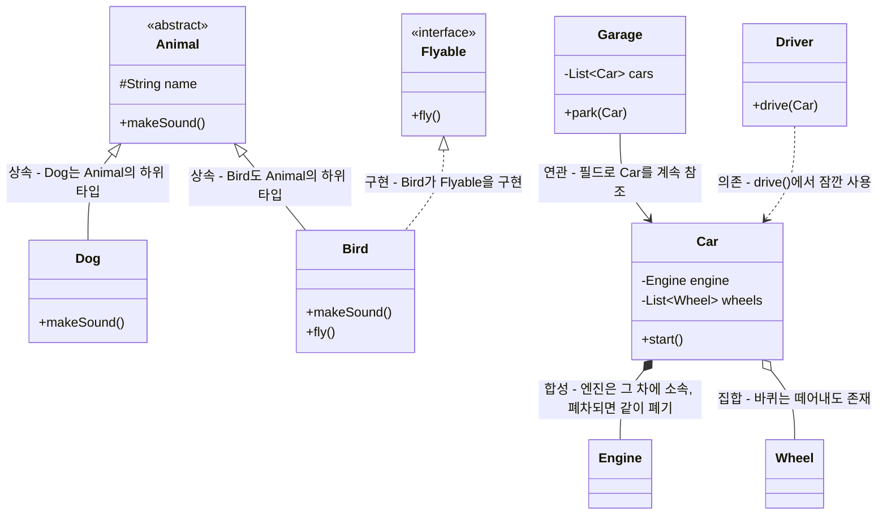
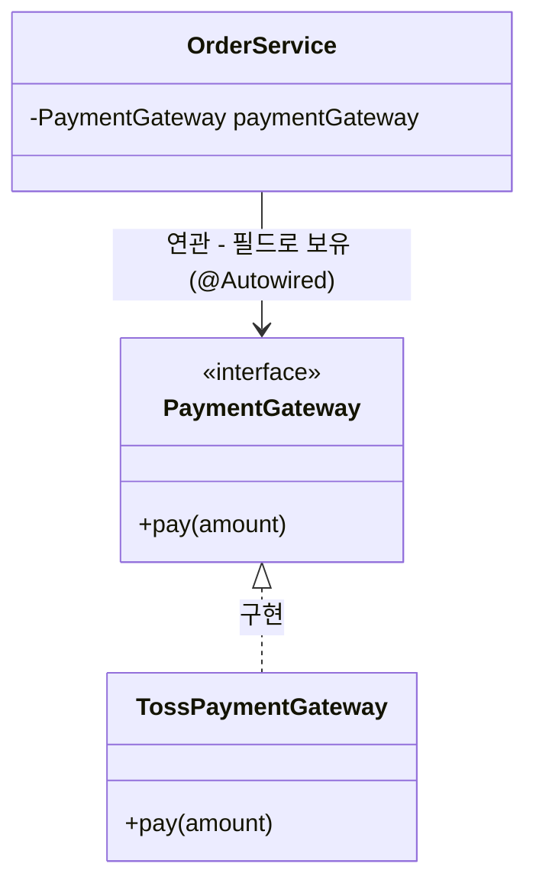
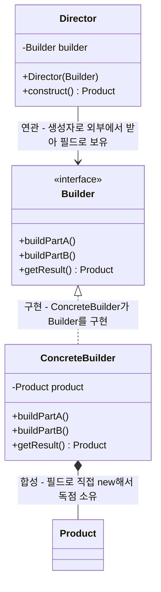

# GoF(Gang of Four) 디자인 패턴 소개

**학습 대상**: 자바 클래스/객체/인터페이스/상속/캡슐화를 배운 초·중급자 (1장 9~13강 수강자)
**학습 목표**: 디자인 패턴이 무엇이고 왜 배우는지 이해하고, GoF 23가지 패턴이 생성·구조·행위 3가지로 분류되는 원리를 안다. UML 클래스 다이어그램을 읽을 수 있게 되어, 다음 시간에 배울 빌더 패턴의 구조를 미리 그려볼 수 있다.
**예상 소요 시간**: 40~60분

---

## 0. 학습 순서

1. 디자인 패턴이란 무엇인가
2. GoF와 『디자인 패턴』 책
3. 왜 디자인 패턴을 배워야 하는가
4. UML 클래스 다이어그램 읽는 법
5. GoF 23가지 패턴의 3대 분류
6. 분류별 대표 패턴 훑어보기
7. 다음 시간 예고 - 빌더 패턴 구조 미리보기
8. 정리

---

## 1. 디자인 패턴이란 무엇인가

건축에서 "계단은 이렇게 설계하면 대부분 안전하고 쓰기 편하다"는 노하우가 반복적으로 쌓이듯, 소프트웨어 설계에도 **"이런 상황에서는 이렇게 구조를 짜면 대부분 잘 풀린다"**는 노하우가 쌓여 왔습니다. 그 노하우를 이름 붙이고 정형화한 것이 **디자인 패턴(Design Pattern)**입니다.

중요한 점은, 패턴이 **복사해서 붙여넣는 코드 조각이 아니라는 것**입니다. 패턴은 "클래스를 이런 역할로 나누고, 이런 관계로 연결하라"는 **구조에 대한 템플릿(아이디어)**입니다. 그래서 같은 패턴이라도 언어나 상황에 따라 실제 코드는 다르게 생길 수 있습니다.

> 비유: "레시피"와 비슷합니다. "볶음밥 레시피"는 재료 목록이 아니라 "밥과 재료를 어떤 순서·비율로 조합하라"는 절차입니다. 디자인 패턴도 "클래스 A, B, C를 이런 역할과 관계로 조합하라"는 절차에 가깝습니다.

---

## 2. GoF와 『디자인 패턴』 책

- **GoF(Gang of Four)** = Erich Gamma, Richard Helm, Ralph Johnson, John Vlissides, 네 명의 저자를 부르는 별명
- 1994년 『Design Patterns: Elements of Reusable Object-Oriented Software』 출간
- 이 책에서 **23가지 패턴**을 정리했고, 이후 객체지향 설계에서 사실상 **공통 어휘(common vocabulary)**가 되었습니다.
- "이 부분 옵저버 패턴으로 짰어요"라고 말하면, 코드를 한 줄도 안 보여줘도 동료 개발자가 대략적인 구조를 머릿속에 그릴 수 있습니다. 이게 패턴을 배우는 실질적인 이유 중 하나입니다.

---

## 3. 왜 디자인 패턴을 배워야 하는가

| 배우지 않았을 때 | 배웠을 때 |
|---|---|
| 매번 문제를 처음부터 다시 고민 | 검증된 해법을 재사용 (바퀴 재발명 방지) |
| "이 구조 왜 이렇게 짰어요?"를 코드로 한참 설명 | "빌더 패턴 썼어요" 한마디로 팀 커뮤니케이션 종료 |
| Spring, JDK 라이브러리 내부 구조가 낯설게 느껴짐 | 프레임워크 코드를 봐도 "아, 이거 전략 패턴이네" 하고 눈에 들어옴 |
| 무작정 설계를 복잡하게 만들기 쉬움 | 패턴이 필요한 상황과 아닌 상황을 구분하는 판단 기준이 생김 |

> ⚠️ **주의**: 패턴이 만능은 아닙니다. 필요하지 않은 곳에 패턴을 욱여넣으면 오히려 코드가 복잡해지는 **과잉 설계(Over-engineering)**가 됩니다. 다음 시간 빌더 패턴 교안의 "언제 패턴이 과한가" 절에서 이 판단 기준을 실제 사례로 다룹니다.

---

## 4. UML 클래스 다이어그램 읽는 법

디자인 패턴은 코드보다 **클래스 다이어그램**으로 설명할 때 구조가 한눈에 들어옵니다. 오늘부터 앞으로 계속 쓸 표기법을 정리합니다.

### 4-1. 클래스 박스

```
┌─────────────────────┐
│      ClassName       │  ← 클래스 이름 (인터페이스는 <<interface>> 표시)
├─────────────────────┤
│ - privateField: Type │  ← 필드. -는 private, +는 public, #는 protected
│ + publicField: Type  │
├─────────────────────┤
│ + method(param): Ret │  ← 메서드
└─────────────────────┘
```

### 4-2. 클래스 사이의 화살표

| 표기 | 이름 | 의미 | 예 |
|---|---|---|---|
| `--\|>` (실선 + 속이 빈 삼각형) | 상속 (Inheritance) | "A는 B의 하위 타입이다" (`extends`) | `Dog --\|> Animal` |
| `..\|>` (점선 + 속이 빈 삼각형) | 구현 (Realization) | "A는 B 인터페이스를 구현한다" (`implements`) | `Dog ..\|> Runnable` |
| `*--` (실선 + 채운 다이아몬드) | 합성 (Composition) | "B(부분)는 A(전체)에 소속되어 독립적으로 존재하지 않는다 - A가 사라지면 B도 함께 사라짐" (전체-부분, 강한 소유) | `Car *-- Engine` |
| `o--` (실선 + 빈 다이아몬드) | 집합 (Aggregation) | "A와 B는 부분-전체지만, B가 A 없이도 따로 존재 가능" | `Team o-- Player` |
| `-->` (실선 화살표) | 연관 (Association) | "A가 B를 필드 등으로 계속 알고 있다" | `Director --> Builder` |
| `..>` (점선 화살표) | 의존 (Dependency) | "A가 B를 잠깐(메서드 안에서) 사용한다" | `Builder ..> Product` |
| `--` (화살표 없는 실선) | 단순 연결 | 표준 UML 관계는 아니지만, "B가 A 안에 정의된 static nested class다"처럼 자바 특유의 관계를 라벨로 설명할 때 사용 (교육용 편의 표기) | `Employee -- Builder : static nested class` |

> 💡 **헷갈리기 쉬운 포인트: 연관·집합·합성은 코드만 보면 똑같이 "필드"입니다.** 셋 다 "필드로 참조를 들고 있다"는 점은 동일해서, 자바 문법만으로는 구별되지 않습니다. 차이는 **"그 필드를 누가 만드는가"**에 있습니다.
>
> ```java
> // 합성 (Car *-- Engine)
> class Car {
>     private final Engine engine;
>     public Car() {
>         this.engine = new Engine();   // ★ Car가 스스로 만듦 (내부에서 new)
>     }
> }
>
> // 연관 (Garage --> Car)
> class Garage {
>     private List<Car> cars = new ArrayList<>();
>     public void park(Car car) {       // ★ 이미 존재하는 Car를 밖에서 받음
>         cars.add(car);
>     }
> }
> ```
>
> | 기준 | 합성 (`*--`) | 연관 (`-->`) / 집합 (`o--`) |
> |---|---|---|
> | 누가 만드나 | 소유하는 쪽이 직접 `new`(보통 생성자 안에서) | 이미 만들어진 객체를 외부에서 받음(생성자 파라미터, setter, 메서드 인자) |
> | 공유 가능한가 | 불가능 — 그 부분은 오직 그 하나의 전체만 씀 | 가능 — 같은 객체가 여러 곳과 관계를 맺을 수 있음 |
> | 생명주기 | 전체가 사라지면 부분도 함께 사라짐 | 전체가 사라져도 부분은 계속 존재 |
>
> 즉 "필드가 있다"는 조건은 연관·집합·합성 모두 공통이고(그래서 셋 다 의존과는 구별됨), 셋 중 정확히 무엇인지는 "누가 만들고, 공유되고, 생명주기가 어떤가"까지 봐야 정해집니다. 실무에서는 집합과 연관의 경계가 흐릿한 경우가 많아서(이 구분 자체가 UML이 자주 받는 비판이기도 합니다), **"직접 만들어서 독점 소유하는가(합성) vs 남이 만든 걸 받아서 참조만 하는가(연관/집합)"** 정도만 확실히 구별해도 실용적으로 충분합니다.

### 4-3. 작은 예제로 연습하기



읽는 순서: `Dog`와 `Bird`는 `Animal`을 **상속**받고(`<|--`), `Bird`는 추가로 `Flyable` 인터페이스를 **구현**합니다(`<|..`). `Car`는 `Engine`을 **합성**(엔진은 그 차에 소속되어 함께 폐기됨), `Wheel`을 **집합**(바퀴는 떼어서 다른 곳에 재사용 가능)으로 갖습니다. `Garage`는 `Car` 목록을 필드로 계속 들고 있으니 **연관**(`-->`)이고, `Driver`는 `drive(Car)`처럼 파라미터로 잠깐 스쳐 지나가니 **의존**(`..>`)입니다. 같은 `Car`인데도 어느 클래스와 관계를 맺느냐에 따라 연관과 의존으로 갈리는 걸 눈여겨보세요 — 필드로 오래 들고 있는지(연관), 메서드 안에서 잠깐만 쓰는지(의존)가 기준입니다.

> 💡 이 표기법은 다음 시간 `02_빌더패턴.md`에서 `Employee`/`Builder`/`Director` 구조를 그릴 때 그대로 재사용됩니다.

### 4-4. 헷갈리기 쉬운 이름: 스프링의 "DI"와 UML의 "의존"은 다르다

스프링을 배우면 `@Autowired`를 **"의존성 주입(Dependency Injection)"**이라고 부릅니다. 그래서 "`@Autowired`가 붙은 필드는 위 표의 `의존(Dependency, `..>`)` 관계겠구나"라고 생각하기 쉬운데, **UML 표기법 기준으로는 정확한 표현이 아닙니다.**

| 용어 | 의미 |
|---|---|
| **DI(의존성 주입)** | "이 객체가 필요로 하는 협력 객체를 스스로 `new`하지 않고 외부에서 넣어준다"는 **설계 원칙**의 이름. 여기서 "의존성"은 일상적인 의미(= 이 클래스가 동작하려면 필요한 것)로 쓰인 말일 뿐, UML 관계 이름이 아님 |
| **UML `의존`(Dependency, `..>`)** | 4-2에서 배운 것처럼, 파라미터·지역변수처럼 **필드로 남지 않고 잠깐 스쳐 지나가는** 가장 약한 관계를 가리키는 **표기법 용어** |

`@Autowired`로 주입되는 대상은 필드에 계속 저장되어 객체가 살아있는 동안 유지되므로, 4-2 기준으로는 오히려 **연관(Association, `-->`)**입니다.



- `OrderService`는 필드 타입으로 **인터페이스** `PaymentGateway`만 압니다 → `OrderService`—`PaymentGateway` 사이는 **연관**
- 실제로 어떤 구현체(`TossPaymentGateway` 등)가 꽂힐지는 스프링 컨테이너가 런타임에 결정하므로, `OrderService`는 구현체를 컴파일 타임에 전혀 모릅니다 (다형성) → `PaymentGateway`—`TossPaymentGateway` 사이는 **구현**
- 즉 `@Autowired`의 정체는 "필드로 인터페이스를 연관으로 갖고 있는데, 그 실체는 코드에 안 적혀 있고 컨테이너가 대신 채워준다"는 것입니다.

> ⚠️ 정리: **"의존성 주입"이라는 이름만 보고 UML `의존` 화살표를 그리면 안 됩니다.** 필드로 저장되는 관계는 언제나 `연관`(또는 그 특수 형태인 `집합`/`합성`)이고, `의존` 화살표는 필드로 남지 않는 경우에만 씁니다. `3_에노테이션/3_DI컨테이너만들기.md`에서 다루는 `@주입` 예제(`학생`이 `학과`/`교수`를 필드로 갖는 구조)도 정확히 같은 패턴입니다.

---

## 5. GoF 23가지 패턴의 3대 분류

GoF는 23가지 패턴을 **"무엇에 관한 패턴인가"** 기준으로 3그룹으로 나눴습니다.

| 분류 | 핵심 질문 | 개수 | 패턴 목록 |
|---|---|---|---|
| **생성 (Creational)** | 객체를 어떻게 "만들지"? | 5개 | Builder, Factory Method, Abstract Factory, Prototype, Singleton |
| **구조 (Structural)** | 클래스/객체를 어떻게 "조합"해서 더 큰 구조를 만들지? | 7개 | Adapter, Bridge, Composite, Decorator, Facade, Flyweight, Proxy |
| **행위 (Behavioral)** | 객체들이 "책임을 어떻게 나누고 상호작용"할지? | 11개 | Chain of Responsibility, Command, Interpreter, Iterator, Mediator, Memento, Observer, State, Strategy, Template Method, Visitor |

- **생성 패턴**: 객체 생성 로직을 클래스 밖으로 캡슐화해서, 생성 방식을 유연하게 바꿀 수 있게 합니다. 다음 시간 배울 **빌더 패턴**이 여기 속합니다.
- **구조 패턴**: 서로 다른 인터페이스를 가진 클래스들을 잘 조합해서 새로운 구조를 만듭니다.
- **행위 패턴**: 객체 사이의 통신·책임 분배 방식을 다룹니다.

---

## 6. 분류별 대표 패턴 훑어보기

전체를 다 외울 필요는 없습니다. 자주 마주치는 몇 가지만 한 줄로 맛보기 합니다.

| 패턴 | 분류 | 한 줄 요약 |
|---|---|---|
| **Builder** | 생성 | 파라미터가 많은 객체를 단계적으로, 이름이 드러나게 조립한다 → **다음 시간 심화** |
| Singleton | 생성 | 클래스의 인스턴스가 애플리케이션 전체에서 딱 하나만 존재하도록 보장한다 |
| Factory Method | 생성 | "어떤 클래스를 생성할지"를 하위 클래스가 결정하게 위임한다 |
| Adapter | 구조 | 서로 안 맞는 인터페이스 사이에 변환기를 끼워 호환되게 만든다 (예: 220V→110V 어댑터) |
| Decorator | 구조 | 기존 객체를 감싸서 원래 클래스를 건드리지 않고 기능을 덧붙인다 (예: `BufferedReader`) |
| Observer | 행위 | 상태가 바뀌면 구독자들에게 자동으로 알린다 (예: 이벤트 리스너) |
| Strategy | 행위 | 알고리즘(로직)을 인터페이스로 분리해서 런타임에 갈아 끼운다 |
| Template Method | 행위 | 전체 절차의 뼈대는 상위 클래스가 정하고, 세부 단계만 하위 클래스가 채운다 |

> 눈치채셨나요? `Comparator`, `Runnable`, `BufferedReader`처럼 이미 써본 JDK 클래스들이 사실 이 패턴들의 실제 사례입니다. 패턴은 낯선 개념이 아니라, 이미 매일 쓰고 있던 구조에 이름을 붙이는 작업에 가깝습니다.

---

## 7. 다음 시간 예고 - 빌더 패턴 구조 미리보기

다음 시간에는 **생성 패턴**에 속하는 **빌더(Builder) 패턴**을 `Employee` 클래스로 직접 실습합니다. 실무에서는 두 가지 구현 방식을 만나게 됩니다.

1. **이너클래스 + 메서드 체이닝 방식** — Joshua Bloch가 『Effective Java』에서 제안했고, Lombok `@Builder`가 자동 생성해주는 실무 표준 방식
2. **인터페이스 + 구현체 + Director 방식** — 1994년 GoF 책에 나온 원조 구조

아래는 GoF 원조 구조를 일반화한 클래스 다이어그램입니다. 다음 시간에 `Employee` 예제로 이 구조를 그대로 채워보게 됩니다.



- `Director`는 `Builder` 인터페이스만 알고, 구체적으로 어떤 `ConcreteBuilder`가 꽂혀 있는지는 모릅니다 (다형성).
- `ConcreteBuilder`를 다른 구현체로 교체해도 `Director`의 조립 절차(레시피) 코드는 그대로 재사용됩니다.
- `Director`는 `Builder`를 직접 `new`하지 않고 **생성자로 외부에서 받아** 필드에 저장합니다. "전체-부분" 관계가 아니라 일할 때 위임할 협력자를 참조로 들고 있는 것뿐이라 **집합이 아니라 연관**입니다 — `Garage --> Car`와 같은 성격입니다.
- 반대로 `ConcreteBuilder`는 `Product`를 필드로 직접 `new`해서(`private final Product product = new Product();`) 혼자만 소유합니다. 남에게 받은 것도, 공유되는 것도 아니라서 **합성**입니다 — `Car *-- Engine`과 같은 성격입니다.
- 이게 바로 이번 장 4절(UML 읽는 법)에서 배운 **구현(`<|..`), 연관(`-->`), 합성(`*--`) 관계**가 실제로 어떻게 쓰이는지 보여주는 예시입니다.

> 💻 이 다이어그램을 그대로 코드로 옮긴 예제가 첨부된 `GofBuilderPreview.java`입니다. `Employee` 같은 구체적인 도메인 없이 `Director`/`Builder`/`ConcreteBuilder`/`Product` 이름 그대로 구현되어 있으니, 다음 시간 `EmployeeGofBuilder.java`(Employee로 구체화한 버전)와 비교해보세요.

---

## 8. 정리

- 디자인 패턴은 "검증된 설계 노하우에 이름을 붙인 것"이며, 코드 조각이 아니라 구조에 대한 템플릿입니다.
- GoF 23가지 패턴은 **생성 / 구조 / 행위** 3가지로 분류됩니다.
- UML 클래스 다이어그램의 화살표(상속·구현·합성·집합·연관·의존)를 읽을 줄 알면, 어떤 패턴이든 구조를 빠르게 파악할 수 있습니다.
- 다음 시간에는 생성 패턴 중 **빌더 패턴**을 `Employee` 클래스로 직접 구현하며, 이너클래스 방식과 GoF 원조 인터페이스 방식을 비교합니다. → `02_빌더패턴.md`
