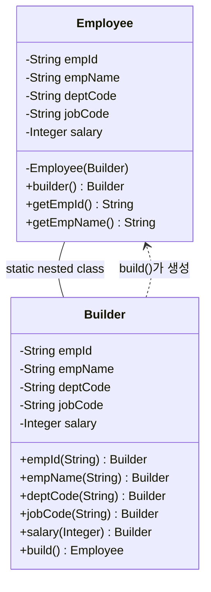
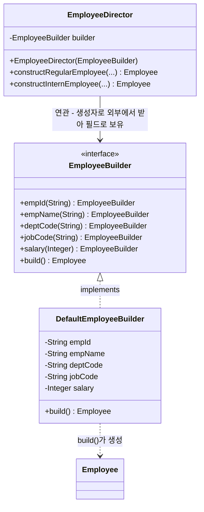

# 빌더(Builder) 패턴

**학습 대상**: 자바 클래스/생성자/인터페이스/상속을 다뤄본 초·중급자 (지난 시간 `Employee` 클래스 실습 이어서 진행, `01_GoF디자인패턴.md`에서 클래스 다이어그램 표기법 학습 완료)
**학습 목표**: 생성자 파라미터가 많을 때 생기는 문제를 이해하고, 빌더 패턴을 (1) 이너클래스 방식과 (2) 인터페이스·상속 기반 GoF 원조 방식 두 가지로 직접 구현한 뒤, Lombok `@Builder`로 자동화하는 방법까지 익힌다
**예상 소요 시간**: 90~120분

---

## 0. 학습 순서

1. 문제 상황: 생성자 파라미터가 많으면 왜 괴로운가
2. 대안 1 - Setter + 기본 생성자의 한계
3. 대안 2 - 빌더 패턴 직접 구현하기 (이너클래스 방식)
4. 다른 구현 방식 - 인터페이스와 상속(구현체)으로 만들기 (GoF 원조 스타일)
5. 빌더 패턴이 해결한 것 정리
6. Lombok `@Builder`로 자동화하기
7. 언제 빌더 패턴을 쓰고, 언제 안 써도 되는가
8. 실습 과제

---

## 1. 문제 상황: 생성자 파라미터가 많으면 왜 괴로운가

지난 시간에 만든 `Employee` 클래스를 다시 봅시다.

```java
public Employee(String empId, String empName, String empNo, String email, String phone,
                 String deptCode, String jobCode, Integer salary, BigDecimal bonus,
                 String managerId, LocalDate hireDate, LocalDate entDate, String entYn) {
    ...
}
```

파라미터가 **13개**입니다. 이 생성자를 호출하는 코드를 상상해보세요.

```java
Employee emp = new Employee("223", "홍길동", "900101-1234567", "hong@abc.or.kr", "01012345678",
        "D1", "J7", 3000000, null, "200", LocalDate.of(2024, 1, 2), null, "N");
```

이 코드를 처음 보는 사람이 다섯 번째 인자 `"01012345678"`이 전화번호인지, `"D1"`이 부서인지 직급인지 한눈에 알 수 있을까요? **순서를 착각해서 `deptCode`와 `jobCode` 자리를 바꿔 넣어도 컴파일 에러가 나지 않습니다.** 둘 다 `String` 타입이기 때문이죠. 이게 이번 시간에 풀어야 할 핵심 문제입니다.

이런 생성자를 **"텔레스코핑 생성자(Telescoping Constructor)"**라고 부릅니다. 망원경을 접었다 펼치듯, 파라미터 몇 개짜리 생성자를 계속 오버로딩해서 늘려가는 방식에서 유래한 이름입니다.

```java
// 파라미터 조합별로 생성자를 계속 늘려가는 안티 패턴 예시
public Employee(String empId, String empName) { ... }
public Employee(String empId, String empName, String deptCode) { ... }
public Employee(String empId, String empName, String deptCode, String jobCode) { ... }
public Employee(String empId, String empName, String deptCode, String jobCode, Integer salary) { ... }
// ... 조합이 늘어날수록 생성자 개수가 기하급수적으로 증가
```

---

## 2. 대안 1: Setter + 기본 생성자 — 왜 완전한 해결책이 아닌가

"그럼 기본 생성자 하나 두고, 필드마다 setter로 값을 채우면 되지 않나요?"라는 생각이 들 수 있습니다.

```java
Employee emp = new Employee();
emp.setEmpId("223");
emp.setEmpName("홍길동");
emp.setDeptCode("D1");
emp.setJobCode("J7");
// ...
```

가독성은 좋아졌지만 두 가지 문제가 남습니다.

| 문제 | 설명 |
|---|---|
| **불변(immutable) 객체를 만들 수 없다** | setter가 있으면 객체 생성 이후에도 누구나 값을 바꿀 수 있음 → 의도치 않은 변경(버그) 위험 |
| **필수 값 누락 감지 불가** | `empId`나 `empName`처럼 반드시 있어야 하는 값을 안 넣어도, 컴파일도 되고 실행도 됨 → NULL 상태로 여기저기 돌아다니다가 나중에 엉뚱한 곳에서 에러 발생 |

지난 시간 `Employee` 클래스는 일부러 필드를 `final`로 선언했었죠. 그건 "한번 만들어진 사원 정보는 바뀌지 않는다"는 의도였는데, setter 방식은 그 의도를 깨버립니다.

---

## 3. 대안 2: 빌더 패턴 직접 구현하기

빌더 패턴은 위 두 문제를 모두 해결합니다. **"객체를 조립하는 전용 객체(Builder)를 따로 만들어서, 필드 이름이 드러나는 메서드 체이닝으로 값을 채우고, 마지막에 `build()`로 완성된 불변 객체를 만든다"**는 아이디어입니다.

### 3-1. 완성된 사용 코드부터 보기

```java
Employee emp = Employee.builder()
        .empId("223")
        .empName("홍길동")
        .empNo("900101-1234567")
        .email("hong@abc.or.kr")
        .phone("01012345678")
        .deptCode("D1")
        .jobCode("J7")
        .salary(3000000)
        .managerId("200")
        .hireDate(LocalDate.of(2024, 1, 2))
        .entYn("N")
        .build();
```

- `.bonus(...)`와 `.entDate(...)`처럼 값이 없는 항목은 아예 호출을 생략할 수 있습니다.
- 어떤 메서드가 어떤 값을 채우는지 이름으로 바로 보입니다.
- 순서를 바꿔 써도 됩니다 (`empName()`을 먼저 부르든 나중에 부르든 결과는 같음).

### 3-2. 직접 구현하기

빌더 패턴은 보통 **정적 내부 클래스(static nested class)**로 구현합니다. 아래는 `Employee`에 적용한 예시입니다. (전체 코드는 첨부된 `Employee.java` 참고)

```java
public class Employee {

    private final String empId;
    private final String empName;
    private final String deptCode;
    private final String jobCode;
    private final Integer salary;
    // ... 나머지 필드 생략

    // 1) 생성자를 private으로 막는다 → 외부에서는 new Employee(...)로 못 만들게
    private Employee(Builder builder) {
        this.empId = builder.empId;
        this.empName = builder.empName;
        this.deptCode = builder.deptCode;
        this.jobCode = builder.jobCode;
        this.salary = builder.salary;
        // ...
    }

    // 2) 빌더를 시작하는 정적 메서드
    public static Builder builder() {
        return new Builder();
    }

    // 3) 내부 정적 클래스 Builder
    public static class Builder {
        private String empId;
        private String empName;
        private String deptCode;
        private String jobCode;
        private Integer salary;
        // ...

        public Builder empId(String empId) {
            this.empId = empId;
            return this;          // ★ 자기 자신을 반환해야 메서드 체이닝이 가능하다
        }

        public Builder empName(String empName) {
            this.empName = empName;
            return this;
        }

        public Builder deptCode(String deptCode) {
            this.deptCode = deptCode;
            return this;
        }

        public Builder jobCode(String jobCode) {
            this.jobCode = jobCode;
            return this;
        }

        public Builder salary(Integer salary) {
            this.salary = salary;
            return this;
        }

        // 4) build()에서 최종 검증 후 진짜 객체를 생성
        public Employee build() {
            if (empId == null || empName == null) {
                throw new IllegalStateException("empId와 empName은 필수입니다.");
            }
            return new Employee(this);
        }
    }
}
```

**코드에서 눈여겨볼 4가지**:

| 번호 | 포인트 | 왜 중요한가 |
|---|---|---|
| 1 | `Employee`의 생성자를 `private`으로 막음 | `new Employee(...)`로 직접 못 만들게 해서, 반드시 `builder()`를 거치도록 강제 |
| 2 | `builder()` 정적 메서드로 시작점 제공 | `Employee.builder()`처럼 자연스러운 진입점 |
| 3 | 각 세터 메서드가 `this`(Builder 자신)를 반환 | 이게 바로 `.empId(...).empName(...)` 체이닝이 가능한 이유 |
| 4 | `build()`에서 필수값 검증 | setter 방식과 달리 "필수 값 누락"을 여기서 잡아낼 수 있음 |

### 3-3. 클래스 다이어그램으로 보기

`01_GoF디자인패턴.md`에서 배운 표기법으로 위 구조를 그리면 다음과 같습니다. `Builder`가 `Employee`의 **정적 내부 클래스(static nested class)**라는 점, 그리고 `build()`가 `Employee`를 만들어서 돌려준다는 의존 관계가 핵심입니다.



- `Employee -- Builder` (화살표 없는 실선) : `Builder`가 `Employee` 안에 정의된 정적 내부 클래스라는 뜻입니다. (자바의 "정적 내부 클래스"는 표준 UML 관계가 아니라서, 단순 연결선에 라벨을 붙여 표시합니다.)
- `Builder ..> Employee` : `Builder`가 `Employee`를 사용(생성)한다는 의존 관계입니다. `build()` 메서드 안에서만 잠깐 `new Employee(this)`로 생성되죠.
- 모든 세터 메서드의 반환 타입이 `Builder`인 것도 다이어그램에 그대로 드러납니다. 이게 바로 메서드 체이닝(`.empId(...).empName(...)`)이 가능한 이유입니다.

---

## 4. 다른 구현 방식 - 인터페이스와 상속(구현체)으로 만들기 (GoF 원조 스타일)

지금까지 만든 방식은 **`Builder`를 `Employee`의 정적 내부 클래스로 두고, 메서드 체이닝으로 값을 채우는 방식**이었습니다. 이는 Joshua Bloch가 『Effective Java』에서 제안한 방식으로, 실무와 Lombok이 채택한 "사실상 표준"입니다.

하지만 1994년 GoF 책에 나온 **원조 빌더 패턴**은 조금 다릅니다. 이너클래스 없이, **인터페이스(`Builder`)와 그 구현체(`ConcreteBuilder`), 그리고 조립 순서를 지휘하는 `Director`**로 역할을 나눕니다.

### 4-1. 원조 방식이 다루는 문제

GoF 원조 빌더 패턴은 "필드가 많다"는 문제보다 **"같은 조립 절차로, 서로 다른 구현체를 이용해 완전히 다른 결과물을 만들고 싶다"**는 문제에 초점을 맞춥니다. 예를 들어 "정규직 사원을 만드는 절차"는 항상 같은데, 그 절차를 수행하는 `Builder` 구현체를 DB 저장용/JSON 변환용 등으로 바꿔 끼울 수 있다면 어떨까요? 이게 인터페이스로 분리하는 이유입니다.

역할을 정리하면:

| 역할 | 의미 | 이번 예제 |
|---|---|---|
| **Product** | 최종적으로 만들어지는 객체 | `Employee` |
| **Builder** (인터페이스) | Product를 조립하는 데 필요한 단계(메서드)를 선언 | `EmployeeBuilder` |
| **ConcreteBuilder** | `Builder`를 구현해서 실제로 값을 채우고 Product를 완성 | `DefaultEmployeeBuilder` |
| **Director** | `Builder`의 메서드를 "어떤 순서로, 어떤 값으로" 호출할지 아는 지휘자. 조립 절차(레시피) 자체를 캡슐화 | `EmployeeDirector` |

### 4-2. 코드로 보기

(전체 코드는 첨부된 `EmployeeGofBuilder.java` 참고)

```java
// 1) Builder 인터페이스 — "무엇을 조립할 수 있는지"만 선언
// (아래 세 타입은 EmployeeGofBuilder.java 한 파일 안에 public 없이 함께 선언됨)
interface EmployeeBuilder {
    EmployeeBuilder empId(String empId);
    EmployeeBuilder empName(String empName);
    EmployeeBuilder deptCode(String deptCode);
    EmployeeBuilder jobCode(String jobCode);
    EmployeeBuilder salary(Integer salary);
    Employee build();
}

// 2) ConcreteBuilder — 인터페이스를 구현(implements)해서 실제로 값을 채움
class DefaultEmployeeBuilder implements EmployeeBuilder {
    private String empId;
    private String empName;
    private String deptCode;
    private String jobCode;
    private Integer salary;

    @Override
    public EmployeeBuilder empId(String empId) { this.empId = empId; return this; }
    @Override
    public EmployeeBuilder empName(String empName) { this.empName = empName; return this; }
    @Override
    public EmployeeBuilder deptCode(String deptCode) { this.deptCode = deptCode; return this; }
    @Override
    public EmployeeBuilder jobCode(String jobCode) { this.jobCode = jobCode; return this; }
    @Override
    public EmployeeBuilder salary(Integer salary) { this.salary = salary; return this; }

    @Override
    public Employee build() {
        if (empId == null || empName == null) {
            throw new IllegalStateException("empId와 empName은 필수입니다.");
        }
        return new Employee(empId, empName, deptCode, jobCode, salary);
    }
}

// 3) Director — 조립 "레시피"를 알고 있는 지휘자
class EmployeeDirector {
    private final EmployeeBuilder builder;

    public EmployeeDirector(EmployeeBuilder builder) {
        this.builder = builder;
    }

    // 레시피 1: 정규직 사원 — 부서/직급/급여가 모두 채워짐
    public Employee constructRegularEmployee(String empId, String empName, String deptCode, Integer salary) {
        return builder.empId(empId)
                .empName(empName)
                .deptCode(deptCode)
                .jobCode("J1")
                .salary(salary)
                .build();
    }

    // 레시피 2: 인턴 사원 — 직급/급여는 회사 규정상 항상 고정값
    public Employee constructInternEmployee(String empId, String empName, String deptCode) {
        return builder.empId(empId)
                .empName(empName)
                .deptCode(deptCode)
                .jobCode("J9")
                .salary(null)
                .build();
    }
}
```

```java
// 4) 사용하는 쪽 (Client) 코드
EmployeeBuilder builder = new DefaultEmployeeBuilder();
EmployeeDirector director = new EmployeeDirector(builder);

Employee regular = director.constructRegularEmployee("223", "홍길동", "D1", 3000000);
Employee intern = director.constructInternEmployee("310", "김인턴", "D2");
```

Director 덕분에 클라이언트는 "인턴 사원은 jobCode가 J9이고 salary가 null이어야 한다"는 규칙을 몰라도 됩니다. 그 규칙(레시피)은 `EmployeeDirector` 안에 캡슐화되어 있고, 다른 `EmployeeBuilder` 구현체로 갈아 끼워도 같은 레시피가 그대로 재사용됩니다.

### 4-3. 클래스 다이어그램으로 보기



3-3의 다이어그램과 비교해보세요. 가장 큰 차이는 `Builder`가 **`<<interface>>`**로 바뀌었고, `Employee`와 나란히 별도 클래스로 존재하는 `EmployeeDirector`가 추가되었다는 점입니다. `EmployeeBuilder <|.. DefaultEmployeeBuilder`(점선+속이 빈 삼각형)는 "구현(implements)" 관계를 뜻합니다 — 3-3의 `--`(정적 내부 클래스, 화살표 없는 단순 연결)와는 완전히 다른 관계입니다. `EmployeeDirector --> EmployeeBuilder`는 `EmployeeDirector`가 생성자로 `EmployeeBuilder`를 외부에서 받아 필드로 들고 있을 뿐(직접 `new`하지 않음), "전체-부분" 관계가 아니므로 집합이 아니라 **연관**입니다.

### 4-4. 이너클래스 방식 vs 인터페이스·상속 방식

| 비교 항목 | 이너클래스 + 체이닝 (Joshua Bloch) | 인터페이스 + Director (GoF 원조) |
|---|---|---|
| 클래스/파일 개수 | 1개 (`Employee` 안에 `Builder` 포함) | 4개 (`Employee`, `EmployeeBuilder`, `DefaultEmployeeBuilder`, `EmployeeDirector`) |
| 코드량(보일러플레이트) | 적음 | 많음 (인터페이스 선언 + 구현체 오버라이드가 중복) |
| Builder 구현체 교체 | 불가능 (`Builder`는 `Employee`에 고정) | 가능 (`EmployeeBuilder`를 구현하는 다른 클래스로 교체 가능) |
| 조립 절차(레시피) 재사용 | 호출하는 쪽 코드에서 매번 직접 나열 | `Director`에 캡슐화되어 여러 곳에서 재사용 |
| Lombok `@Builder` 지원 | ⭕ (바로 대응) | ❌ (Lombok은 이 방식을 자동 생성해주지 않음) |
| 실무에서의 비중 | 압도적으로 많음 | 드묾 — Builder 구현체가 실제로 여러 개 필요한 경우(예: 문서를 HTML/PDF 등 여러 포맷으로 만드는 경우)에만 |

> 💡 **결론**: 우리가 6장에서 Lombok으로 자동화할 대상은 **이너클래스 방식**입니다. 인터페이스·상속 방식은 "GoF 책의 원조 구조를 눈으로 확인해보고, 실무에서 왜 더 가벼운 이너클래스 방식이 표준이 되었는지"를 이해하기 위한 비교 대상으로 기억해두세요.

---

## 5. 빌더 패턴이 해결한 것 정리

| 문제 | 텔레스코핑 생성자 | Setter 방식 | 빌더 패턴 |
|---|---|---|---|
| 가독성 (어떤 값이 뭔지 알기 쉬움) | ❌ | ⭕ | ⭕ |
| 파라미터 순서 실수 방지 | ❌ | ⭕ | ⭕ |
| 불변 객체 생성 가능 | ⭕ | ❌ | ⭕ |
| 선택적 값 자유롭게 생략 | ❌ (조합별 생성자 필요) | ⭕ | ⭕ |
| 필수 값 누락을 생성 시점에 검증 | ⭕ (파라미터라 강제됨) | ❌ | ⭕ (`build()`에서 검증) |

빌더 패턴이 표에서 전부 ⭕를 받은 게 보이시나요? 대신 치러야 하는 비용은 **"보일러플레이트(반복적인 뼈대) 코드가 늘어난다"**는 점입니다. 필드가 13개면 세터 메서드도 13개를 다 만들어야 하니까요. 이 단점을 해결해주는 게 다음 단계의 Lombok입니다.

---

## 6. Lombok `@Builder`로 자동화하기

지난 시간에 VS Code에 Lombok 설정하는 법을 다뤘었죠. 이제 실제로 써볼 차례입니다.

```java
import lombok.Builder;
import lombok.Getter;

import java.math.BigDecimal;
import java.time.LocalDate;

@Getter
@Builder
public class EmployeeLombokBuilder {
    private final String empId;
    private final String empName;
    private final String empNo;
    private final String email;
    private final String phone;
    private final String deptCode;
    private final String jobCode;
    private final Integer salary;
    private final BigDecimal bonus;
    private final String managerId;
    private final LocalDate hireDate;
    private final LocalDate entDate;
    private final String entYn;
}
```

**끝입니다.** 클래스 위에 `@Builder` 어노테이션 하나만 붙이면, 컴파일 시점에 Lombok이 3장에서 우리가 직접 타이핑했던 `Builder` 내부 클래스, `builder()` 메서드, 모든 세터 메서드, `build()` 메서드를 **자동으로 생성**해줍니다. 사용하는 쪽 코드는 3-1에서 본 것과 완전히 동일합니다.

```java
EmployeeLombokBuilder emp = EmployeeLombokBuilder.builder()
        .empId("223")
        .empName("홍길동")
        .deptCode("D1")
        .jobCode("J7")
        .salary(3000000)
        .hireDate(LocalDate.of(2024, 1, 2))
        .entYn("N")
        .build();
```

> 💡 **직접 구현부터 배운 이유**: Lombok이 뒤에서 뭘 만들어주는지 모르고 어노테이션만 외우면, 나중에 필수값 검증(`@NonNull`)이나 빌더 커스터마이징이 필요할 때 원리를 몰라 헤매게 됩니다. 3장에서 손으로 만들어본 구조가 바로 Lombok이 자동 생성하는 코드의 정체입니다.

### 6-1. 필수값 검증 추가하기

수동 구현에서는 `build()` 안에서 직접 `if`문으로 검증했죠. Lombok에서는 `@NonNull`을 필드에 붙이면 됩니다.

```java
@Getter
@Builder
public class Employee {
    @NonNull
    private final String empId;
    @NonNull
    private final String empName;
    // ... 나머지 필드
}
```

이제 `empId`나 `empName` 없이 `.build()`를 호출하면 `NullPointerException`이 발생합니다.

---

## 7. 언제 빌더 패턴을 쓰고, 언제 안 써도 되는가

빌더 패턴이 항상 정답은 아닙니다. 아래 기준으로 판단하세요.

**빌더 패턴이 잘 맞는 경우**:
- 필드가 4개 이상이고, 그중 상당수가 선택적(optional)인 경우 — 오늘 실습한 `Employee`가 정확히 이 경우입니다 (`bonus`, `managerId`, `entDate` 등이 선택적)
- 객체를 불변으로 유지하고 싶은 경우
- 생성 시점에 값이 여러 곳(여러 줄의 코드)에 걸쳐 조립되는 경우

**빌더 패턴이 과한 경우**:
- 필드가 2~3개뿐이고 대부분 필수값인 경우 → 그냥 생성자로 충분
- DTO/VO가 아니라 동작(메서드)이 중심인 클래스인 경우

> 실무 팁: Lombok 덕분에 비용이 거의 0에 가까워졌기 때문에, 요즘은 필드가 4개만 넘어가도 `@Builder`를 붙이는 경우가 흔합니다. 다만 "이 객체가 정말 조립식으로 만들어져야 하는가"는 한 번쯤 생각해보는 게 좋습니다.

---

## 8. 실습 과제

1. 첨부된 `Employee.java`를 열어서, 3장 코드가 실제로 어떻게 동작하는지 직접 실행해보세요. `build()`에서 `empId`를 빼고 호출하면 어떤 에러가 나는지 확인하세요.
2. 첨부된 `EmployeeGofBuilder.java`를 열어서, `EmployeeDirector`의 `constructRegularEmployee()`와 `constructInternEmployee()`를 각각 호출해보고 결과를 비교하세요. `EmployeeBuilder` 인터페이스에 새 구현체(예: 콘솔에 로그를 남기는 `LoggingEmployeeBuilder`)를 하나 더 만들어 `EmployeeDirector`에 꽂아보고, `Director` 코드를 한 줄도 안 고쳐도 되는지 확인하세요.
3. 같은 결과를 `EmployeeLombokBuilder.java`(Lombok 버전)로 다시 만들어보고, `Employee.java` / `EmployeeGofBuilder.java` / `EmployeeLombokBuilder.java` 세 코드의 줄 수와 클래스 개수를 비교해보세요.
4. **심화**: `EMPLOYEE` 테이블 대신 `DEPARTMENT` 테이블(부서코드, 부서명, 지역코드)을 위한 `Department` 클래스를 빌더 패턴으로 직접 만들어보세요. 필드가 3개뿐인데도 빌더가 필요할지, 필요하다면 이너클래스 방식과 인터페이스 방식 중 어느 쪽이 적합할지 스스로 판단해보는 것이 이번 과제의 핵심입니다.

