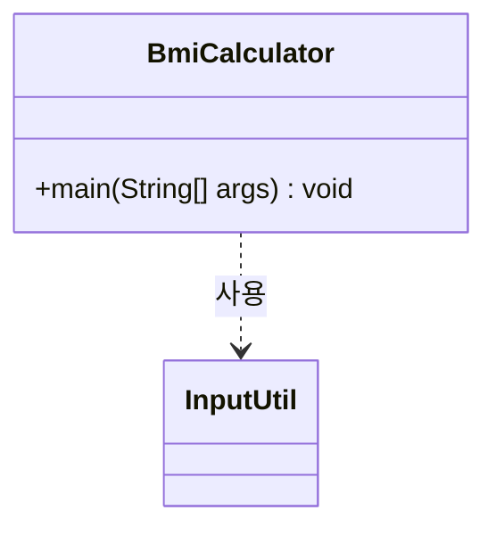
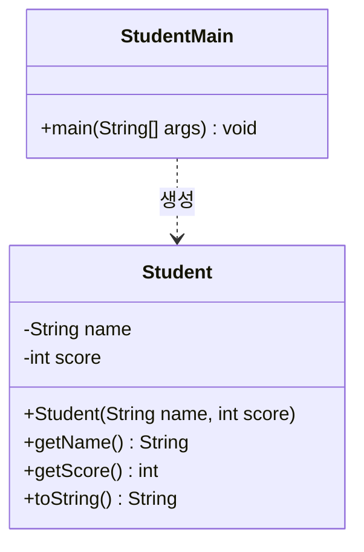
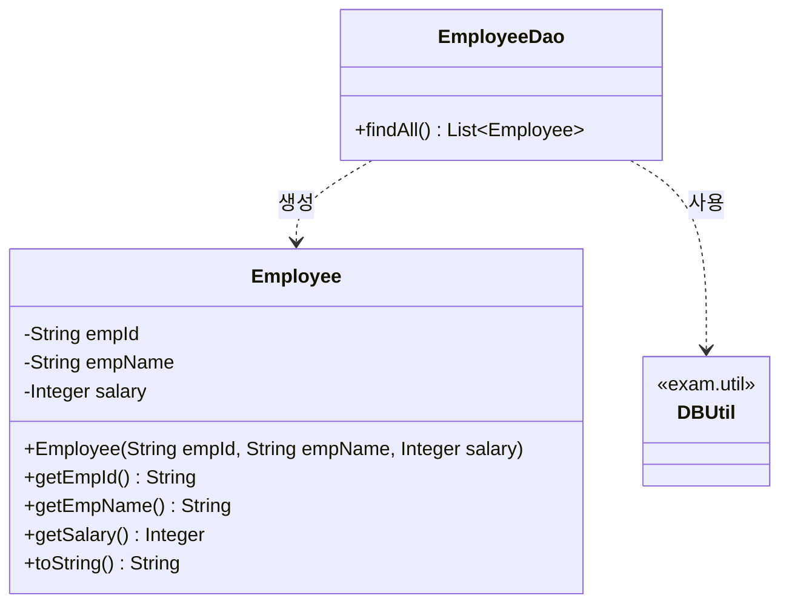
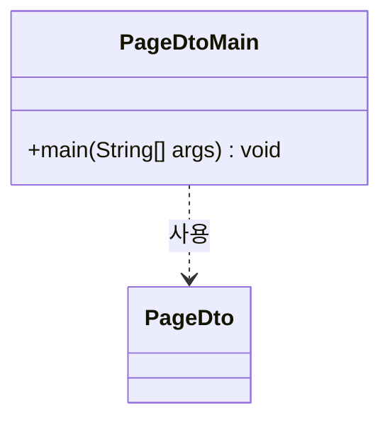

# 자바 과정 최종 평가 - 실기시험

| 항목 | 내용 |
|---|---|
| 배점 | 50점 (필기 50점과 합산 시 100점) |
| 형식 | 새 프로젝트를 하나 생성하여, 아래 5개 문제를 순서대로 진행하는 미니 프로젝트 |

> 각 문제는 시도한 부분까지 부분점수를 인정합니다.
> 클래스 다이어그램에 제시된 클래스명·메서드명·시그니처를 그대로 사용하세요.
> `DBUtil.java`, `InputUtil.java`, `PageDto.java`는 시험 안내 메일에 첨부되어 있습니다. 첨부 파일을 다운로드하여 사용하세요.
> **제출 방법**: 문제별로 프로그램을 실행한 결과 화면을 캡처하고, 프로젝트 전체를 압축(zip)하여 캡처 이미지와 함께 아래 이메일로 제출하세요.
> - momo.class5@gmail.com

---

## 문제 1. (5점) 프로젝트 및 패키지 생성

아래 이름으로 자바 프로젝트와 패키지를 생성하시오.

- 프로젝트명: `JavaFinalExam`
- 패키지명: `exam`

또한 `exam.util` 패키지를 만들고, 별도로 제공되는 `DBUtil.java`, `InputUtil.java` 파일을 그대로 복사하여 준비해두시오. (이후 문제에서 재사용합니다)

- 프로젝트가 정상적으로 생성되어 컴파일/실행이 가능할 것
- 문제 2~6에서 작성하는 클래스는 `exam` 패키지에, `DBUtil`/`InputUtil`은 `exam.util` 패키지에 소속될 것

---

## 문제 2. (20점) BMI 계산기

새 프로젝트에서 `InputUtil`(문제1에서 준비)로 사용자로부터 키와 몸무게(kg)를 입력받아 BMI 지수를 구하고, 아래 기준에 따라 판정 결과를 출력하는 프로그램을 작성하시오. (5점)

- BMI 계산식: `BMI = 몸무게(kg) / (키(m) × 키(m))`

| BMI 범위 | 판정 |
|---|---|
| BMI < 18.5 | 저체중 |
| 18.5 ≤ BMI < 23 | 정상 |
| 23 ≤ BMI < 25 | 과체중 |
| 25 ≤ BMI < 30 | 비만 |
| BMI ≥ 30 | 고도비만 |

또한, 한 번 계산하고 끝나는 것이 아니라 계산이 끝날 때마다 **"계속 하시겠습니까? (y/n)"**를 물어보고, **`y`를 입력하면 처음부터 반복**하고 그 외 값을 입력하면 프로그램이 종료되도록 작성하시오. (5점)

마지막으로, 키 입력값이 **100을 넘으면 cm 단위로 간주**하여 100으로 나눠 m로 환산하고, **100 이하이면 이미 m 단위**로 간주하여 그대로 계산하도록 작성하시오. (예: `170` 입력 → `1.7m`로 환산, `1.7` 입력 → `1.7m` 그대로 사용) (5점)



**실행 예시**
```
키를 입력하세요 (cm 또는 m): 170
몸무게(kg)를 입력하세요: 65
BMI: 22.49
판정: 정상
계속 하시겠습니까? (y/n): y

키를 입력하세요 (cm 또는 m): 1.6
몸무게(kg)를 입력하세요: 80
BMI: 31.25
판정: 고도비만
계속 하시겠습니까? (y/n): n
프로그램을 종료합니다.
```

---

## 문제 3. (10점) 학생 클래스와 리스트

이름과 점수를 필드로 갖는 `Student` 클래스를 아래 클래스 다이어그램대로 정의하시오. `toString()`을 아래 형식대로 재정의하고, `StudentMain`에서 3명의 학생 객체를 생성하여 `List<Student>`에 담은 뒤 `toString()`으로 출력하시오. (이름과 점수는 자유롭게 정할 것)

- `toString()` 형식: `이름: 홍길동, 점수: 90`



- `StudentMain.main()`에서 서로 다른 학생 3명을 생성해 `List<Student>`에 담고, 각 학생을 `toString()`으로 출력할 것

---

## 문제 4. (10점) 사원 목록 조회

`Employee` 클래스와, 문제 1에서 준비한 `exam.util.DBUtil`을 사용하는 `EmployeeDao`를 아래 클래스 다이어그램대로 작성하여, MySQL의 `HR` 데이터베이스 `EMPLOYEE` 테이블에서 사번·이름·급여를 조회해 `List<Employee>`에 담아 콘솔에 출력하시오.

- `Employee.toString()` 형식: `사번: 200, 이름: 선동일, 급여: 8000000`



- `EmployeeDao.findAll()`은 `EMPLOYEE` 테이블에서 `EMP_ID`, `EMP_NAME`, `SALARY` 컬럼만 `PreparedStatement`로 조회할 것
- `try-with-resources`로 `Connection`/`PreparedStatement`/`ResultSet`을 자동 해제할 것

---

## 문제 5. (5점) 페이지 네비게이션 출력

별도로 제공되는 `PageDto.java`를 `exam` 패키지에 복사(패키지 선언을 `exam`으로 수정)하고, 총 게시물 건수가 **130건**이고 사용자가 **5페이지**를 요청했을 때의 결과를 출력하는 `PageDtoMain`을 작성하시오. (페이지당 게시물 수 10건, 페이지블럭당 페이지 수 5건은 `PageDto`에 이미 설정되어 있음)



- `PageDtoMain.main()`에서 `new PageDto(5, 130)`으로 객체를 생성하고, 결과를 출력할 것

---

수고하셨습니다. 답안지를 제출하세요.
