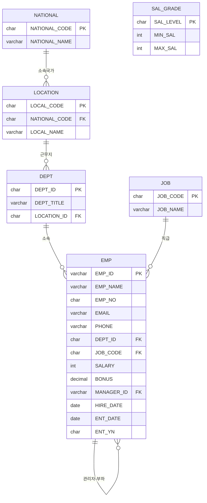

# 공통 실습 데이터 (MySQL)

> 이 스크립트는 4개 챕터(DQL/함수/JOIN/SUBQUERY)에서 공통으로 사용합니다.
> MySQL 문법 기준으로 작성했습니다. (사원명 21명, 생년월일 1980~2005년, 입사일 2013년 이후)

## 1. 실습 스키마 준비

MySQL에서는 "스키마 = 데이터베이스"입니다. 아래처럼 실습용 데이터베이스를 하나 만들고
그 안에서 작업합니다.

```sql
CREATE DATABASE 데이터베이스명;
USE 데이터베이스명;
```

## 2. ERD (테이블 구조)



> `SAL_GRADE`는 다른 테이블과 FK로 연결되어 있지 않습니다. `EMP.SALARY`가 어느
> `MIN_SAL`~`MAX_SAL` 구간에 속하는지로만 연결되는 테이블이라, JOIN 챕터의 **비동등 조인**
> (`BETWEEN`으로 연결하는 조인) 실습에 사용됩니다.

## 3. 생성 스크립트

```sql
DROP TABLE IF EXISTS EMP;
DROP TABLE IF EXISTS DEPT;
DROP TABLE IF EXISTS JOB;
DROP TABLE IF EXISTS LOCATION;
DROP TABLE IF EXISTS NATIONAL;
DROP TABLE IF EXISTS SAL_GRADE;

CREATE TABLE DEPT (
    DEPT_ID     CHAR(2),
    DEPT_TITLE  VARCHAR(35),
    LOCATION_ID CHAR(2)
);

CREATE TABLE JOB (
    JOB_CODE CHAR(2),
    JOB_NAME VARCHAR(35)
);

CREATE TABLE LOCATION (
    LOCAL_CODE    CHAR(2),
    NATIONAL_CODE CHAR(2),
    LOCAL_NAME    VARCHAR(40)
);

CREATE TABLE NATIONAL (
    NATIONAL_CODE CHAR(2),
    NATIONAL_NAME VARCHAR(35)
);

CREATE TABLE SAL_GRADE (
    SAL_LEVEL CHAR(2),
    MIN_SAL   INT,
    MAX_SAL   INT
);

CREATE TABLE EMP (
    EMP_ID     VARCHAR(3),
    EMP_NAME   VARCHAR(20),
    EMP_NO     CHAR(14),
    EMAIL      VARCHAR(25),
    PHONE      VARCHAR(12),
    DEPT_ID    CHAR(2),
    JOB_CODE   CHAR(2),
    SALARY     INT,
    BONUS      DECIMAL(4,2),
    MANAGER_ID VARCHAR(3),
    HIRE_DATE  DATE,
    ENT_DATE   DATE,
    ENT_YN     CHAR(1) DEFAULT 'N'
);
```

## 4. 데이터 입력

```sql
-- DEPT
INSERT INTO DEPT VALUES ('D1', '인사관리부', 'L1');
INSERT INTO DEPT VALUES ('D2', '회계관리부', 'L1');
INSERT INTO DEPT VALUES ('D3', '마케팅부', 'L1');
INSERT INTO DEPT VALUES ('D4', '국내영업부', 'L1');
INSERT INTO DEPT VALUES ('D5', '해외영업1부', 'L2');
INSERT INTO DEPT VALUES ('D6', '해외영업2부', 'L3');
INSERT INTO DEPT VALUES ('D7', '해외영업3부', 'L4');
INSERT INTO DEPT VALUES ('D8', '기술지원부', 'L5');
INSERT INTO DEPT VALUES ('D9', '총무부', 'L1');

-- JOB
INSERT INTO JOB VALUES ('J1', '대표');
INSERT INTO JOB VALUES ('J2', '부사장');
INSERT INTO JOB VALUES ('J3', '부장');
INSERT INTO JOB VALUES ('J4', '차장');
INSERT INTO JOB VALUES ('J5', '과장');
INSERT INTO JOB VALUES ('J6', '대리');
INSERT INTO JOB VALUES ('J7', '사원');

-- LOCATION
INSERT INTO LOCATION VALUES ('L1', 'KO', 'ASIA1');
INSERT INTO LOCATION VALUES ('L2', 'JP', 'ASIA2');
INSERT INTO LOCATION VALUES ('L3', 'CH', 'ASIA3');
INSERT INTO LOCATION VALUES ('L4', 'US', 'AMERICA');
INSERT INTO LOCATION VALUES ('L5', 'RU', 'EU');

-- NATIONAL
INSERT INTO NATIONAL VALUES ('KO', '한국');
INSERT INTO NATIONAL VALUES ('JP', '일본');
INSERT INTO NATIONAL VALUES ('CH', '중국');
INSERT INTO NATIONAL VALUES ('US', '미국');
INSERT INTO NATIONAL VALUES ('RU', '러시아');

-- SAL_GRADE
INSERT INTO SAL_GRADE VALUES ('S1', 6000000, 10000000);
INSERT INTO SAL_GRADE VALUES ('S2', 5000000, 5999999);
INSERT INTO SAL_GRADE VALUES ('S3', 4000000, 4999999);
INSERT INTO SAL_GRADE VALUES ('S4', 3000000, 3999999);
INSERT INTO SAL_GRADE VALUES ('S5', 2000000, 2999999);
INSERT INTO SAL_GRADE VALUES ('S6', 1000000, 1999999);

-- EMP (21명 / 생년월일 1980~2005년 / 입사일 2013년 이후)
INSERT INTO EMP VALUES ('200', '곽상혁', '800514-1234567', 'kwak_sh@company.com', '01099546325', 'D9', 'J1', 8000000, 0.30, NULL,  '2013-03-02', NULL, 'N');
INSERT INTO EMP VALUES ('201', '권진우', '820622-1345678', 'kwon_jw@company.com', '01045686656', 'D9', 'J2', 6000000, NULL, '200', '2013-09-15', NULL, 'N');
INSERT INTO EMP VALUES ('202', '김민혜', '850311-2456789', 'kim_mh@company.com', '01066656263', 'D9', 'J2', 3700000, NULL, '201', '2014-02-10', NULL, 'N');
INSERT INTO EMP VALUES ('203', '김은민', '830728-2567890', 'kim_em@company.com', '01077607879', 'D6', 'J3', 3400000, 0.20, '200', '2014-07-01', NULL, 'N');
INSERT INTO EMP VALUES ('204', '김태일', '860919-1678901', 'kim_ti@company.com', '01099999129', 'D6', 'J3', 3900000, NULL, '203', '2014-11-11', NULL, 'N');
INSERT INTO EMP VALUES ('205', '박지민', '870405-2789012', 'park_jm@company.com', '01036654875', 'D5', 'J3', 3500000, 0.15, '200', '2015-05-20', NULL, 'N');
INSERT INTO EMP VALUES ('206', '염성원', '910213-1890123', 'yeom_sw@company.com', '01096935222', 'D5', 'J5', 2200000, 0.10, '205', '2017-06-07', NULL, 'N');
INSERT INTO EMP VALUES ('207', '유제영', '920830-1901234', 'yoo_jy@company.com', '01036654488', 'D5', 'J5', 2500000, NULL, '205', '2019-04-28', NULL, 'N');
INSERT INTO EMP VALUES ('208', '윤정주', '930117-2012345', 'yoon_jj@company.com', '01078634444', 'D5', 'J5', 3760000, NULL, '205', '2019-12-23', NULL, 'N');
INSERT INTO EMP VALUES ('209', '최주호', '990625-1123456', 'choi_jh@company.com', '01013654485', 'D5', 'J7', 1800000, NULL, '206', '2022-04-02', NULL, 'N');
INSERT INTO EMP VALUES ('210', '이광렬', '940222-1234561', 'lee_gr@company.com', '01079964233', 'D8', 'J6', 2000000, NULL, '200', '2020-03-12', NULL, 'N');
INSERT INTO EMP VALUES ('211', '이금빈', '950809-2345671', 'lee_gb@company.com', '01044432222', 'D8', 'J6', 2550000, 0.25, '210', '2020-09-12', NULL, 'N');
INSERT INTO EMP VALUES ('212', '오미자', '001215-4456781', 'oh_mj@company.com', '01066682224', 'D8', 'J7', 2436240, 0.35, '210', '2021-11-28', '2025-09-12', 'Y');
INSERT INTO EMP VALUES ('213', '이다현', '960503-2567891', 'lee_dh@company.com', '01158456632', 'D1', 'J6', 2780000, 0.20, '200', '2021-02-03', NULL, 'N');
INSERT INTO EMP VALUES ('214', '전태성', '971118-1112233', 'jeon_ts@company.com', '01074127545', 'D1', 'J6', 3660000, 0.30, '213', '2021-06-17', NULL, 'N');
INSERT INTO EMP VALUES ('215', '한재헌', '010427-3223344', 'han_jh@company.com', '01088808584', 'D1', 'J7', 1380000, NULL, '213', '2024-04-04', NULL, 'N');
INSERT INTO EMP VALUES ('216', '박홍주', '880614-1334455', 'park_hj@company.com', NULL, 'D2', 'J4', 2800000, NULL, NULL, '2015-11-09', NULL, 'N');
INSERT INTO EMP VALUES ('217', '심재호', '890921-1445566', 'sim_jh@company.com', NULL, 'D2', 'J4', 1550000, NULL, NULL, '2016-09-09', NULL, 'N');
INSERT INTO EMP VALUES ('218', '엄용민', '900308-1556677', 'eom_ym@company.com', NULL, 'D2', 'J4', 2490000, NULL, NULL, '2017-03-20', NULL, 'N');
INSERT INTO EMP VALUES ('219', '조정원', '981225-1667788', 'jo_jw@company.com', '01096354221', NULL, 'J6', 2320000, 0.10, NULL, '2022-09-18', NULL, 'N');
INSERT INTO EMP VALUES ('220', '한규원', '000710-3778899', 'han_gw@company.com', '01087221093', NULL, 'J7', 2890000, NULL, NULL, '2023-03-01', NULL, 'N');
```

> MySQL은 `DATE` 컬럼에 `'YYYY-MM-DD'` 형식의 문자열을 그대로 대입하면 자동으로 날짜로
> 변환합니다. Oracle의 `TO_DATE(...)`처럼 별도 변환 함수를 쓰지 않아도 됩니다.

## 5. 데이터로 미리 확인해두면 좋은 특징 (실습에서 자주 활용)

| 특징 | 조건 | 해당 인원 |
|---|---|---|
| 부서가 배정되지 않음 | `DEPT_ID IS NULL` | 2명 |
| 관리자가 없음 | `MANAGER_ID IS NULL` | 6명 (대표 포함) |
| 보너스를 받지 않음 | `BONUS IS NULL` | 12명 |
| 퇴사자 | `ENT_YN = 'Y'` | 1명 |
| 같은 부서에 여러 직급 혼재 | 해외영업1부(D5) | 부장~사원 5명 |
| 급여 등급(SAL_GRADE) 구간에 걸쳐 분포 | 전체 | 21명 |

> 정확한 사원 목록은 강의 중 `SELECT * FROM EMP;`로 직접 확인하도록 유도하세요.
> (실습 문제의 답을 미리 노출하지 않기 위해 표에는 이름을 적지 않았습니다.)
