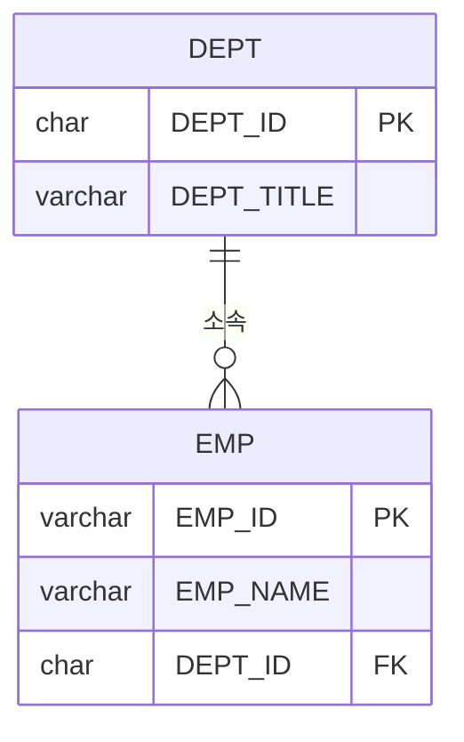
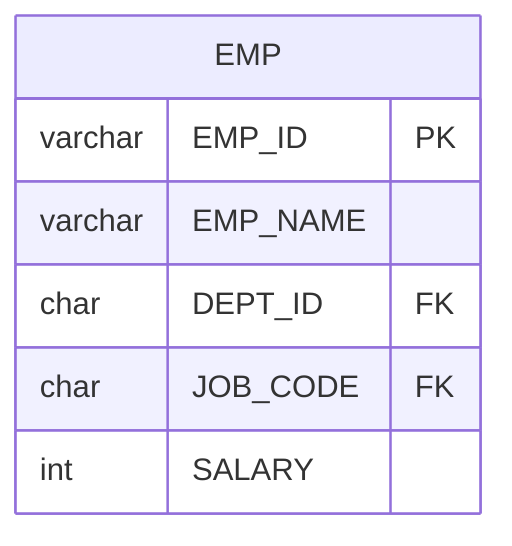
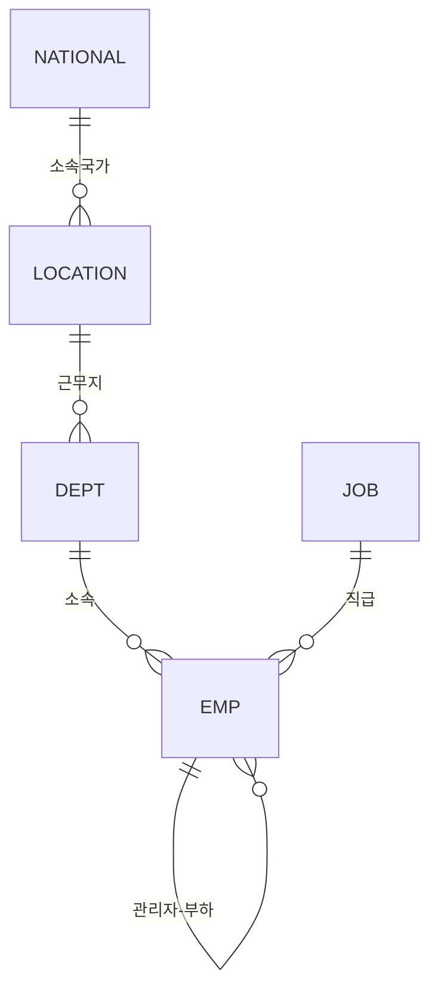

# ERD 읽는 법

| 항목 | 내용 |
|---|---|
| 선수 학습 | 없음 |
| 이번 자료 | `01_실습데이터.md`의 ERD를 스스로 해석할 수 있도록 표기법 정리 |
| 권장 시점 | Day 1 시작 전, 실습 데이터를 처음 보여줄 때 5~10분 |

## 학습목표
- ERD(개체-관계 다이어그램)가 무엇이고 왜 보는지 설명할 수 있다
- 개체(테이블) 박스 안의 컬럼명, 타입, `PK`/`FK` 표시를 읽을 수 있다
- 관계선의 까마귀발(crow's foot) 기호를 보고 "몇 대 몇 관계인지" 해석할 수 있다
- 우리 실습 데이터의 ERD(`01_실습데이터.md`)를 직접 해석할 수 있다

---

## 1. ERD란?

ERD(Entity-Relationship Diagram, 개체-관계 다이어그램)는 데이터베이스에 어떤 테이블들이
있고, 그 테이블들이 서로 어떻게 연결되어 있는지를 그림으로 표현한 것입니다. SQL을 작성하기
전에 ERD를 먼저 읽을 수 있어야, "이 데이터를 조회하려면 어느 테이블과 어느 테이블을
연결해야 하는지" 를 파악할 수 있습니다.



이 작은 예시 하나만으로도 "부서(DEPT) 테이블과 사원(EMP) 테이블이 있고, 사원은 부서에
소속된다"는 것을 알 수 있습니다. 지금부터 이 그림을 이루는 두 요소, **① 개체 박스**와
**② 관계선**을 각각 읽는 법을 배웁니다.

---

## 2. 개체(Entity) 박스 읽는 법

박스 하나가 테이블 하나입니다. 박스 맨 위에는 테이블명, 그 아래에는 `타입 컬럼명 [PK|FK]`
형태로 컬럼이 나열됩니다.



| 표기 | 의미 |
|---|---|
| `EMP` (박스 제목) | 테이블명 |
| `varchar EMP_ID` | 컬럼의 자료형(`varchar`)과 컬럼명(`EMP_ID`) |
| `PK` (Primary Key) | 이 컬럼이 그 테이블에서 한 행을 유일하게 구분하는 기본 키 |
| `FK` (Foreign Key) | 이 컬럼이 **다른 테이블의 PK 값**을 그대로 가져와 참조하는 외래 키 |
| 표시 없음 | 그냥 일반 컬럼 (PK도 FK도 아님) |

**설명**: `EMP_ID`가 `PK`라는 것은 "사번이 같은 사원은 있을 수 없다"는 뜻입니다. `DEPT_ID`가
`FK`라는 것은 "이 값은 `DEPT` 테이블의 `DEPT_ID`(그쪽에서는 PK)에 실제로 존재하는 값이어야
한다"는 뜻입니다. 즉 `EMP.DEPT_ID`에 `'D9'`가 들어있다면, `DEPT` 테이블에도 반드시
`DEPT_ID = 'D9'`인 행이 있어야 합니다. 이 "FK는 다른 테이블의 PK를 참조한다"는 규칙 때문에
두 테이블을 연결(JOIN)할 수 있는 것입니다.

---

## 3. 관계선 읽는 법 (까마귀발 표기법)

두 박스 사이의 선 양 끝에 붙은 기호가 "관계가 몇 대 몇인지"를 나타냅니다. 이 기호를
까마귀발(crow's foot) 표기법이라고 부릅니다.

| 기호 | 모양 | 의미 |
|---|---|---|
| `\|\|` | 막대기 두 개 | 정확히 1개 |
| `o\|` | 동그라미 + 막대기 | 0개 또는 1개 |
| `}o` | 까마귀발 + 동그라미 | 0개 이상(0개 포함, 여러 개 가능) |
| `}\|` | 까마귀발 + 막대기 | 1개 이상(반드시 1개 이상) |

관계선은 `개체A <A쪽기호>--<B쪽기호> 개체B : "레이블"` 형태로 씁니다. **기호는 반대쪽
개체에서 나를 몇 개나 참조하는지**를 나타낸다는 점이 헷갈리기 쉬운 포인트입니다.

```
DEPT ||--o{ EMP : "소속"
```

| 읽는 순서 | 기호 | 해석 |
|---|---|---|
| ① `DEPT` 쪽의 `\|\|` | EMP 한 행은 DEPT를 정확히 1개 가리킴 | "사원 한 명은 부서를 딱 하나만 가진다" |
| ② `EMP` 쪽의 `o{` | DEPT 한 행은 EMP를 0개 이상 가짐 | "부서 하나에는 사원이 0명일 수도, 여러 명일 수도 있다" |

**전체 해석**: "부서(DEPT) 하나에는 사원(EMP)이 0명 이상 소속될 수 있고, 사원(EMP) 한 명은
반드시 부서(DEPT)를 하나만 가진다." → 이것이 바로 **1(DEPT) : N(EMP)** 관계, 즉
"1대다 관계"입니다. ERD에서 실선 끝에 까마귀발(`{`, `}`)이 있는 쪽이 항상 "여러 개(N)"
쪽입니다.

> **읽는 요령**: 화살표처럼 방향이 있는 게 아니라, 선 양 끝의 기호를 각각 "그 반대쪽에서
> 나를 몇 개까지 가질 수 있는가"로 해석하면 헷갈리지 않습니다.

---

## 4. 우리 실습 데이터 ERD 직접 해석하기

`01_실습데이터.md`의 ERD 관계선 5개를 하나씩 해석해봅시다.



| 관계선 | 해석 |
|---|---|
| `DEPT \|\|--o{ EMP` | 부서 하나에 사원이 여러 명(0명 이상) 소속되고, 사원 한 명은 부서를 하나만 가진다 |
| `JOB \|\|--o{ EMP` | 직급 하나에 사원이 여러 명 있고, 사원 한 명은 직급을 하나만 가진다 |
| `EMP \|\|--o{ EMP` | **자기 자신을 참조하는 관계(자기 참조, self-reference)**. 관리자(EMP) 한 명이 부하 직원(EMP)을 여러 명 둘 수 있고, 부하 직원은 관리자를 한 명만 가진다. `MANAGER_ID` 컬럼이 같은 `EMP` 테이블의 `EMP_ID`를 참조하기 때문에 이런 모양이 됩니다 |
| `LOCATION \|\|--o{ DEPT` | 지역 하나에 부서가 여러 개 있을 수 있고, 부서 하나는 지역을 하나만 가진다 |
| `NATIONAL \|\|--o{ LOCATION` | 국가 하나에 지역이 여러 개 있을 수 있고, 지역 하나는 국가를 하나만 가진다 |

**설명**: `EMP ||--o{ EMP`처럼 같은 테이블끼리 관계선이 그려진 경우를 **자기 참조(SELF
관계)**라고 합니다. `EMP` 테이블 안에 `MANAGER_ID`라는 컬럼이 있고, 이 값이 같은 테이블의
`EMP_ID`를 가리키기 때문에 생기는 관계입니다. 이 구조는 JOIN 챕터의 **SELF JOIN**에서 그대로
다시 등장합니다 — "사원 목록에서 각자의 관리자 이름까지 함께 조회하려면, `EMP` 테이블을
자기 자신과 한 번 더 조인해야 한다"는 것을 미리 ERD로 예습하는 셈입니다.

---

## 자주 하는 실수

1. **PK와 FK를 반대로 착각함**
   - `PK`는 "그 테이블 안에서 나를 구분하는 값", `FK`는 "다른 테이블의 PK를 빌려와 참조하는
     값"입니다. `EMP.DEPT_ID`는 `EMP` 입장에서는 그냥 참조용 컬럼(`FK`)일 뿐, `EMP`를
     구분하는 값이 아닙니다.

2. **까마귀발 기호가 있는 쪽을 "부모"로 착각함**
   - 까마귀발(`{`, `}`)이 있는 쪽이 오히려 "여러 개(N)" 쪽, 즉 자식/하위 테이블입니다.
     `DEPT ||--o{ EMP`에서 까마귀발은 `EMP` 쪽에 있으므로, 여러 개가 될 수 있는 쪽은
     `EMP`(부서 하나에 사원 여러 명)입니다.

3. **1:N 관계에서 어느 테이블에 FK가 있는지 헷갈림**
   - FK는 항상 **"N(여러 개)" 쪽 테이블**에 있습니다. 부서 하나에 사원이 여러 명이므로
     (1:N), FK(`DEPT_ID`)는 "여러 명" 쪽인 `EMP` 테이블에 있습니다. `DEPT` 테이블에는
     `EMP_ID` 같은 컬럼이 없습니다.

---

## 핵심 요약

| 항목 | 핵심 내용 |
|---|---|
| 개체 박스 | 테이블 1개, 컬럼마다 `타입 컬럼명 [PK\|FK]` |
| PK | 그 테이블에서 한 행을 유일하게 구분하는 컬럼 |
| FK | 다른 테이블의 PK 값을 참조하는 컬럼 (JOIN의 연결 고리) |
| `\|\|` | 정확히 1개 | `o{` | 0개 이상(여러 개 가능) |
| 까마귀발(`{`)이 있는 쪽 | "여러 개(N)" 쪽 = FK가 있는 테이블 |
| 자기 참조 (`EMP \|\|--o{ EMP`) | 같은 테이블 안에서 다른 행을 참조 (예: 관리자-부하), SELF JOIN으로 이어짐 |
