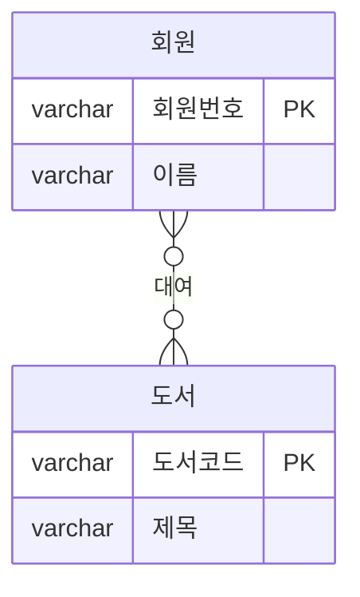

# Chapter 1. 데이터베이스 모델링 개념

> 이 교안은 도서관리 시스템(회원 - 도서 - 대여)을 예시로 데이터 모델링의 기본 개념을
> 설명합니다.

## 학습목표
- 데이터 모델링이 무엇이고 왜 필요한지 설명할 수 있다.
- 개념적/논리적/물리적 설계 단계의 차이를 구분할 수 있다.
- 엔티티, 속성, 인스턴스, 관계, 카디널리티, 식별자 등 모델링 용어를 실제 예시에
  적용해서 설명할 수 있다.

---

## 1. 데이터 모델링의 이해

### 1.1 데이터 모델링이란

데이터 모델링이란 어떠한 프로젝트에 있어 필요한 데이터들을 분석하여 정의하고 해당
프로젝트에 맞게 절차를 구성하는 것을 말한다. 이 과정은 크게 다음과 같은 절차로 이루어
진다. 먼저 고객의 요구사항을 분석하여 데이터들을 개체(Entity)와 속성, 관계로
명확화하는 과정이 필요하며, 그에 따른 요소를 사용하여 각각의 과정을 설계해 나가야 한다.

도서관 시스템을 예로 들면, "회원이 도서를 빌리고 반납한다"는 업무 요구사항 안에는
이미 세 가지 요소가 숨어 있다.

- **개체(Entity)**: 사람, 장소, 물건, 사건, 개념 등의 명사에 해당하며, 객체의 의미를
  지닌다. → 도서관 시스템에서는 **회원**, **도서**, **대여**가 개체에 해당한다.
- **속성**: 개체(Entity)가 가지는 항목으로 사람의 이름, 나이 등이 이에 해당한다.
  → 회원의 **이름**, **연락처**, 도서의 **제목**, **저자** 등이 속성이다.
- **관계**: 부서와 직원의 1:N 관계 등 각 개체(Entity) 간의 상관관계를 의미한다.
  → 회원과 도서 사이의 **"빌린다/빌려진다"** 관계가 이에 해당한다.

### 1.2 개념적 설계 방법

개념적 데이터 설계는 요구분석 단계에서 정의된 핵심 개체(Entity)와 그들 간의 관계를
바탕으로 개체(Entity)-관계 다이어그램(ERD)을 생성하는 단계이다.

다음 이미지는 회원이라는 개체(Entity)와 도서라는 개체(Entity)로 관계를 두어 회원은
0~N권의 도서를, 도서는 0~N명의 회원에게 (시간 차를 두고) 대여되는 관계를 ERD로
표현한 것이다.

이렇게 추상화가 적용된 ER 다이어그램은 대상이 되는 조직이나 다양한 고객에게 다음과
같은 두 가지 기능을 제공한다.

첫째, 고객과 개발자간의 데이터 토론이 쉽게 이루어진다. 개념 데이터 모델은 추상적이기
때문에, 시스템의 구조화를 알기 쉬우며, 이에 따라 고객과 개발자가 시스템 기반에 대한
논의를 할 수 있는 기반을 형성한다.

둘째, 개념 데이터 모델은 데이터 구체화의 틀을 제공한다. 데이터 구조가 복잡한 시스템
일지라도 추상적 모델링을 통해 보다 쉽게 표현하고 설명할 수 있기 때문이다. 이 과정을
통해 개념적 스키마가 도출된다.

### 1.3 논리적 설계 방법

논리 데이터 모델링은 개념 설계에서 추상화된 데이터를 구체화하여 개체(Entity), 속성을
테이블화하고 상세화하는 과정이라 할 수 있다. 보통 데이터 모델링이라 하면 이 과정을
의미하며, 개념적 설계를 통해 도출된 구조를 컴퓨터가 이해할 수 있도록 컴퓨터 환경에
맞춰 변환하는 과정을 말한다. 논리적 데이터 모델링은 데이터 간의 관계를 어떻게
표현하느냐에 따라 관계 모델, 계층 모델, 네트워크 모델로 세분화할 수 있다.

**⊙ 관계형 데이터 모델**
2차원적인 표를 이용하여 데이터 간의 관계를 정의하는 구조로, 간단하고 균등한 데이터
구조를 가진다. 하지만 각 관계를 모두 엮어 주어야 하므로, 성능이 다소 떨어질 수 있다.
(회원 테이블과 도서 테이블을 대여 테이블로 엮는 우리 실습 구조가 이 방식이다.)

**⊙ 계층형 데이터 모델**
데이터의 논리적 구조를 트리 형태로 만들어 개체(Entity)를 노드로 하여 각 관계를
링크로 연결하는 형태이다. 트리 구조 특성상 검색, 수정에 용이한 형태이나 데이터
상호 간 유연성이 부족하여 다 대 다 관계를 처리하기 어렵다.

**⊙ 네트워크형(망형) 데이터 모델**
그래프를 이용하여 데이터 논리 구조를 표현한 것으로 상위와 하위 레코드로 구성되어
있다. 복잡한 형태의 모델링에 용이하나 설계가 어렵고, 사용자가 이해하기 어렵다는
단점이 있다.

### 1.4 물리적 설계 방법

논리적 설계 단계에서 표현된 데이터를 실제 컴퓨터의 저장장치에 어떻게 표현할 것인가를
다룬다. 이를 물리적 스키마라고도 하는데, 이 단계에서 테이블, 칼럼 들을 구성하며 이를
구현하기 위해서 많은 시간이 소요된다. 따라서 보통 논리적 설계 이후에 작업하지 않고
논리적 설계와 물리적 설계를 한꺼번에 모델링으로 수행한다.

앞서 다루었던 개념적, 논리적 그리고 물리적 설계를 하나의 표로 정리해보았다.

| 설계 구분 | 내용 | 추상화 |
|---|---|---|
| 개념적 모델링 | 시스템에 사용되는 데이터 구조 추상화 | 추상적 |
| 논리적 모델링 | 개체(Entity), 속성, 관계를 구체화, 모델 상세화라고도 함 | ↕ |
| 물리적 모델링 | 실제 데이터를 DB에 담을 수 있도록 설계 | 구체적 |

---

## 2. 데이터 모델링의 주요 개념

아래 용어들을 모두 도서관리 시스템의 실제 요소로 바꿔서 이해해보자.

**⊙ 엔티티 (Entity)**
업무의 관심 대상이 되는 정보를 갖고 있거나 그에 대한 정보를 관리할 필요가 있는 유형,
무형의 사물(개체)를 뜻한다. 종류로는 유형, 무형, 문서, 이력, 코드 엔티티가 있다.
→ **회원**(유형 엔티티: 실제 사람), **도서**(유형 엔티티: 실물 책), **대여**(이력
엔티티: 언제 누가 무엇을 빌렸는지 기록이 계속 쌓임)가 이에 해당한다.

**⊙ 속성 (Attribute)**
엔티티에서 관리해야 할 최소 단위 정보 항목. 즉, 관심이 있는 항목을 말하며 엔티티는
하나 이상의 속성을 포함해야된다. 종류로는 기본, 유도, 설계 속성이 있다.
→ 회원 엔티티의 속성: **회원번호, 이름, 연락처**. 도서 엔티티의 속성: **도서코드,
제목, 저자**.

**⊙ 인스턴스 (Instance)**
엔티티의 속성이 실제로 구현된 하나의 값. 즉, 테이블의 행(Row) 또는 튜플(Tuple)과
대응된다.
→ "회원번호 M001, 이름 김민지"라는 실제 한 사람의 데이터 한 줄이 회원 엔티티의
인스턴스이다.

**⊙ 관계 (Relationship)**
두 엔티티 사이의 상관 관계를 나타낸다. 즉, 실무적인 관점에서 상호 공유하는 속성이
있다는 의미이다.
→ 회원과 도서는 직접 연결되어 있지 않지만, **대여** 엔티티를 통해 "이 회원이 이
도서를 빌렸다"는 관계로 연결된다.

**⊙ 카디널리티 (Cardinality)**
각 엔티티에 속해 있는 인스턴스들 간에 수적으로 어떤 관계에 있는지를 나타낸다.
종류로는 1:1, 1:N, M:N의 관계가 있다.
→ 한 명의 회원은 여러 권의 도서를 빌릴 수 있고, 한 권의 도서도 시간 차를 두고 여러
회원에게 빌려질 수 있으므로 회원-도서는 **M:N** 관계이다. (이 관계는 Chapter 2에서
대여 엔티티로 풀어낸다.)

**⊙ 주식별자 (Primary Identifier)**
엔티티 내에 있는 각각의 인스턴스를 구별하는 기준을 뜻한다.
→ 회원 엔티티에서는 **회원번호**, 도서 엔티티에서는 **도서코드**가 주식별자이다.

**⊙ 외래식별자 (Foreign Identifier)**
엔티티와 엔티티를 연결해주는 고리의 역할을 뜻한다.
→ 대여 엔티티가 갖는 **회원번호**, **도서코드**는 각각 회원 엔티티, 도서 엔티티의
주식별자를 그대로 가져와 참조하는 외래식별자이다.

---

## 핵심 요약

| 용어 | 도서관리 시스템에서의 예시 |
|---|---|
| 엔티티 | 회원, 도서, 대여 |
| 속성 | 회원의 이름/연락처, 도서의 제목/저자 |
| 인스턴스 | 회원 테이블의 한 행(예: 김민지의 회원 정보) |
| 관계 | 회원이 도서를 빌리는 대여 관계 |
| 카디널리티 | 회원-도서는 M:N (대여 엔티티로 해소) |
| 주식별자 | 회원번호, 도서코드 |
| 외래식별자 | 대여 테이블의 회원번호, 도서코드 |
