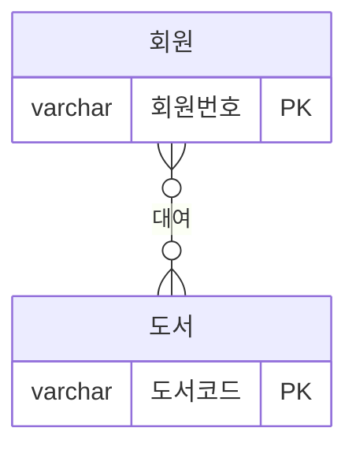
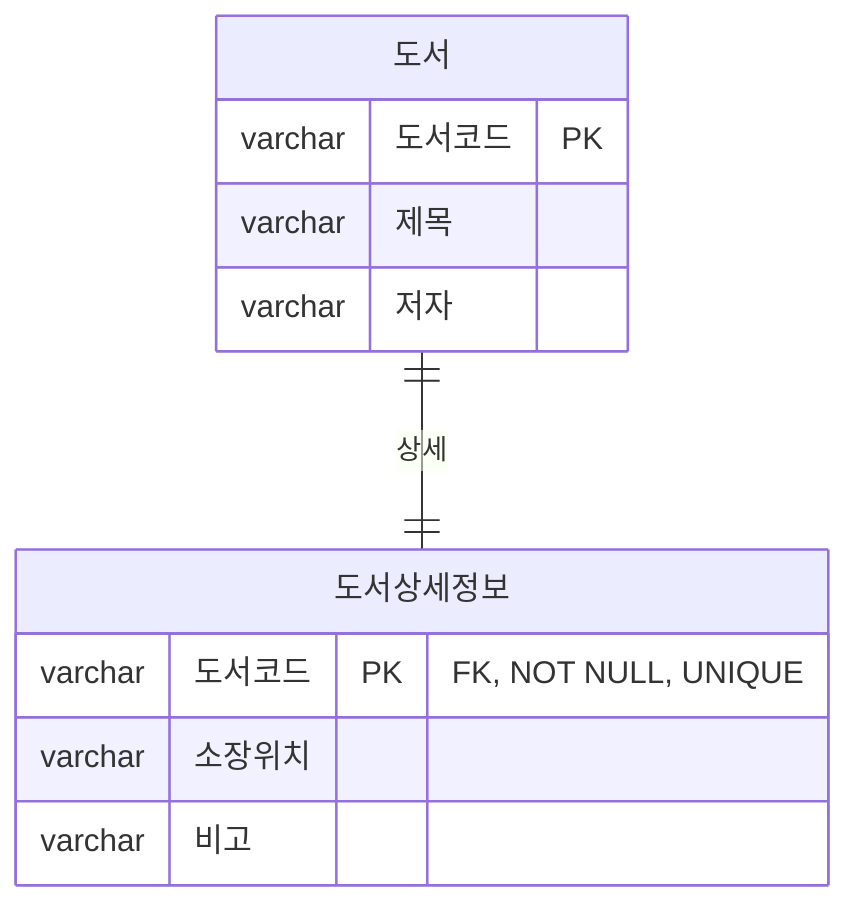
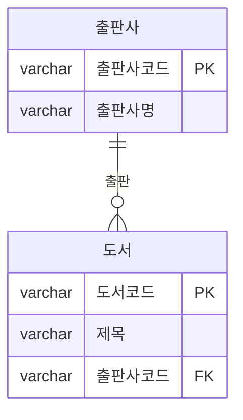
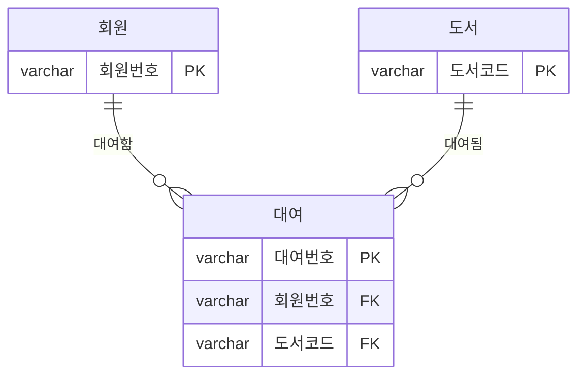
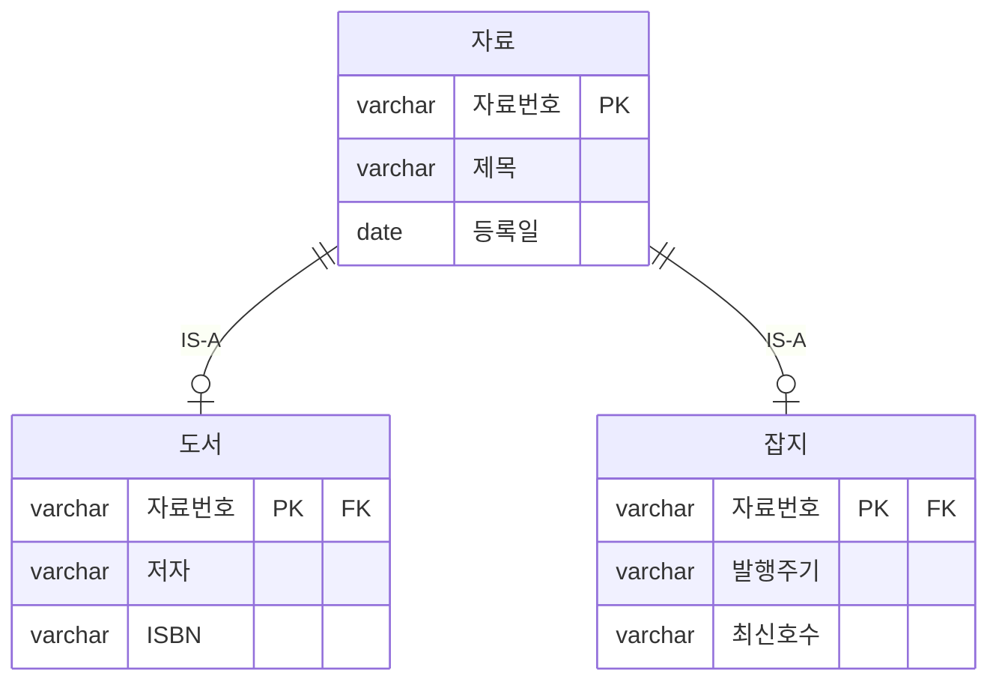
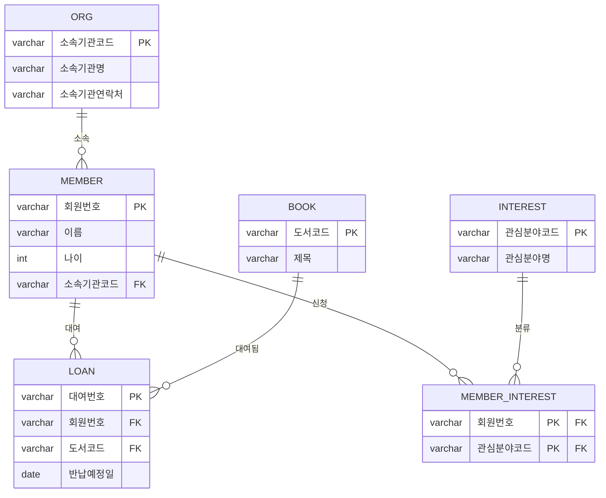

# Chapter 2. ERD 및 정규화의 이해

> Chapter 1에 이어 도서관리 시스템(회원 - 도서 - 대여)을 예시로 ERD 표기법과
> 정규화를 설명합니다.

## 학습목표
- IE 표기법으로 개체 간 관계와 카디널리티/참여도를 표현할 수 있다.
- 1:1, 1:N, N:M, ISA 관계를 각각 예시로 구분하고 설계할 수 있다.
- 정규화가 필요한 이유(이상 현상)를 설명하고, 1차~3차 정규화를 순서대로 적용할 수
  있다.

---

## 1. 개체-관계 다이어그램 (ERD)

### 1.1 ERD 표기법

개체-관계 다이어그램은 여러 표기법이 있는데, 본 교재에서는 그 중 표준 표기법인 IE
표기법을 기준으로 작성하겠다. 작업 순서는 다음과 같다.

1. 먼저 개체(Entity) 타입 작성 후 배치
2. 해당 개체(Entity)들을 연결하여 관계 설정 후 관계명 기술
3. 카디널리티(Cardinality)와 참여도 표기

> ERD 작성의 이해를 돕기 위해 예제는 회원과 도서로 사용하였다.

그럼 이러한 개체간의 관계의 종류와 그 표기법에 대해 알아보도록 하자. 먼저 표기법의
종류는 다음과 같이 있다.

| Barker 표기법 | IE 표기법 | 의미 |
|---|---|---|
| `——————·` (점선 끝 O) | `——○┼` | 0 또는 1 |
| `————` (실선 끝 두 줄) | `——┼┼` | 반드시 1 |
| `———<` (점선 화살) | `——○<` | 0 이상 |
| `———<` (실선 화살) | `——┼<` | 1 이상 |

이러한 표기법으로 나타낼 수 있는 관계는 크게 4가지로 1:1, 1:N, M:N, ISA 관계가 있다.

> **참여도**: 참여도에는 필수(Mandatory), 선택(Optional) 두 가지가 존재한다. 어떤
> 기준이 되는 엔티티가 있을 때 반드시 대응되는 엔티티가 존재해야 한다면 필수, 존재할
> 수도, 하지 않을 수도 있다면 선택으로 표시한다.

---

### 1.2 관계의 종류

#### 일대일 관계 (1:1)

관계에 참여하는 두 개체 타입이 모두 하나씩의 개체와 관계를 맺는 것을 말하며, 이러한
개체들은 하나의 개체로 합칠 수 있기 때문에 많이 쓰이지는 않는다. 데이터베이스의
성능이 떨어지는 경우에는 큰 테이블을 여러 작은 테이블로 나누어서 관리하여 효율적으로
운용할 수도 있지만, 그렇지 않은 경우에는 역효과가 발생할 수 있기 때문이다.

**도서 - 도서상세정보**: 도서 테이블에는 자주 조회되는 기본 정보(제목, 저자)만 두고,
잘 쓰지 않는 부가 정보(장정, 소장 위치, 비고)는 도서상세정보 테이블로 분리한 경우다.
도서 한 권마다 상세정보가 정확히 하나씩만 존재해야 하므로, 도서상세정보 쪽의
`도서코드(FK)`에 `NOT NULL` + `UNIQUE` 제약을 건다.

#### 일대다 관계 (1:N)

관계에 참여하는 개체 타입 중 한 개체 타입은 여러 개의 개체와 관계를 맺고, 다른 한
개체는 하나의 개체와 관계를 맺는 것을 말하며 일반적으로 가장 많이 쓰이는 형태이다.

**출판사 - 도서**: 한 출판사는 여러 권의 도서를 출판할 수 있고(1 이상일 수도, 아직
등록된 도서가 없어 0일 수도 있음), 도서 한 권은 반드시 하나의 출판사에 속한다.

#### 다대다 관계 (N:M)

관계에 참여하는 두 개체 모두 여러 개의 개체와 관계를 맺을 수 있는 것을 말한다.
논리적으로는 가능할 수 있으나 **물리적으로는 불가능한 관계**이며, 실제 이러한 관계가
형성될 경우 반드시 새로운 테이블을 만들어 1:N 관계로 형성하여 이 관계를 해소해야
한다. 이 작업은 데이터베이스 설계에 매우 중요한 작업 중의 하나이므로, 명심하기
바란다.

**회원 - 도서**: 한 회원은 여러 권의 도서를 (시간 차를 두고) 대여할 수 있고, 한 권의
도서도 여러 회원에게 (시간 차를 두고) 대여될 수 있다. 이 관계는 **대여**라는 새로운
엔티티를 만들어 회원-대여(1:N), 대여-도서(1:N) 두 개의 1:N 관계로 풀어낸다.

> 이 관계는 일반적으로 위 그림과 같이 새로운 테이블(대여)을 생성하여 표현한다.

#### ISA 관계 (SUPER : SUB)

공통 속성을 가지는 슈퍼 타입과 공통 부분을 제외한 속성을 가지는 여러 개의 서브
테이블을 말하며, "자료 IS A 도서", "자료 IS A 잡지" 같은 1:1 관계의 테이블을 말할 수
있겠다.

**자료 - 도서/잡지**: 자료번호, 제목, 등록일처럼 도서와 잡지가 공통으로 가지는 속성은
슈퍼 타입인 자료 테이블에 두고, 도서만 갖는 저자/ISBN, 잡지만 갖는 발행주기/최신
호수는 각각의 서브 테이블에 둔다.

---

## 2. 정규화

### 2.1 정규화란

정규화란 데이터를 관리함에 있어 발생할 수 있는 이상 현상을 최대한 줄이기 위해
테이블을 재구성하고 자료의 중복을 없애, DB의 데이터 무결성을 확보하는 과정을 말한다.

정규화를 수행하며 고려해야 하는 이상 현상이 3가지 있는데, 이는 각각 삭제 이상, 삽입
이상, 갱신 이상이라고 하며 상세 내용은 다음과 같다.

| 이상 현상 | 설명 | 도서관리 예시 |
|---|---|---|
| 삭제 이상 | 특정 데이터를 삭제할 경우, 원하지 않는 정보까지 삭제되는 현상(데이터 손실) | 마지막 대여 기록을 지웠더니 그 회원의 소속기관 정보까지 함께 사라짐 |
| 삽입 이상 | 특정 데이터를 삽입할 경우 원하지 않는 데이터까지 삽입해야 하는 현상 | 아직 책을 한 번도 안 빌린 신규 회원을 등록하려면 도서코드 자리를 억지로 비워둬야 함 |
| 갱신 이상 | 특정 속성 값 갱신 시 중복 저장되어 있는 속성 값 중 하나만 갱신되고, 나머지는 갱신되지 않아 발생하는 현상(데이터 불일치) | 같은 소속기관 회원이 여러 명이면, 소속기관 전화번호가 바뀌었을 때 한 회원 행만 고치고 나머지는 놓쳐서 같은 기관인데 전화번호가 서로 달라짐 |

이러한 이상 현상을 최대한 줄이기 위해 수행해야 하는 정규화의 절차는 그 과정에 따라
총 여섯 과정으로 분류되는데, 그 내용은 다음과 같다.

| 정규화 단계 | 내용 |
|---|---|
| 1차 정규화 | 모든 속성은 반드시 하나의 값을 가져야 한다. (도메인 종속성, 데이터 원자성) |
| 2차 정규화 | 개체(Entity)의 모든 속성이 한 식별자에 종속되어야 한다. (부분 함수 종속성 제거) |
| 3차 정규화 | 속성에 종속적인 속성을 별도로 분리한다. (이행 함수 종속성 제거) |
| 보이스코드 정규화(BCNF) | 테이블에 식별자(결정자)가 여러 개 존재할 경우 주 식별자를 제외한 다른 식별자를 분리한다. (결정자 제거) |
| 4차 정규화 | 속성간 종속 관계가 여러 개일 경우 이를 분리한다. (다치 종속성 제거) |
| 5차 정규화 | 식별자와 각 속성간의 연관성은 있지만, 속성끼리의 연관성은 존재하지 않을 경우 식별자와 각 속성별로 분리 (조인 종속성) |

실무에서는 키/도메인 관리의 어려움 때문에 보통 4, 5차 정규화를 다루는 경우는 없다.
아래에서는 1~3차 정규화를 실제 도서관리 데이터로 직접 적용해본다.

---

### 2.2 정규화 실전 예제 - 도서 대여 등록대장

도서관에서 신규 회원이 책을 빌릴 때마다 아래처럼 종이 대장 한 줄에 모든 정보를
같이 적어왔다고 하자. (실습 이해를 돕기 위해 예제는 6명의 회원으로 값을 넣어보았다.)

**REGISTER_TABLE (정규화 전)**

| 회원번호 | 이름 | 나이 | 소속기관 | 소속기관연락처 | 도서코드 | 반납예정일 | 관심분야 |
|---|---|---|---|---|---|---|---|
| M2024001 | 김민지 | 25 | 한빛초등학교 | 02-0001-0001 | B0012 | 2026-09-01 | 추리소설, SF소설 |
| M2024002 | 박정민 | 23 | 나래독서모임 | 02-0010-1110 | B0031 | 2026-08-25 | 역사 |
| M2024003 | 이두박 | 25 | 별빛중학교 | 02-0002-0001 | B0007 | 2026-08-30 | 추리소설 |
| M2024004 | 오기훈 | 22 | 늘봄고등학교 | 02-0002-0070 | B0045 | 2026-09-05 | 추리소설, 에세이 |
| M2024005 | 장미래 | 22 | 늘봄고등학교 | 02-0002-0070 | B0019 | 2026-08-28 | 에세이 |
| M2024006 | 송성우 | 25 | 한빛초등학교 | 02-0001-0001 | B0002 | 2026-08-27 | 인문학 |

#### 1차 정규화

위 표에서도 알 수 있듯이 관심분야 속성에 값이 한 개 이상 들어간 회원이 존재한다
(김민지, 오기훈). 이로 인해 만약 이 회원이 취향 하나를 정정하려 할 때, 두 관심분야
정보가 한 칸에 뒤섞여 있어 원하는 값만 골라 고치기 어렵고, 실수로 칸 전체를 지우면
두 취향 정보가 한꺼번에 사라질 위험이 있다. 때문에 이 테이블을 아래처럼 관심분야를
회원번호별로 한 줄씩 풀어서 재설계하였다.

**INTEREST_LINK (1차 정규화 결과)**

| 회원번호 | 관심분야코드 | 관심분야명 |
|---|---|---|
| M2024001 | I01 | 추리소설 |
| M2024001 | I02 | SF소설 |
| M2024002 | I03 | 역사 |
| M2024003 | I01 | 추리소설 |
| M2024004 | I01 | 추리소설 |
| M2024004 | I04 | 에세이 |
| M2024005 | I04 | 에세이 |
| M2024006 | I05 | 인문학 |

회원번호와 관심분야코드로 각 회원의 관심분야 하나하나를 구분할 수 있으므로, 이를
한데 묶어 복합 식별자(회원번호+관심분야코드)로 구분짓기로 한다. 이로 인해서 관심분야
속성에 대한 1차 정규화는 완료되었다. (REGISTER_TABLE에서는 관심분야 컬럼이 빠진다.)

#### 2차 정규화

하지만 관심분야명에 대한 정보가 중복으로 삽입되는 현상이 발생하였다(추리소설, 에세이
모두 여러 번 반복 저장). 이 과정에서는 부분 함수 종속적인 부분을 제거하여 테이블을
분리하는 것이 필요하다. 1차 정규화 때 보았던 INTEREST_LINK 테이블을 다시
확인해보자. 현재 이 테이블은 회원번호와 관심분야코드로 복합 식별자가 형성되어 있다.

표를 보면 관심분야명에 해당하는 정보는 회원번호와 관심분야코드 두 개에 묶여 있는
것이 아닌, 단순 관심분야코드 하나에 구분이 된다. 이는 부분 함수 종속에 해당하므로
다시 한 번 더 분리하여 테이블을 설계해야 하겠다.

**MEMBER_INTEREST (신규, 회원-관심분야 연결 전용)**

| 회원번호 | 관심분야코드 |
|---|---|
| M2024001 | I01 |
| M2024001 | I02 |
| M2024002 | I03 |
| M2024003 | I01 |
| M2024004 | I01 |
| M2024004 | I04 |
| M2024005 | I04 |
| M2024006 | I05 |

**INTEREST (신규, 관심분야 정보 전용)**

| 관심분야코드 | 관심분야명 |
|---|---|
| I01 | 추리소설 |
| I02 | SF소설 |
| I03 | 역사 |
| I04 | 에세이 |
| I05 | 인문학 |

#### 3차 정규화

3차 정규화는 주 식별자가 아닌 속성에 종속이 되는 속성들을 분리하는 작업이다. 이
과정은 이행적 함수 종속 제거라고도 한다. 현재 REGISTER_TABLE(관심분야를 뺀 나머지)을
보면 **소속기관연락처는 소속기관에 종속**되고, **도서코드/반납예정일은 회원 개인의
속성이 아니라 "이 회원이 이 도서를 빌린 사건(대여)"에 종속**된다.

먼저 소속기관 정보와 대여 정보를 별도로 분리하여 테이블을 생성한다.

**ORG (신규, 소속기관 정보 전용)**

| 소속기관코드 | 소속기관명 | 소속기관연락처 |
|---|---|---|
| G01 | 한빛초등학교 | 02-0001-0001 |
| G02 | 나래독서모임 | 02-0010-1110 |
| G03 | 별빛중학교 | 02-0002-0001 |
| G04 | 늘봄고등학교 | 02-0002-0070 |

**MEMBER (재설계)**

| 회원번호 | 이름 | 나이 | 소속기관코드 |
|---|---|---|---|
| M2024001 | 김민지 | 25 | G01 |
| M2024002 | 박정민 | 23 | G02 |
| M2024003 | 이두박 | 25 | G03 |
| M2024004 | 오기훈 | 22 | G04 |
| M2024005 | 장미래 | 22 | G04 |
| M2024006 | 송성우 | 25 | G01 |

**LOAN (신규, 대여 사건 전용)**

| 대여번호 | 회원번호 | 도서코드 | 반납예정일 |
|---|---|---|---|
| L001 | M2024001 | B0012 | 2026-09-01 |
| L002 | M2024002 | B0031 | 2026-08-25 |
| L003 | M2024003 | B0007 | 2026-08-30 |
| L004 | M2024004 | B0045 | 2026-09-05 |
| L005 | M2024005 | B0019 | 2026-08-28 |
| L006 | M2024006 | B0002 | 2026-08-27 |

지금까지 설계한 내용을 간단한 ERD로 표현하면 다음과 같다.

여기까지 1, 2, 3차 정규화를 각각 알아보았다. 이 과정은 단순히 데이터를 쪼개 테이블을
늘리는 것이 아닌, 데이터 관리에 대한 이상 현상들을 최대한 막기 위해 DB를 재설계하는
과정이라고 생각하기 바란다.

---

## 자주 하는 실수

- **개념적 설계 단계에서 이미 세부 컬럼까지 다 정하려고 함** → 개념적 설계는
  "어떤 개체와 어떤 관계가 있는가"만 정하는 추상적 단계다. 컬럼 타입, 제약조건 같은
  세부사항은 물리적 설계에서 정한다.
- **N:M 관계를 그대로 테이블 두 개로 구현하려고 시도** → N:M은 물리적으로 구현할 수
  없다. 반드시 중간에 연결 엔티티(우리 예제의 `대여`, `MEMBER_INTEREST`)를 만들어
  1:N + 1:N으로 풀어야 한다.
- **1차 정규화만 하고 멈춤** → 반복되는 값을 별도 행으로 풀어내는 것(1차)까지만
  하고, 그 결과 테이블에 남아있는 부분/이행 함수 종속(2차, 3차)을 놓치는 경우가
  많다. 표를 새로 그릴 때마다 "이 속성은 정말 이 식별자 전체에 종속되는가?"를 다시
  질문해야 한다.
- **정규화를 무조건 3차, 4차까지 끝까지 진행해야 한다고 생각** → 정규화 단계가
  높아질수록 테이블 수가 늘어 JOIN이 많아지고 조회 성능이 떨어질 수 있다. 실무에서는
  보통 3차 정규화까지 진행한 뒤, 필요에 따라 의도적으로 일부를 다시 합치는
  **반정규화**를 함께 고려한다.

---

## 핵심 요약

| 구분 | 내용 | 도서관리 예시 |
|---|---|---|
| 1:1 | 두 개체가 각각 하나씩만 대응 | 도서 - 도서상세정보 |
| 1:N | 한쪽은 하나, 다른 쪽은 여러 개 | 출판사 - 도서 |
| N:M | 양쪽 모두 여러 개, 연결 엔티티로 해소 | 회원 - 도서 (→ 대여) |
| ISA | 공통 속성은 슈퍼 타입, 고유 속성은 서브 타입 | 자료 - 도서/잡지 |
| 1차 정규화 | 다중값 속성을 행으로 분리 | 관심분야 여러 개 → INTEREST_LINK |
| 2차 정규화 | 복합키 중 일부에만 종속된 속성 분리 | 관심분야명 → INTEREST 테이블 |
| 3차 정규화 | 식별자가 아닌 속성에 종속된 속성 분리 | 소속기관연락처 → ORG, 대여정보 → LOAN |
