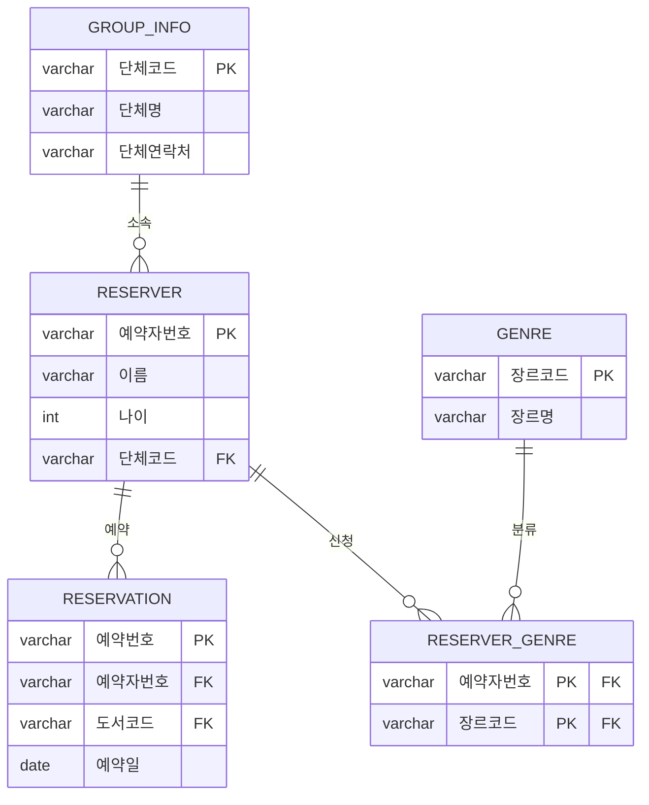

# Chapter 2. ERD 및 정규화 - 실습 답안

---

## 문제 1. 1차 정규화

**설명**: `선호장르` 속성 한 칸에 값이 2개 이상(`"판타지, 로맨스"`) 들어간 예약자가
있다. 1차 정규화는 "모든 속성은 반드시 하나의 값을 가져야 한다"는 원자성을 요구하므로,
한 칸에 여러 값이 들어간 이 속성은 1차 정규화를 위반한다.

**GENRE_LINK**

| 예약자번호 | 장르코드 | 장르명 |
|---|---|---|
| P3001 | G01 | 판타지 |
| P3001 | G02 | 로맨스 |
| P3002 | G03 | 자기계발 |
| P3003 | G01 | 판타지 |
| P3004 | G01 | 판타지 |
| P3004 | G04 | 역사 |
| P3005 | G04 | 역사 |
| P3006 | G03 | 자기계발 |

선호장르가 판타지+로맨스 두 개였던 한소희(P3001), 판타지+역사 두 개였던 문서율
(P3004)이 각각 2행으로 나뉘면서 전체 6명이 8행이 되었습니다. 이제 (예약자번호,
장르코드)를 합쳐야 각 행을 유일하게 구분할 수 있으므로, 이 둘이 복합 식별자가
됩니다.

---

## 문제 2. 2차 정규화

**설명**: `GENRE_LINK`의 식별자는 (예약자번호, 장르코드) 복합키다. 그런데
`장르명`은 예약자번호와는 무관하고 **장르코드 하나에만** 종속된다(`G01`이면 항상
`판타지`). 이렇게 복합키 중 일부에만 종속되는 속성이 있는 것을 부분 함수 종속이라
하며, 2차 정규화는 이를 제거하기 위해 테이블을 분리한다.

**RESERVER_GENRE** (연결 전용, 어떤 예약자가 어떤 장르를 좋아하는지만 기록)

| 예약자번호 | 장르코드 |
|---|---|
| P3001 | G01 |
| P3001 | G02 |
| P3002 | G03 |
| P3003 | G01 |
| P3004 | G01 |
| P3004 | G04 |
| P3005 | G04 |
| P3006 | G03 |

**GENRE** (장르 정보 전용, 중복 제거됨)

| 장르코드 | 장르명 |
|---|---|
| G01 | 판타지 |
| G02 | 로맨스 |
| G03 | 자기계발 |
| G04 | 역사 |

---

## 문제 3. 3차 정규화

**설명**: `RESERVE_TABLE`(선호장르 제외)의 식별자는 `예약자번호` 하나다. 이 식별자가
아닌 다른 속성에 종속된 속성 두 가지는 다음과 같다.

1. **소속기관연락처**는 예약자번호가 아니라 **소속기관**에 종속된다. 같은
   `다솜중학교` 소속인 한소희·강태오·신하은이 모두 같은 연락처를 중복해서 갖고
   있는 것이 그 증거다. (이행 함수 종속: 예약자번호 → 소속기관 → 소속기관연락처)
2. **예약도서코드, 예약일**은 예약자 개인의 고정 속성이 아니라, "이 예약자가 이
   시점에 이 책을 예약했다"는 **개별 사건(예약)**에 속하는 정보다. 한 예약자가
   나중에 책을 한 번 더 예약하면 이 두 값은 새로운 행으로 추가되어야 하며, 예약자
   테이블 안에 그대로 두면 예약이 늘어날 때마다 이름·나이 같은 예약자 고유 정보가
   함께 중복 저장된다.

**GROUP_INFO** (소속기관 정보 전용)

| 단체코드 | 단체명 | 단체연락처 |
|---|---|---|
| T01 | 다솜중학교 | 031-111-2222 |
| T02 | 별하도서모임 | 02-333-4444 |
| T03 | 하늘고등학교 | 031-555-6666 |

**RESERVER** (예약자 고유 정보만)

| 예약자번호 | 이름 | 나이 | 단체코드 |
|---|---|---|---|
| P3001 | 한소희 | 24 | T01 |
| P3002 | 유지안 | 27 | T02 |
| P3003 | 강태오 | 24 | T01 |
| P3004 | 문서율 | 29 | T03 |
| P3005 | 배주안 | 29 | T03 |
| P3006 | 신하은 | 24 | T01 |

**RESERVATION** (예약 사건 전용)

| 예약번호 | 예약자번호 | 도서코드 | 예약일 |
|---|---|---|---|
| R001 | P3001 | B0101 | 2026-08-10 |
| R002 | P3002 | B0210 | 2026-08-11 |
| R003 | P3003 | B0155 | 2026-08-12 |
| R004 | P3004 | B0089 | 2026-08-13 |
| R005 | P3005 | B0044 | 2026-08-14 |
| R006 | P3006 | B0132 | 2026-08-15 |

---

## 문제 4. 종합 - ERD로 표현하기

**설명**: `GROUP_INFO`-`RESERVER`, `RESERVER`-`RESERVATION`, `RESERVER`-
`RESERVER_GENRE`, `GENRE`-`RESERVER_GENRE` 모두 1:N 관계입니다. 특히
`RESERVER_GENRE`는 `RESERVER`와 `GENRE` 사이의 N:M 관계(한 예약자가 여러 장르를
좋아하고, 한 장르도 여러 예약자가 좋아함)를 풀어내기 위한 연결 엔티티로,
(예약자번호, 장르코드) 복합키를 그대로 PK 겸 FK로 사용합니다.
