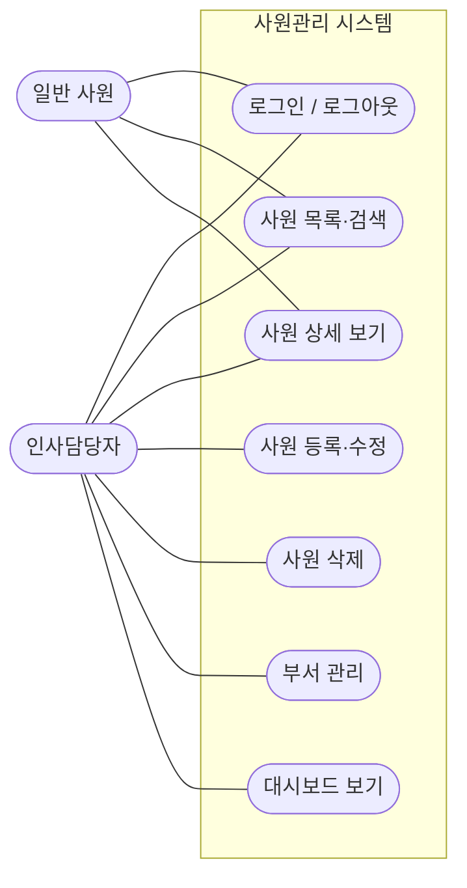
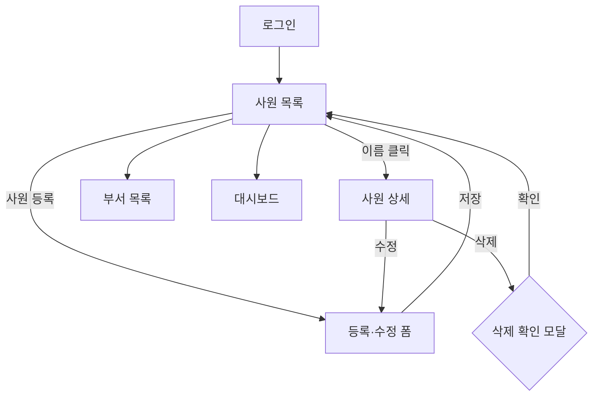
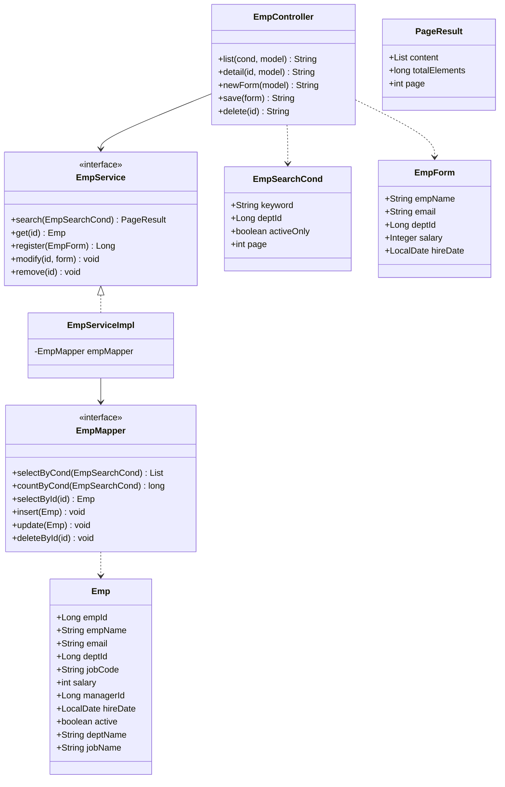
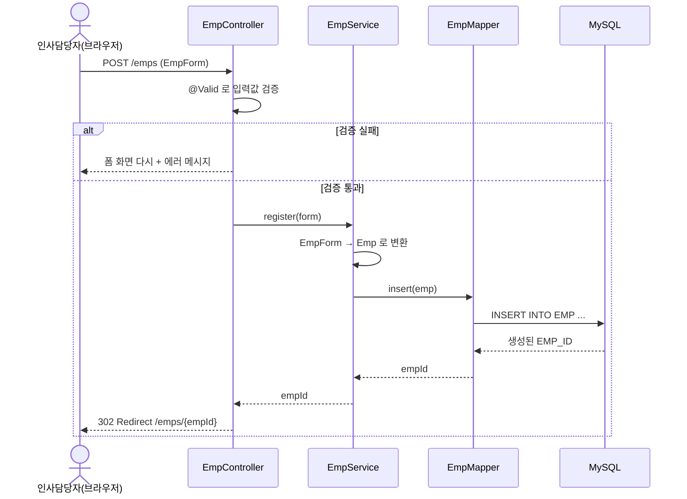
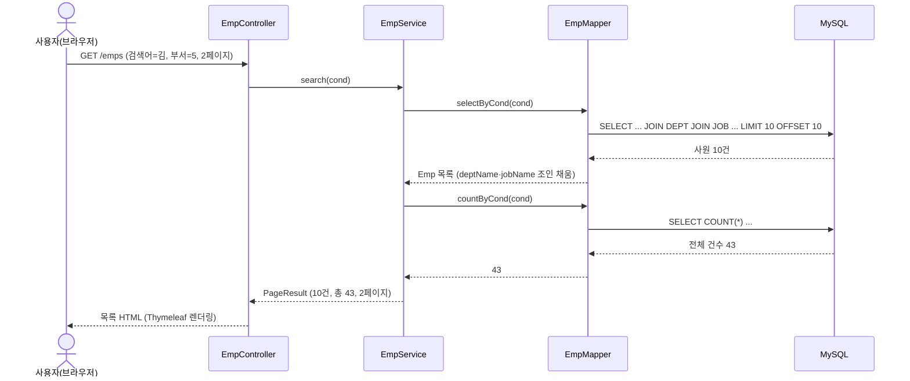

# Day 1. 사원관리 시스템 설계

| 항목 | 내용 |
|---|---|
| 선수학습 | Java(클래스/인터페이스), SQL(HR 스키마 `EMP`/`DEPT`/`JOB`), HTML 폼과 GET/POST |
| 이번 챕터 | 요구사항 → 유즈케이스 → 화면 흐름 → 클래스 다이어그램 → 시퀀스 다이어그램 → 패키지 구조 |
| 권장 진행 | 1일 |
| 도구 | Mermaid(마크다운에 바로 그림). 실무에서는 PlantUML도 많이 씀 |
| 참고 | 화면 프로토타입 `교안/3. 스프링/prototypes/templates/hr/` |

## 학습목표

- 코드를 치기 전에 **무엇을 만들지 그림으로 합의**하는 이유를 설명할 수 있다.
- 요구사항에서 **액터(actor)** 와 **유즈케이스(use case)** 를 뽑아 유즈케이스 다이어그램을 그릴 수 있다.
- 프로토타입을 기준으로 **화면 목록**과 **화면 흐름도**를 정리할 수 있다.
- **클래스 다이어그램**으로 Controller–Service–Mapper 계층과 도메인·DTO의 역할을 나눌 수 있다.
- **시퀀스 다이어그램**으로 "사원 등록", "목록 조회" 요청이 흐르는 과정을 표현할 수 있다.
- 앞으로 15일간 코드를 채워 넣을 **패키지 구조**를 확정할 수 있다.

---

## 1. 왜 코드보다 설계가 먼저인가

지금까지는 문제가 주어지면 바로 코드를 썼습니다. 화면 하나, 기능 하나짜리면 그래도 됩니다.
그런데 이번 과정에서 만들 **사원관리 시스템**은 화면이 대여섯 개, 클래스가 수십 개가 됩니다.
바로 코드부터 시작하면 이런 일이 벌어집니다.

- "이 값을 화면에 보여주려면 클래스에 필드를 하나 더 넣어야겠네" → 도메인 클래스가 화면 사정에 따라 계속 바뀜
- "Controller에서 바로 DB를 부르는 게 빠르겠다" → 나중에 로직을 재사용·테스트하기 어려워짐
- 팀원마다 패키지 이름·계층 나누는 기준이 달라서 코드가 뒤죽박죽

**설계는 "코드를 치기 전에 팀이 같은 그림을 보는 것"** 입니다. 완벽한 UML을 그리는 게 목적이 아닙니다.
오늘 그린 그림 4장(유즈케이스 · 화면 흐름 · 클래스 · 시퀀스)이, 남은 15일 동안 "다음에 뭘 만들지"를
알려주는 지도가 됩니다.

> **다이어그램 도구**: 이 교안은 **Mermaid**를 씁니다. 마크다운 안에 ```` ```mermaid ```` 블록으로
> 적으면 GitHub·IntelliJ·VS Code에서 바로 그림으로 보입니다. 그림 그리는 프로그램을 따로 열 필요가 없어
> "코드와 함께 관리"하기 좋습니다. 문법·노드 모양·관계선·자주 나는 오류는
> [부록. Mermaid 사용법](../00_Mermaid_사용법.md) 참고.

---

## 2. 요구사항 정리

고객(=우리 회사 인사팀)이 원하는 것을 문장으로 적습니다. 화면·버튼 같은 말은 빼고,
**"누가 무엇을 하고 싶은가"** 만 남깁니다.

| # | 요구사항 |
|---|---|
| R1 | 인사담당자는 전체 사원을 목록으로 보고, 이름·부서·재직 여부로 검색하고 싶다. |
| R2 | 목록은 한 번에 10명씩, 페이지를 넘겨 볼 수 있어야 한다. |
| R3 | 사원 한 명을 골라 상세 정보(연락처·급여·소속·관리자)를 보고 싶다. |
| R4 | 새 사원을 등록하고, 기존 사원 정보를 수정하고, 퇴사자를 삭제(또는 퇴사 처리)하고 싶다. |
| R5 | 부서 목록을 보고 부서를 추가·수정하고 싶다. |
| R6 | 로그인한 담당자만 이 기능을 쓸 수 있어야 한다. |
| R7 | 첫 화면에서 전체 인원수·부서 수·최근 입사자 같은 요약을 보고 싶다. |

이 7개가 이번 과정의 **범위(scope)** 입니다. "조직도", "연봉 협상", "결재" 같은 건
이번엔 하지 않기로 합니다. 범위를 못 박는 것도 설계입니다.

---

## 3. 유즈케이스 다이어그램

### 3.1 용어

- **액터(actor)**: 시스템을 쓰는 사람(주 액터). 시스템과 데이터를 주고받는 다른 시스템은 **외부 시스템**(보조 액터).
  사람 액터는 왼쪽, 외부 시스템은 오른쪽에 두는 게 관례.
- **유즈케이스(use case)**: 액터가 시스템으로 **이루려는 목적** 하나. 타원으로 그림.
  "등록 버튼을 누른다"가 아니라 **"사원을 등록한다"** 처럼 목적으로 적습니다.
- **시스템 경계(boundary)**: 유즈케이스들을 담는 사각형. 안 = 우리가 만들 것, 밖 = 액터.
- **연결선**: 액터와 유즈케이스를 잇는 **실선(연관)** 이 기본이자 대부분입니다.

### 3.2 사원관리 시스템의 유즈케이스

요구사항 R1~R7에서 "누가 무엇을 하려는가"만 뽑습니다. **선은 실선 하나로 단순하게.**



**읽는 법**: 인사담당자는 모든 기능을, 일반 사원은 조회 2개(목록·상세)만 씁니다.
이 "누가 무엇을 할 수 있나"가 **Spring Security 권한 설정**(Day 17)의 밑그림입니다.

> **로그인 전제조건**: R6("로그인한 담당자만")은 유즈케이스마다 «include» 화살표를 그리면 그림이
> 복잡해지므로, 다이어그램에는 넣지 않고 **각 유즈케이스 설명에 "전제조건: 로그인 상태"** 로 적습니다.
> "로그인 / 로그아웃"만 별도 유즈케이스로 둡니다.

> **외부 시스템**: 사원 사진은 우리 DB가 아니라 **외부 파일 저장소**에 보관합니다(보조 액터).
> 이번 그림에는 핵심 기능만 담고, 파일 저장소는 **Day 16(파일 업로드)** 에서 다시 그립니다.

### 3.3 참고 - UML 관계선 4종

실무에서는 **연관(실선)** 위주로 그리고, 아래 셋은 **꼭 필요할 때만** 씁니다(남용하면 오히려 안 읽힘).

| 관계 | 선 모양 | 언제 |
|---|---|---|
| 연관 (association) | 실선 `───` | 액터가 이 유즈케이스를 씀 (기본) |
| 포함 (include, «include») | 점선 화살표, 포함하는 쪽 → 포함되는 쪽 | 여러 유즈케이스가 **똑같은 하위 절차**를 공유해 빼낼 가치가 있을 때 (예: "주문" · "환불" 이 모두 "재고 확인"을 포함) |
| 확장 (extend, «extend») | 점선 화살표, 확장 기능 → 대상 (방향 반대) | **특정 조건에서만** 덧붙는 선택 기능 (예: "사원 등록" 중 조건부 "사진 첨부") |
| 일반화 (generalization) | 실선 + 빈 삼각형, 자식 → 부모 | 액터·유즈케이스의 상속 (예: "관리자"는 "일반 사원"의 일종) |

> Mermaid에는 UML 표준 유즈케이스 기호가 없어 `flowchart`로 대신 그립니다.
> 타원 `(["..."])` = 유즈케이스, 둥근 사각형 `([...])` = 액터, 실선 `---` = 연관.

---

## 4. 화면 목록과 화면 흐름도

유즈케이스는 "무엇을"이고, 화면은 "그것을 어디서" 합니다. 프로토타입
(`prototypes/templates/hr/`)이 이미 있으니 화면 목록은 거기서 그대로 가져옵니다.

| 화면 | 파일 | 대응 유즈케이스 | 주소(예정) |
|---|---|---|---|
| 사원 목록 | `index.html` | 사원 목록·검색 | `GET /emps` |
| 사원 상세 | `emp-detail.html` | 사원 상세 보기 | `GET /emps/{id}` |
| 사원 등록/수정 폼 | `emp-form.html` | 사원 등록, 사원 수정 | `GET /emps/new`, `GET /emps/{id}/edit` |
| 부서 목록 | `depts.html` | 부서 관리 | `GET /depts` |
| 대시보드 | `dashboard.html` | 대시보드 보기 | `GET /` |
| 로그인 | (공통 모달) | 로그인/로그아웃 | `POST /login` |

### 화면 흐름도

버튼을 눌렀을 때 어느 화면으로 가는지 화살표로 잇습니다.



이 흐름도의 화살표 하나하나가 나중에 **컨트롤러 메서드 하나**가 됩니다.
(`list → form` 은 `GET /emps/new`, `form → 저장 → list` 는 `POST /emps` + redirect 처럼요.)

---

## 5. 클래스 다이어그램

### 5.1 계층: Controller → Service → Mapper

`Java 2. DB연결하기`에서 `EmployeeDao` 하나에 SQL과 로직을 다 넣었습니다.
스프링에서는 역할을 3층으로 나눕니다.

| 계층 | 역할 | 하는 일 | 하지 않는 일 |
|---|---|---|---|
| **Controller** | 웹 요청/응답 | 파라미터 받기, 서비스 호출, 화면 이름 반환 | 업무 규칙, SQL |
| **Service** | 업무 로직 | 검증 후 흐름 조립, 트랜잭션 경계, DTO↔도메인 변환 | 웹(HttpRequest), SQL 직접 작성 |
| **Mapper** | DB 접근 | SQL 실행, 결과를 객체로 매핑 | 업무 규칙 |

계층을 나누는 이유: **각 계층을 따로 바꾸고 따로 테스트**할 수 있기 때문입니다.
(예: 화면을 Thymeleaf → REST API로 바꿔도 Service·Mapper는 그대로.)

### 5.2 도메인 vs DTO

- **도메인 객체**(`Emp`, `Dept`): DB 테이블과 거의 1:1. "사원이라는 것 자체".
  목록 화면에 필요한 **부서명·직급명**은 `Emp`에 **조인으로 채우는 읽기 전용 필드**(`deptName`, `jobName`)로 둡니다.
  단순히 다른 테이블의 컬럼 하나를 끌어오는 정도라, 별도 클래스를 만들 것 없이 도메인에 얹습니다.
- **DTO**(Data Transfer Object): 특정 화면·요청 **전용** 데이터 묶음.
  - `EmpSearchCond` — 목록 검색 조건 (검색어, 부서, 재직여부, 페이지 번호)
  - `EmpForm` — 등록/수정 폼에서 들어오는 값 (+ 검증 애노테이션이 붙을 자리)
  - `PageResult<T>` — 목록 + 전체 건수 + 페이지 정보 (Day 12)

> **언제 전용 DTO를 만드나?** `부서명`처럼 조인 컬럼 하나면 `Emp`의 읽기 필드로 충분합니다.
> 하지만 `부서별 인원수`·`평균 급여`처럼 **집계(GROUP BY)해야 나오는 값**이나, 여러 테이블을
> 가공해 만든 화면 전용 모양이면 도메인에 얹지 말고 전용 DTO로 뺍니다.
> (부서 목록의 `DeptListRow`가 그 예 — 실습에서 만듭니다.)

### 5.3 다이어그램



> 이 다이어그램엔 `Dept` 클래스를 넣지 않았습니다. `Emp`는 `Dept` 객체가 아니라 `deptId`(FK 값)만
> 들고 있고, `deptName`·`jobName`은 목록 조회 SQL이 `DEPT`·`JOB`을 조인해 채우는 **읽기 전용 필드**입니다
> (등록·수정 땐 비어 있음). `Dept` 자체는 "부서 관리" 기능의 도메인 클래스로 따로 존재하고,
> 테이블끼리의 `EMP.DEPT_ID → DEPT.DEPT_ID` 관계는 클래스 그림이 아니라 **ERD**에서 그립니다.

**화살표 읽는 법**

| 기호 | 뜻 | 여기서는 |
|---|---|---|
| `A --> B` | A가 B를 사용(의존)한다 | Controller가 Service를 부른다 |
| `A <\|.. B` | B가 A를 구현한다(인터페이스 실현) | `EmpServiceImpl`이 `EmpService`를 구현 |
| `A ..> B` | A가 B를 잠깐 참조한다(파라미터·반환) | Mapper가 `Emp` 목록을 반환 |

인터페이스(`EmpService`, `EmpMapper`)를 두는 이유는 `Java 3.에노테이션`에서 만든
DI 컨테이너와 같습니다 — **"구현이 아니라 약속에 의존"** 하면 나중에 구현을 갈아끼우거나
가짜(mock)로 테스트하기 쉽습니다.

---

## 6. 시퀀스 다이어그램

클래스 다이어그램이 "정지 사진"이라면, 시퀀스 다이어그램은 **"요청 하나가 흐르는 동영상"** 입니다.
시간은 위에서 아래로 흐르고, 화살표는 메서드 호출입니다.

### 6.1 사원 등록



여기서 배울 점:

- **검증은 Controller에서** 먼저 걸러 Service로 잘못된 값이 안 들어가게 한다(Day 14).
- **`EmpForm` → `Emp` 변환은 Service에서**. Controller는 웹 값을 받기만, Mapper는 DB만.
- 저장 성공 후엔 **redirect** 한다(새로고침해도 다시 등록되지 않도록 — PRG 패턴).

### 6.2 사원 목록 조회 (검색·페이징)



목록에는 SQL이 **2번** 필요합니다 — 현재 페이지의 10건(`LIMIT`)과, 페이지 버튼을 그리기 위한
전체 건수(`COUNT`). 이 패턴은 SQL 과정 `4. SUBQUERY`의 페이징과 같고, Day 12 "동적 SQL과 페이징"에서 구현합니다.

---

## 7. 패키지 구조 확정

위 그림들을 그대로 폴더로 옮깁니다. 앞으로 새 파일은 항상 이 구조 안에 만듭니다.

```
com.example.hr
├── HrApplication.java        (main)
├── config/                   설정 클래스 (WebConfig, MyBatisConfig, SecurityConfig …)
├── common/                   공통 (예외 클래스, PageResult, 상수, 유틸)
├── domain/                   도메인 객체 — DB 테이블과 1:1  (Emp, Dept, Job)
├── dto/                      화면·API 전용 데이터  (EmpSearchCond, EmpForm, PageResult, DeptListRow)
├── controller/               웹 요청 처리  (EmpController, DeptController, HomeController)
├── service/                  업무 로직  (EmpService, EmpServiceImpl, DeptService …)
└── mapper/                   DB 접근  (EmpMapper, DeptMapper)
    └── resources/mapper/     *.xml  (EmpMapper.xml, DeptMapper.xml)
```

- **계층별로 나눔**(controller/service/mapper). 규모가 커지면 기능별(`emp/`, `dept/`)로 다시 쪼갤 수 있지만,
  이번 규모에서는 계층별이 이해하기 쉽습니다.
- `domain`과 `dto`를 **반드시 분리**합니다(5.2 참고).
- `mapper` 인터페이스는 `src/main/java`에, SQL을 적는 **XML은 `src/main/resources/mapper/`** 에 둡니다(Day 9).

---

## 자주 하는 실수

- **완벽한 다이어그램을 그리려다 시작을 못 함** → 목적은 "팀이 같은 그림을 보는 것". 손그림·러프도 충분하고, 구현하며 고쳐 나갑니다.
- **유즈케이스에 UI 동작을 적음** ("검색 버튼 클릭") → 유즈케이스는 사용자의 **목적**("사원을 검색한다").
- **도메인에 화면 상태·집계값을 얹음** (`Emp`에 `checked`, `선택여부`, `부서별 평균급여` 같은 필드) → 조인 컬럼 하나(`deptName`)는 읽기 필드로 괜찮지만, 화면 상태값·집계 결과는 전용 DTO로 뺍니다.
- **Controller에서 바로 Mapper/DB 호출** → 업무 로직과 트랜잭션은 Service에 둡니다. Controller는 얇게.
- **Mapper 인터페이스에 로직을 넣으려 함** → Mapper는 "SQL 한 번 실행"만. 여러 SQL을 조합하는 흐름은 Service.
- **패키지를 사람마다 다르게 나눔** → 오늘 정한 구조를 팀 규칙으로 고정하고 `README`에 적어둡니다.

---

## 핵심 요약

| 다이어그램 | 답하는 질문 | 이번 챕터 결과물 | 이어지는 챕터 |
|---|---|---|---|
| 유즈케이스 | 누가 무엇을 하려는가 (범위) | 액터 2, 유즈케이스 8 | 권한 설계(Day 17) |
| 화면 목록·흐름도 | 어떤 화면이 있고 어떻게 이동하는가 | 화면 6, 흐름 화살표 = 컨트롤러 메서드 | MVC·Thymeleaf(Day 7~8) |
| 클래스 다이어그램 | 클래스를 어떻게 나누고 연결하는가 | Controller→Service→Mapper + 도메인/DTO | 계층형 아키텍처(Day 5) |
| 시퀀스 다이어그램 | 요청 하나가 어떻게 흐르는가 | 등록·조회 흐름 | 검증(Day 14), 트랜잭션(Day 13), 페이징(Day 12) |
| 패키지 구조 | 파일을 어디에 두는가 | `config/common/domain/dto/controller/service/mapper` | 전 챕터 |

> **한 줄 정리**: 오늘 그린 그림 4장 + 패키지 1개가, 남은 15일의 지도입니다.
> 경험자용 심화(도메인 모델·CQRS·C4·PlantUML)는 `1_설계_심화.md`.
