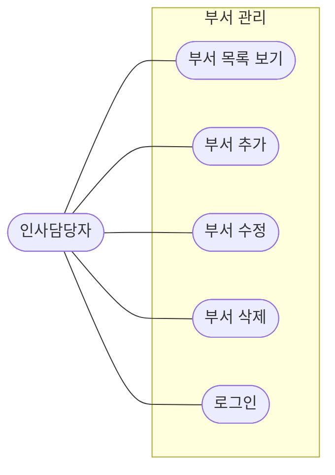
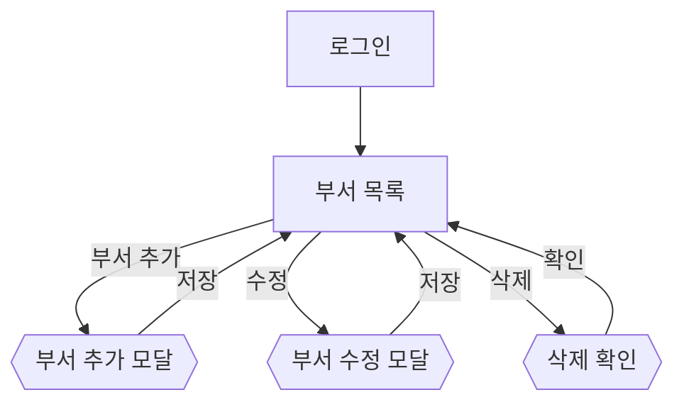
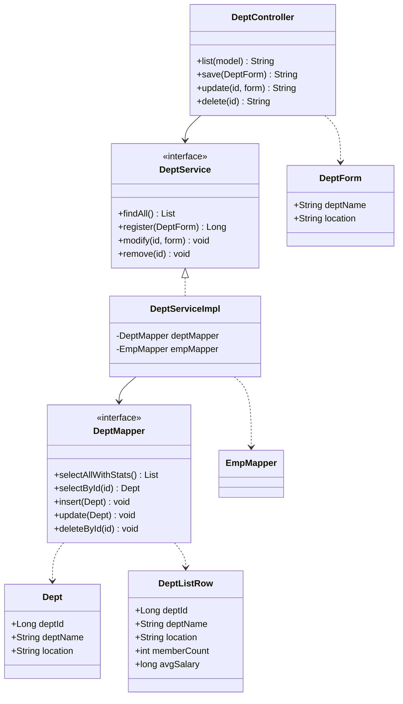
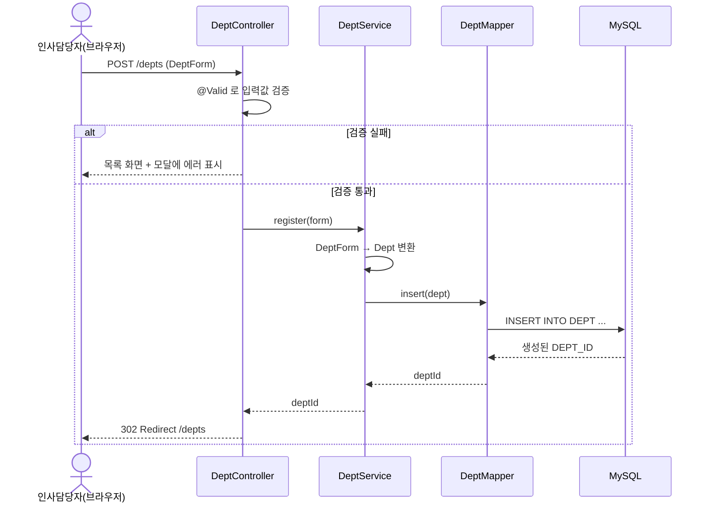
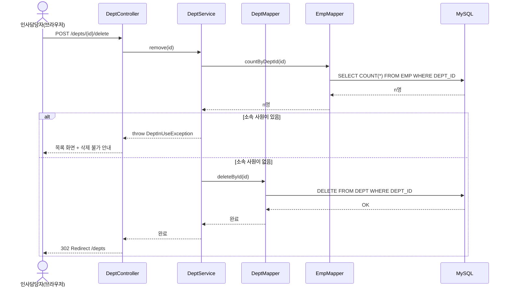

# Day 1. 사원관리 시스템 설계 — 실습 답안

---

## 문제 1. 유즈케이스 다이어그램

**확인**

- 액터는 **1명**(인사담당자). 일반 사원은 부서를 "관리"하지 않으므로 여기서는 뺍니다.
  (일반 사원이 사원 목록에서 부서명을 *보는* 것은 사원 유즈케이스 쪽에 이미 있습니다.)
- "부서 추가"와 "부서 수정"은 **나눕니다**. 화면(모달)은 비슷하지만 목적이 다르고
  (새로 만든다 vs 기존 걸 바꾼다), 검증 규칙·권한이 달라질 수 있기 때문입니다.

---

## 문제 2. 화면 흐름도

모달은 `{{ }}`(육각형)으로 그려 "새 페이지가 아니라 같은 화면 위 레이어"임을 구분했습니다.
부서는 목록 화면 하나에서 추가·수정·삭제가 모두 일어납니다(전용 상세/폼 페이지 없음).

---

## 문제 3. 클래스 다이어그램

> `DeptServiceImpl`이 `EmpMapper`도 참조하는 것은 문제 6(삭제 정책)에서 "소속 사원 수"를
> 확인하기 위해서입니다. 통계용 조회를 `DeptMapper.selectAllWithStats()`에서 `EMP`를 조인해
> 처리한다면 `EmpMapper` 의존은 없어도 됩니다 — 둘 다 정답입니다.

**확인 (도메인 vs DTO)**

- `Dept`는 `DEPT` 테이블 그 자체(부서 코드·이름·위치)이고, 여러 곳에서 재사용됩니다.
- `DeptListRow`의 `memberCount`·`avgSalary`는 `EMP`를 집계해야 나오는 **목록 화면 전용** 값입니다.
  이것을 `Dept`에 넣으면 부서를 단순 조회할 때도 불필요한 집계가 따라붙고, 도메인이 화면에 종속됩니다.

---

## 문제 4. 시퀀스 다이어그램 — 부서 추가

---

## 문제 5. 개념 — 도메인에 얹을까, 전용 DTO로 뺄까

**정답: (A)**

- **(A) 조인해서 `Emp.deptName`(읽기 전용 필드)에 담기** → 목록 SQL 한 번(`EMP JOIN DEPT JOIN JOB`)으로
  화면이 원하는 모양이 나옵니다. `deptName`은 `DEPT` 테이블 컬럼 하나를 그대로 끌어온 것뿐이라
  도메인에 얹어도 부담이 작고, 등록·수정 경로에선 그냥 비어 있으면 됩니다.
- **(B) 화면에서 사원마다 부서 재조회** → 사원 10명이면 부서 조회 SQL이 10번 더 나갑니다(N+1 문제).
  화면(뷰)이 DB를 호출하는 구조 자체도 계층 분리에 어긋납니다.
- **(C) `Emp`에 평균급여·선택여부까지 추가** → `평균 급여`는 `EMP`를 **집계(GROUP BY)**해야 나오고,
  `선택여부`는 화면 상태입니다. 이런 값을 도메인에 얹으면 단순 조회 때도 불필요한 계산이 따라붙고
  도메인이 특정 화면에 종속됩니다 → 전용 DTO로 뺍니다.

**추가 답**: `deptName`은 다른 테이블의 **컬럼 하나를 그대로** 가져온 값이라 도메인 필드로 충분하지만,
`DeptListRow`의 `memberCount`·`avgSalary`는 `EMP`를 **집계해야 생기는 값**이라 성격이 다릅니다.
"조인 컬럼이면 도메인 읽기 필드, 집계·가공값이면 전용 DTO"가 기준입니다.

---

## 문제 6. 정책 결정 — 부서 삭제

**택한 정책: ① 소속 사원이 있으면 삭제를 막고, 안내 메시지를 보여준다.**
(가장 단순하고 데이터 사고 위험이 낮음. ②·③은 이후 확장 과제로.)

> `DeptInUseException`은 `common/` 패키지의 커스텀 예외로 두고, Day 14 "검증과 예외 처리"의
> `@ControllerAdvice`에서 사용자 메시지로 변환합니다. "소속 사원 수 확인 → 삭제"는 하나의
> 트랜잭션으로 묶어야 하므로 `DeptService.remove()`에 `@Transactional`을 답니다(Day 13).
