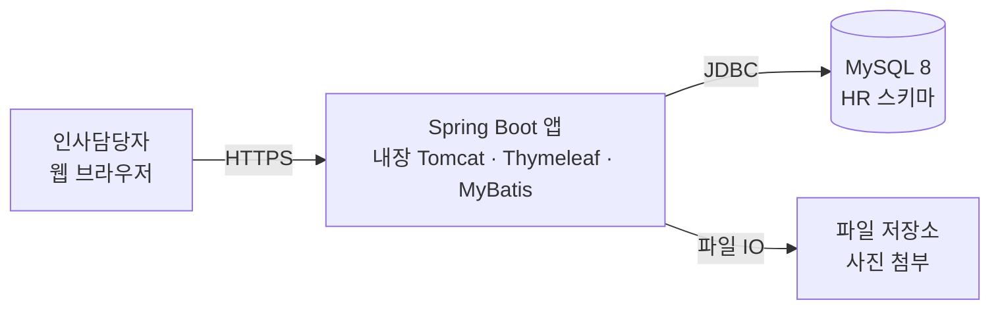
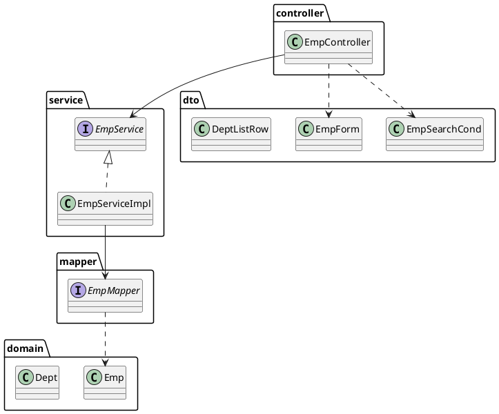

# Day 1. 사원관리 시스템 설계 — 심화 (경험자용)

본문(`1_설계.md`)은 "그림 4장으로 지도 만들기"에 집중했습니다. 여기서는 설계를 실무 수준으로
끌어올릴 때 부딪히는 판단들을 다룹니다. 처음 배우는 분은 이 문서를 건너뛰고 구현을 먼저 해도 됩니다.

## 1. 빈약한 도메인 vs 풍부한 도메인

본문의 `Emp`는 필드 + getter/setter 뿐인 **빈약한 도메인 모델(anemic domain model)** 입니다.
모든 규칙이 Service의 절차적 코드에 흩어집니다. MyBatis + 절차형 서비스 조합에서는 흔하고,
이 과정도 그렇게 갑니다. 다만 **도메인이 스스로 지킬 수 있는 규칙은 도메인에 두는** 편이 낫습니다.

```java
// 나쁨: 서비스 여기저기서
if (emp.getSalary() < 0) throw ...;
emp.setActive(false); emp.setEntDate(LocalDate.now());

// 나음: 도메인 메서드로
public class Emp {
    public void resign(LocalDate when) {          // "퇴사시킨다"
        this.active = false;
        this.entDate = when;
    }
    public void changeSalary(int newSalary) {
        if (newSalary < 0) throw new IllegalArgumentException("급여는 음수일 수 없습니다");
        this.salary = newSalary;
    }
}
```

판단 기준: **여러 Service·Controller에서 반복되는 상태 변경**이면 도메인 메서드로 올린다.
DB·외부 시스템을 호출해야 하는 로직은 도메인에 두지 않는다(도메인은 순수하게).

## 2. 명령 모델 / 조회 모델 분리 = CQRS의 씨앗

본문에서 이미 나눴습니다.

| 방향 | 모델 | 통로 |
|---|---|---|
| 명령(Command) — 쓰기 | `EmpForm` → `Emp` → `insert/update` | 검증·트랜잭션·도메인 규칙을 태움 |
| 조회(Query) — 읽기 | `EmpSearchCond` → `Emp`(조인 읽기필드까지 채운) | 도메인 규칙 없이 Mapper가 바로 화면 모양으로 |

이것이 **CQRS**(Command Query Responsibility Segregation)의 가장 가벼운 형태입니다.
읽기는 "화면이 원하는 모양 그대로" SQL을 짜고(조인·GROUP BY 자유롭게), 쓰기는 도메인 규칙을
지키는 좁은 문으로만 들어오게 합니다. 별도 DB나 이벤트는 필요 없습니다 — 모델만 분리하면 됩니다.

> 이 과정에서는 읽기 결과도 대개 `Emp`에 담습니다(조인 컬럼은 읽기 전용 필드로). 다만 `부서별 평균급여`
> 같은 **집계·가공 모양**은 도메인에 억지로 담지 말고 전용 조회 DTO(`DeptListRow` 등)로 분리합니다 —
> 규모가 커지면 조회 전용 DTO/뷰가 늘어나는 게 자연스럽습니다.

## 3. 애그리거트 경계 — 왜 `Emp`가 `Dept` 객체를 통째로 안 갖는가

본문 클래스 다이어그램에서 `Emp`는 `deptId : Long` 만 갖고 `Dept dept` 필드는 없습니다. 의도된 선택입니다.

- `Emp`와 `Dept`는 **각자 독립적으로 생성·수정·삭제**됩니다. 서로 다른 **애그리거트**입니다.
- 다른 애그리거트는 **객체 참조가 아니라 ID로만** 참조합니다. 이유:
  - `Emp`를 저장할 때 `Dept`까지 저장할지 말지 같은 애매함이 사라짐
  - 부서명이 필요한 화면에서만 조인해서 `Emp`의 읽기 전용 필드(`deptName`)에 채우면 됨
  - 트랜잭션 경계가 애그리거트 하나로 명확해짐
- JPA를 쓴다면 `@ManyToOne Dept dept` 로 연관을 맺는 선택지가 생기지만, 그때도 "경계를 넘는 참조는
  ID로"라는 원칙은 유효합니다. (JPA는 이 과정에서 분리 — 별도 과정)

## 4. 인터페이스를 꼭 둬야 하나? (YAGNI 반론)

`EmpService` 인터페이스 + `EmpServiceImpl` 하나뿐이면 "쓸데없는 추상화"라는 비판이 있습니다. 정리:

| 인터페이스를 두는 편이 나은 경우 | 클래스 하나로 충분한 경우 |
|---|---|
| 구현을 바꿔 끼울 여지가 있다(다른 저장소, 외부 연동) | 정말로 구현이 영원히 하나다 |
| 테스트에서 가짜 구현(mock/stub)을 넣고 싶다 | 스프링 프록시·`@MockitoBean`으로 충분히 대체된다 |
| 팀 컨벤션·모듈 경계로 강제한다 | 소규모 단일 모듈 |

이 과정의 입장: **Service는 인터페이스를 둔다**(테스트·설명에 유리, `Java 3.에노테이션`의
"약속에 의존" 흐름과 이어짐). **Controller·Mapper는 인터페이스를 따로 두지 않는다**
(Controller는 그 자체가 경계, Mapper 인터페이스가 이미 추상화).

## 5. C4 모델 — 줌 레벨을 나눠 그리기

UML 종류를 외우기보다, **줌 레벨**로 나누는 C4가 실무에서 소통이 빠릅니다.

| 레벨 | 무엇을 보여주나 | 이 프로젝트 |
|---|---|---|
| 1. Context | 시스템과 바깥(사용자·외부 시스템) | 인사담당자 ↔ 사원관리 ↔ MySQL, (선택) 사내 SSO |
| 2. Container | 배포 단위 | 브라우저, Spring Boot 앱(내장 톰캣), MySQL |
| 3. Component | 컨테이너 안의 주요 덩어리 | EmpController·EmpService·EmpMapper·SecurityConfig … (= 본문 클래스 다이어그램) |
| 4. Code | 클래스 세부 | 필요할 때만 |

Container 레벨을 Mermaid로:



## 6. 설계를 코드와 함께 살아있게 유지하기

그림은 그린 순간부터 낡습니다. 살리는 방법:

- 다이어그램 소스를 **저장소 안에** 둔다: `docs/diagrams/*.mmd` 또는 `*.puml`. 리뷰 대상이 됨.
- 큰 결정은 **ADR**(Architecture Decision Record)로 1페이지씩: `docs/adr/0001-mybatis-vs-jpa.md`
  ("무엇을, 왜, 어떤 대안을 버렸는지"). 이 과정의 "JPA 분리", "세션→JWT" 같은 결정이 ADR 감입니다.
- PR 템플릿에 "이 변경으로 바뀌는 다이어그램이 있으면 함께 수정" 항목을 넣는다.

## 7. PlantUML 버전 (같은 클래스 다이어그램)

Mermaid는 마크다운에 바로 박혀서 편하고, PlantUML은 표현력(스테레오타입, 패키지, 노트)이 더 넓습니다.
IntelliJ `PlantUML integration` 플러그인으로 미리보기됩니다.



## 8. 이벤트 스토밍 (한 문단 소개)

요구사항이 불명확하거나 도메인이 복잡할 때, 회의실 벽에 포스트잇으로 **도메인 이벤트**
("사원이 등록됨", "사원이 퇴사함", "부서가 폐지됨")를 시간순으로 붙이고, 각 이벤트를 일으키는
**명령**과 **액터**, 관련 **데이터(애그리거트)** 를 그 주변에 붙여 나가는 워크숍 기법입니다.
사원관리 정도 규모에는 과할 수 있지만, "이벤트 → 명령 → 애그리거트" 순서로 생각하는 습관은
유즈케이스·시퀀스 다이어그램을 빠르게 뽑는 데 도움이 됩니다.
