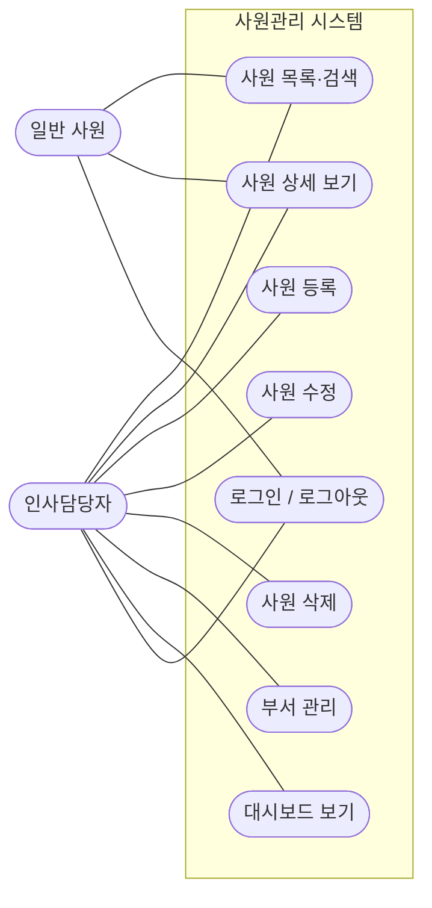
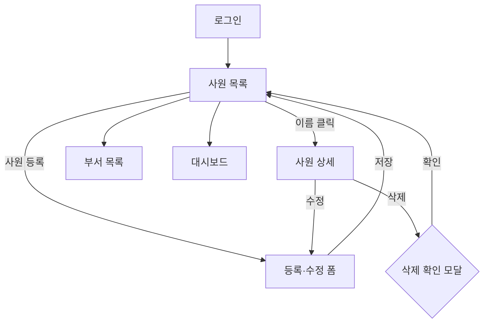
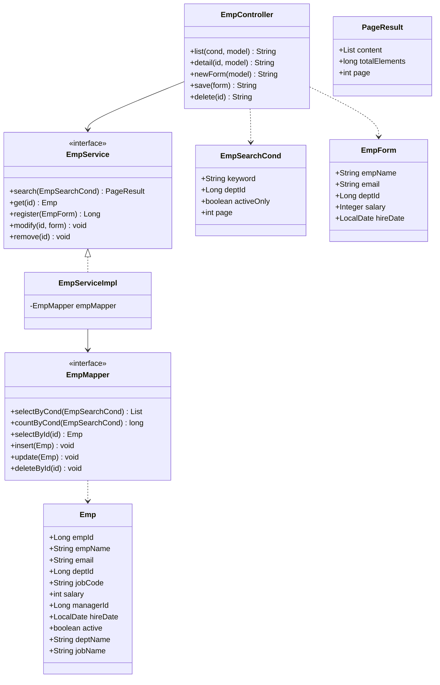
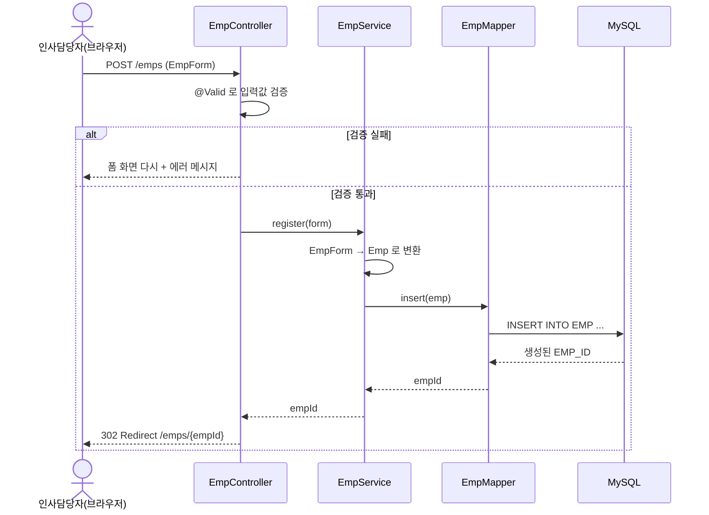
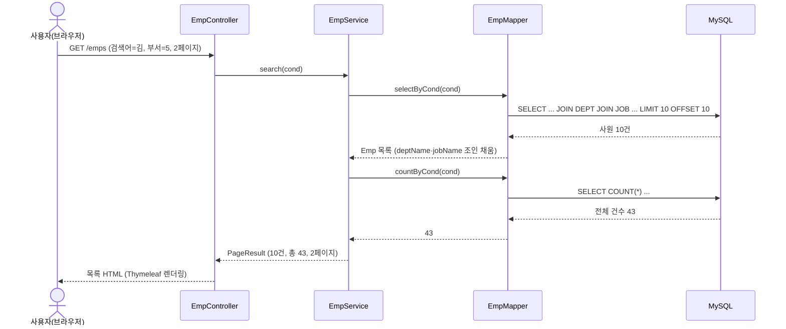

# 사원관리 시스템 — 다이어그램 모음

`1_설계.md` 본문 다이어그램의 소스입니다. 복사해서 수정·재사용하세요.
(GitHub · IntelliJ · VS Code Markdown 미리보기에서 그림으로 렌더됩니다.)

## 1. 유즈케이스



## 2. 화면 흐름도



## 3. 클래스 다이어그램



> `Dept` 클래스는 이 그림에서 뺐습니다. `Emp`는 `Dept` 객체가 아니라 `deptId`(FK 값)만 보유하고,
> `deptName`·`jobName`은 목록 조회 SQL이 `DEPT`·`JOB`을 조인해 채우는 읽기 전용 필드(등록·수정 땐 빈 값).

## 4. 시퀀스 — 사원 등록



## 5. 시퀀스 — 사원 목록 조회 (검색·페이징)



## 6. 패키지 구조

```
com.example.hr
├── HrApplication.java
├── config/
├── common/
├── domain/     (Emp, Dept, Job)
├── dto/        (EmpSearchCond, EmpForm, PageResult, DeptListRow)
├── controller/ (EmpController, DeptController, HomeController)
├── service/    (EmpService, EmpServiceImpl, DeptService, ...)
└── mapper/     (EmpMapper, DeptMapper)  + resources/mapper/*.xml
```
