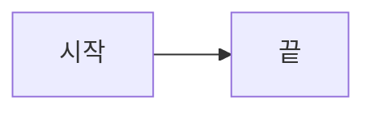
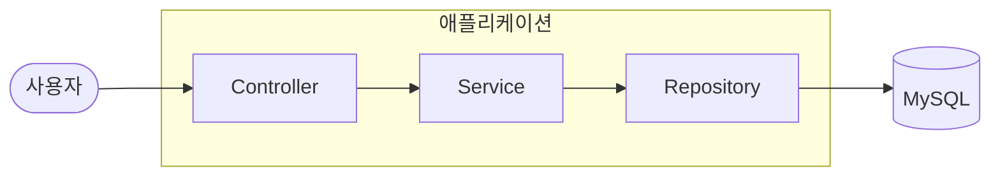
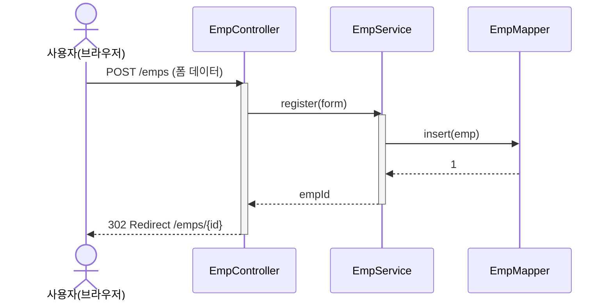
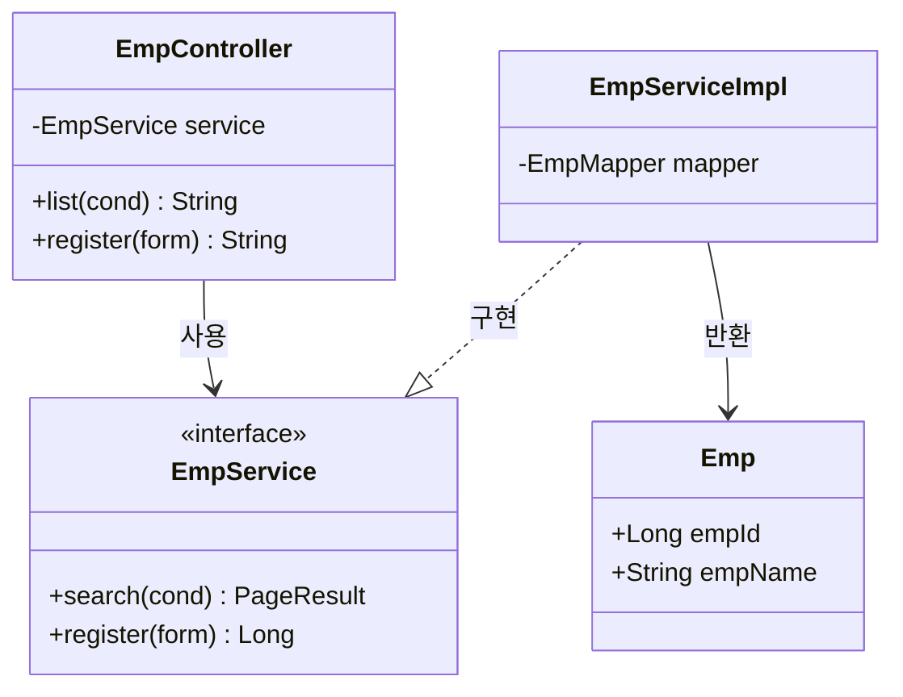
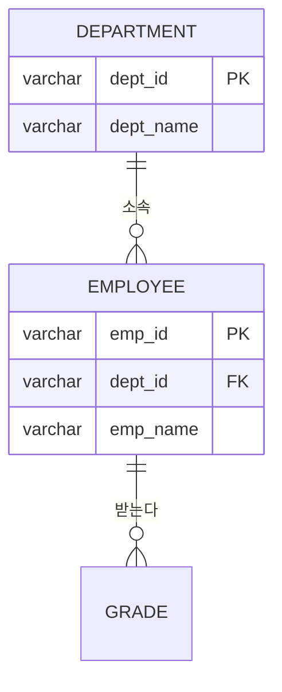
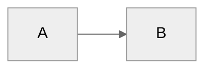

# 부록. Mermaid 다이어그램 사용법

이 커리큘럼의 모든 다이어그램(유즈케이스·클래스·시퀀스·ERD·아키텍처)은 **Mermaid** 로 그립니다.
텍스트로 쓰면 그림이 되므로 Git 으로 버전 관리가 되고, 리뷰에서 diff 를 볼 수 있습니다.

---

## 1. 어떻게 쓰나

마크다운 안에 ```` ```mermaid ```` 코드펜스로 감싸면 됩니다.

````markdown

````

**렌더되는 곳**: GitHub/GitLab, VS Code(확장 *Markdown Preview Mermaid Support*), IntelliJ(내장),
[mermaid.live](https://mermaid.live) (붙여넣기 즉시 미리보기 — 문법 오류 잡을 때 여기 쓰기).

---

## 2. 이 커리큘럼에서 쓰는 5가지

| 타입 | 첫 줄 | 용도 |
|---|---|---|
| 플로차트 | `flowchart TD` / `flowchart LR` | 유즈케이스(대용), 화면 흐름, 아키텍처, 처리 순서 |
| 시퀀스 | `sequenceDiagram` | 요청 한 건이 컴포넌트를 어떻게 지나가는지 |
| 클래스 | `classDiagram` | 도메인·DTO·계층 구조와 관계 |
| ER | `erDiagram` | DB 테이블과 관계 (2. SQL 모델링) |
| 상태 | `stateDiagram-v2` | 주문 상태, 결재 상태 등 (선택) |

---

## 3. 플로차트 (flowchart)

### 방향
`flowchart TD`(위→아래) · `LR`(왼→오) · `RL` · `BT`.

### 노드 모양

| 문법 | 모양 | 관례상 용도 |
|---|---|---|
| `id["텍스트"]` | 사각형 | 일반 처리·화면 |
| `id("텍스트")` | 둥근 사각형 | 시작/끝 |
| `id(["텍스트"])` | 타원(스타디움) | 유즈케이스 |
| `id[["텍스트"]]` | 겹사각형 | 외부 시스템·서브루틴 |
| `id[("텍스트")]` | 원통 | 데이터베이스 |
| `id{"텍스트"}` | 마름모 | 분기(조건) |
| `id(("텍스트"))` | 원 | 연결점 |

### 엣지(선)

| 문법 | 뜻 |
|---|---|
| `A --> B` | 화살표 |
| `A --- B` | 실선(방향 없음) — 연관 |
| `A -.-> B` | 점선 화살표 — 포함/의존 |
| `A ==> B` | 굵은 화살표 — 강조 |
| `A -->|"라벨"| B` | 선에 라벨 |
| `A --> B & C` | 한 줄로 여러 개 연결 |

### 묶기(subgraph)



> `subgraph` 의 끝은 소문자 `end`. 그래서 **노드 ID 로 `end` 를 쓰면 안 됩니다**(`endNode` 처럼).

---

## 4. 시퀀스 다이어그램 (sequenceDiagram)



| 문법 | 뜻 |
|---|---|
| `actor 이름` / `participant 이름` | 참여자 선언 (`as` 로 별칭) |
| `A->>B: 메시지` | 요청(실선 화살표) |
| `A-->>B: 메시지` | 응답(점선 화살표) |
| `A-)B: 메시지` | 비동기 |
| `activate A` / `deactivate A` | 실행 막대 (또는 `A->>+B` / `B-->>-A` 축약) |
| `Note over A,B: 설명` | 메모 |
| `alt 조건` / `else` / `end` | 분기 |
| `opt 조건` / `end` | 선택(있을 수도) |
| `loop 조건` / `end` | 반복 |
| `par` / `and` / `end` | 병렬 |

---

## 5. 클래스 다이어그램 (classDiagram)



### 멤버 가시성
`+` public · `-` private · `#` protected · `~` package.

### 관계선

| 문법 | 관계 | 읽는 법 |
|---|---|---|
| `A <|-- B` | 상속(일반화) | B 는 A 를 상속 |
| `A ..|> B` | 실현(구현) | A 는 인터페이스 B 를 구현 |
| `A *-- B` | 합성 | A 가 B 를 소유(생명주기 같이) |
| `A o-- B` | 집합 | A 가 B 를 참조(생명주기 별개) |
| `A --> B` | 연관 | A 가 B 를 안다 |
| `A ..> B` | 의존 | A 가 B 를 잠깐 씀(파라미터·반환) |

`<<interface>>` `<<abstract>>` `<<enumeration>>` 는 스테레오타입(그대로 씀).

---

## 6. ER 다이어그램 (erDiagram)



### 카디널리티 (왼쪽엔딩 + `--` + 오른쪽엔딩)

| 기호 | 뜻 |
|---|---|
| `||` | 정확히 1 |
| `o|` | 0 또는 1 |
| `}o` | 0 이상 |
| `}|` | 1 이상 |

예: `A ||--o{ B` = A 하나에 B 는 0개 이상 (1:N). 관계 라벨은 `: "텍스트"`.

---

## 7. 자주 나는 오류와 회피 (중요)

Mermaid 파서는 일부 문자를 문법으로 오해합니다. 아래만 지키면 대부분 피합니다.

| 상황 | 문제 | 해결 |
|---|---|---|
| **시퀀스 메시지에 `<` `>` `&`** | `List<Emp>` , `A & B` , `GET /x?a=1` 등에서 파싱 실패 | `List of Emp` / `Emp 목록`, `,` 로, 쿼리스트링 제거 |
| **`alt` / `else` 조건에 `>`** | `alt n > 0` 오류 | `alt 건수가 있으면` 처럼 말로 |
| **플로차트 라벨에 `/` `(` `)` `:` 한글+기호** | `A[등록/수정]` 깨짐 | **항상 `"..."` 로 감싸기**: `A["등록/수정"]` |
| **classDiagram 제네릭 `~T~`** | `PageResult~T~` , `List~Emp~` 오류 잦음 | `PageResult` , `EmpList` 로 단순화 |
| **노드 ID 에 `end`** | subgraph 종료어와 충돌 | `endNode` 등으로 |
| **노드 ID 에 한글·공백·기호** | 오류 | ID 는 영문/숫자, **한글은 라벨(따옴표 안)** 에만 |
| **`participant` 별칭에 특수문자** | 깨짐 | `participant C as EmpController` 처럼 단순하게 |

> 확실하지 않으면 [mermaid.live](https://mermaid.live) 에 붙여넣어 **에러 폭탄(빨간 상자)** 이 안 뜨는지
> 먼저 확인하고 교안에 넣습니다.

---

## 8. 렌더 설정 (선택)

코드 첫 줄 위에 `%%{init: ...}%%` 로 테마·방향 등을 바꿀 수 있습니다.



`theme`: `default` · `neutral` · `dark` · `forest` · `base`.
