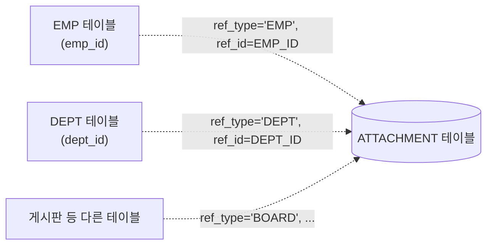
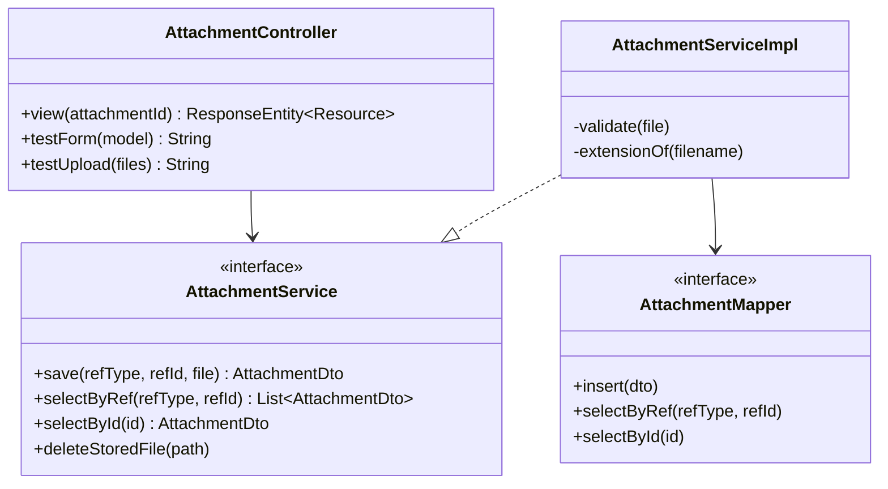
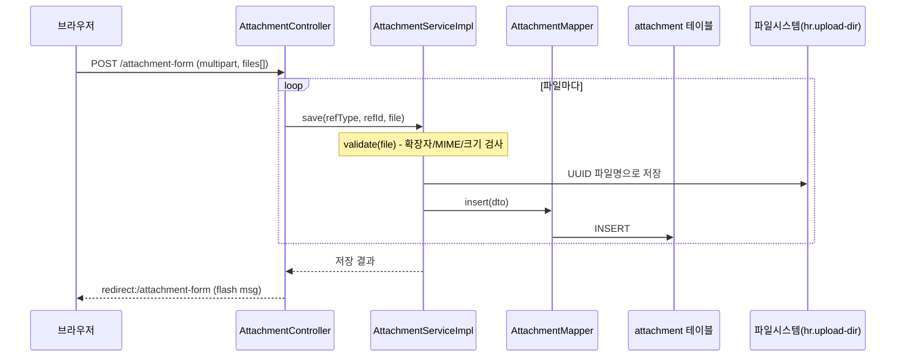

# Day 17. 첨부파일 공통 모듈 (파일 업로드와 다운로드)

| 항목 | 내용 |
|---|---|
| 선수학습 | Day 5 계층형 아키텍처, Day 6 Spring MVC, Day 7 MyBatis |
| 이번 챕터 | 특정 화면(사원 등)에 종속되지 않는 **공통 첨부파일 모듈** 설계·구현 |
| 권장 진행 | 1일 |
| 결과물 | `attachment` 테이블 + DTO/Mapper/Service/Controller + 등록·목록 화면, 이후 어떤 엔티티에도 재사용 가능 |

## 학습목표

- 파일 업로드 기능을 특정 화면(사원 등록 등)에 종속시키지 않고, 여러 화면이 공유하는 **공통 모듈**로 설계한다.
- `ref_type` + `ref_id` 다형(polymorphic) 참조로, 테이블을 늘리지 않고 어떤 엔티티에도 파일을 여러 개 붙일 수 있게 만든다.
- `MultipartFile`을 확장자·MIME 타입·크기·빈 파일 기준으로 검증한다.
- 원본 파일명을 그대로 쓰지 않고 UUID 파일명으로, 프로젝트 밖 디렉터리에 안전하게 저장한다.
- 저장된 파일 목록을 조회하고, `ResponseEntity`로 이미지를 화면에 표시하거나 다운로드한다.
- 파일을 응답할 때는 왜 뷰 렌더링이 아니라 `ResponseEntity`를 직접 조립해야 하는지 이해한다.

---

## 1. 설계 — 왜 "공통" 모듈로 만드는가

사원 프로필 사진, 부서 첨부 문서, 게시판 이미지처럼 "이 데이터 하나에 파일을 여러 개 붙이고 싶다"는 요구는 화면마다 반복해서 나타난다.

**안 좋은 접근**: `EMP` 테이블에 `PROFILE_IMAGE_NAME/PATH/TYPE` 컬럼을 추가한다.
- 사원 1명당 이미지 1장만 가능 (여러 장 요구사항에 못 맞음)
- `DEPT`에도 파일이 필요해지면 `DEPT`에도 같은 컬럼 3개를 또 추가해야 함 → 테이블마다 반복, 확장성 없음

**이번 챕터의 접근**: `attachment` 테이블 하나가 `ref_type`("어떤 종류의 대상인지")과 `ref_id`("그 대상의 PK 값")만으로 **어떤 테이블의 어떤 행에도** 파일을 여러 개 붙일 수 있게 한다. 1(엔티티) : N(첨부파일) 관계를 특정 FK가 아니라 문자열 두 개로 표현하는 것이다.



> **주의**: 점선은 실제 FK 제약(`FOREIGN KEY`)이 아니라 **애플리케이션 코드가 지키는 약속**이라는 뜻이다. `ref_type`이 하나의 컬럼으로 여러 테이블을 가리킬 수 있어야 하므로, DB 레벨의 진짜 FK로는 표현할 수 없다. 그 대신 `(ref_type, ref_id)` 조합에 인덱스를 걸어 조회 성능을 확보한다.

---

## 2. 테이블 설계와 생성

```sql
CREATE TABLE attachment (
    attachment_id BIGINT AUTO_INCREMENT PRIMARY KEY,
    ref_type      VARCHAR(20) NOT NULL,   -- 첨부 대상 종류 (예: 'EMP', 'DEPT')
    ref_id        VARCHAR(20) NOT NULL,   -- 첨부 대상의 기본키 값
    original_name VARCHAR(255) NOT NULL,  -- 사용자가 올린 원본 파일명 (표시용)
    stored_name   VARCHAR(255) NOT NULL,  -- 서버에 저장된 실제 파일명 (UUID)
    stored_path   VARCHAR(500) NOT NULL,  -- 서버 내부 저장 경로 (사용자 입력 아님)
    content_type  VARCHAR(100) NOT NULL,  -- image/png 등 검증된 MIME 타입
    file_size     BIGINT NOT NULL,
    uploaded_at   DATETIME NOT NULL DEFAULT CURRENT_TIMESTAMP,
    INDEX idx_attachment_ref (ref_type, ref_id)  -- "이 대상의 첨부파일 목록" 조회를 빠르게
);
```

확인:

```sql
SHOW CREATE TABLE attachment;
```

| 컬럼 | 저장하는 값 | 저장하지 않는 것 |
|---|---|---|
| `original_name` | 원본 파일명 (화면 표시·다운로드용) | 경로 조합에 사용하지 않음 |
| `stored_name` / `stored_path` | UUID 기반 저장 파일명과 서버 내부 경로 | 사용자가 입력한 경로 |
| `content_type` | 서버가 검증을 마친 MIME 타입 | 클라이언트가 보낸 값을 그대로 믿지 않음 |

---

## 3. 전체 구조



패키지 구조는 기존 계층형 구조(`dto/mapper/service/controller`)를 그대로 따른다. `Attachment*`로 이름을 붙여, `Emp*`/`Dept*`와 나란히 존재하는 **독립된 기능**으로 만든 것이 핵심이다 — 어느 클래스도 `Emp`를 알지 못한다.

> **설계 노트 — 검증/저장을 왜 별도 클래스로 안 뒀나**: 처음엔 "검증"(`AttachmentValidator`)과 "저장"(`AttachmentStorage`)을 별도 클래스로 나누는 방법도 있다(각자 책임이 다르고, 독립적으로 테스트·교체하기 쉽다는 장점). 하지만 지금 이 프로젝트에는 그 두 로직을 재사용하는 다른 소비자가 없고, 정책도 단순(확장자 3종+크기 제한)하다. 그래서 처음부터 나누지 않고 `AttachmentServiceImpl`의 private 메서드로 시작한다 — 나중에 "S3로 저장소를 바꾼다"거나 "검증 규칙이 복잡해져서 다른 곳에서도 재사용해야 한다" 같은 **실제 이유가 생기면 그때 분리**해도 늦지 않다. 처음부터 나누는 것과 필요할 때 나누는 것의 차이를 판단하는 것도 설계 감각이다.

---

## 4. DTO

```java
package com.example.hr.dto;

import java.time.LocalDateTime;
import lombok.Data;

@Data
public class AttachmentDto {
    private int attachmentId;
    private String refType;      // 첨부 대상 종류 (예: "EMP")
    private String refId;        // 첨부 대상의 기본키 값
    private String originalName;
    private String storedName;
    private String storedPath;
    private String contentType;
    private long fileSize;
    private LocalDateTime uploadedAt;
}
```

`empId` 같은 특정 엔티티 이름 대신 `refType`/`refId`를 쓴 것이 이 DTO를 "공통"으로 만드는 핵심이다.

---

## 5. 파일 검증과 저장

두 가지를 한다: **검증**("이 파일을 받아도 되는가")과 **저장**("어디에 어떤 이름으로 쓸 것인가"). 개념은 분리해서 이해하지만, 코드는 뒤(7장)에서 보듯 `AttachmentServiceImpl` 안에 private 메서드로 함께 둔다.

**검증 규칙**: 빈 파일 금지, 5MB 이하, 확장자 화이트리스트(`jpg/jpeg/png/webp`), `Content-Type`도 같은 화이트리스트로 재확인. 확장자만 믿거나 `Content-Type`만 믿지 않는다 — 클라이언트가 보낸 `accept` 속성이나 `Content-Type`은 얼마든지 조작할 수 있으므로 **둘을 함께** 확인한다.

**저장 규칙**: `UUID.randomUUID()`로 저장 파일명을 만들어 원본 파일명 충돌·추측을 막고, `target.startsWith(uploadDir)` 검사로 `../../etc/passwd` 같은 경로 조작(path traversal)을 막는다. DB insert가 실패하면 이미 디스크에 쓴 파일을 지우는 보상 처리(`deleteStoredFile`)도 있다.

### 5.1 `application.properties`

```properties
spring.servlet.multipart.max-file-size=5MB
spring.servlet.multipart.max-request-size=30MB
# 고정 경로 사용 (환경변수 없이 항상 이 경로)
hr.upload-dir=C:/upload
```

업로드 파일은 `src/main/resources`나 프로젝트 안에 저장하지 않는다. 빌드·재배포할 때 사라지거나 정적 리소스와 뒤섞이기 때문이다. 지금은 `C:/upload`로 고정해뒀지만, 서버마다 경로가 다를 수 있는 운영 환경에서는 `hr.upload-dir=${HR_UPLOAD_DIR:C:/upload}`처럼 환경변수로 오버라이드할 수 있게 열어두는 방법도 있다(이 프로젝트는 학습 편의를 위해 고정값을 선택).

---

## 6. Mapper

```java
package com.example.hr.mapper;

import java.util.List;
import org.apache.ibatis.annotations.Mapper;
import org.apache.ibatis.annotations.Select;
import com.example.hr.dto.AttachmentDto;

@Mapper
public interface AttachmentMapper {
    int insert(AttachmentDto dto);
    List<AttachmentDto> selectByRef(String refType, String refId);

    @Select("select * from attachment where attachment_id = #{attachmentId}")
    AttachmentDto selectById(int attachmentId);
}
```

```xml
<!-- resources/mapper/AttachmentMapper.xml -->
<mapper namespace="com.example.hr.mapper.AttachmentMapper">

    <insert id="insert" parameterType="AttachmentDto"
            useGeneratedKeys="true" keyProperty="attachmentId" keyColumn="attachment_id">
        INSERT INTO attachment (ref_type, ref_id, original_name, stored_name, stored_path, content_type, file_size)
        VALUES (#{refType}, #{refId}, #{originalName}, #{storedName}, #{storedPath}, #{contentType}, #{fileSize})
    </insert>

    <select id="selectByRef" resultType="AttachmentDto">
        SELECT attachment_id, ref_type, ref_id, original_name, stored_name, stored_path, content_type, file_size, uploaded_at
        FROM attachment
        WHERE ref_type = #{refType} AND ref_id = #{refId}
        ORDER BY attachment_id
    </select>

</mapper>
```

`attachment_id`는 진짜 `AUTO_INCREMENT` 컬럼이므로 `useGeneratedKeys`로 생성된 값을 그대로 `AttachmentDto.attachmentId`에 받아올 수 있다. (참고: `EMP.EMP_ID`처럼 사람이 관리하는 수동 코드 컬럼에는 이 방식을 쓸 수 없다 — 그런 경우는 `MAX(...)+1` 조회로 다음 번호를 직접 계산해야 한다.)

---

## 7. Service

```java
package com.example.hr.service;

import java.io.IOException;
import java.util.List;
import org.springframework.web.multipart.MultipartFile;
import com.example.hr.dto.AttachmentDto;

public interface AttachmentService {
    AttachmentDto save(String refType, String refId, MultipartFile file) throws IOException;
    List<AttachmentDto> selectByRef(String refType, String refId);
    AttachmentDto selectById(int attachmentId);
    void deleteStoredFile(String storedPath);
}
```

```java
package com.example.hr.service;

import java.io.IOException;
import java.nio.file.Files;
import java.nio.file.Path;
import java.nio.file.Paths;
import java.util.List;
import java.util.Locale;
import java.util.Set;
import java.util.UUID;
import org.springframework.beans.factory.annotation.Value;
import org.springframework.stereotype.Service;
import org.springframework.web.multipart.MultipartFile;
import com.example.hr.dto.AttachmentDto;
import com.example.hr.mapper.AttachmentMapper;
import lombok.extern.slf4j.Slf4j;

@Service
@Slf4j
public class AttachmentServiceImpl implements AttachmentService {

    private static final long MAX_SIZE = 5 * 1024 * 1024;
    private static final Set<String> ALLOWED_EXTENSIONS = Set.of("jpg", "jpeg", "png", "webp");
    private static final Set<String> ALLOWED_TYPES = Set.of("image/jpeg", "image/png", "image/webp");

    private final AttachmentMapper mapper;
    private final Path uploadDir;

    public AttachmentServiceImpl(AttachmentMapper mapper, @Value("${hr.upload-dir}") String uploadDir) {
        this.mapper = mapper;
        this.uploadDir = Paths.get(uploadDir).toAbsolutePath().normalize();
    }

    @Override
    public AttachmentDto save(String refType, String refId, MultipartFile file) throws IOException {
        validate(file);

        Files.createDirectories(uploadDir);
        String extension = extensionOf(file.getOriginalFilename());
        String storedName = UUID.randomUUID() + (extension.isEmpty() ? "" : "." + extension);
        Path target = uploadDir.resolve(storedName).normalize();
        if (!target.startsWith(uploadDir)) {
            throw new IllegalArgumentException("잘못된 파일 경로입니다.");
        }
        file.transferTo(target);

        AttachmentDto dto = new AttachmentDto();
        dto.setRefType(refType);
        dto.setRefId(refId);
        dto.setOriginalName(file.getOriginalFilename());
        dto.setStoredName(storedName);
        dto.setStoredPath(target.toString());
        dto.setContentType(file.getContentType());
        dto.setFileSize(file.getSize());
        mapper.insert(dto);
        return dto;
    }

    @Override
    public List<AttachmentDto> selectByRef(String refType, String refId) {
        return mapper.selectByRef(refType, refId);
    }

    @Override
    public AttachmentDto selectById(int attachmentId) {
        return mapper.selectById(attachmentId);
    }

    // 보상 처리용 - 실패해도 등록 흐름 자체를 막지 않도록 예외를 삼키고 로그만 남긴다
    @Override
    public void deleteStoredFile(String storedPath) {
        try {
            Files.deleteIfExists(Path.of(storedPath));
        } catch (IOException e) {
            log.warn("첨부파일 삭제 실패: {}", storedPath, e);
        }
    }

    private void validate(MultipartFile file) {
        if (file == null || file.isEmpty()) {
            throw new IllegalArgumentException("첨부할 이미지를 선택하세요.");
        }
        if (file.getSize() > MAX_SIZE) {
            throw new IllegalArgumentException("이미지는 5MB 이하만 업로드할 수 있습니다.");
        }
        String extension = extensionOf(file.getOriginalFilename());
        if (!ALLOWED_EXTENSIONS.contains(extension)) {
            throw new IllegalArgumentException("jpg, jpeg, png, webp 이미지만 업로드할 수 있습니다.");
        }
        String contentType = file.getContentType();
        if (contentType == null || !ALLOWED_TYPES.contains(contentType.toLowerCase(Locale.ROOT))) {
            throw new IllegalArgumentException("허용되지 않은 이미지 형식입니다.");
        }
    }

    private String extensionOf(String filename) {
        if (filename == null) return "";
        int dot = filename.lastIndexOf('.');
        if (dot < 0 || dot == filename.length() - 1) return "";
        return filename.substring(dot + 1).toLowerCase(Locale.ROOT);
    }
}
```

`save()` 한 번은 파일 한 개를 검증→저장→DB insert 한다. "여러 장 등록"은 이 서비스의 책임이 아니라, **여러 장을 어떻게 처리할지 아는 호출자**(예: 사원 등록 컨트롤러/서비스)가 파일마다 `save()`를 반복 호출하고, 트랜잭션·실패 롤백을 책임진다. `AttachmentService`는 "한 파일을 어떤 대상에 붙인다"만 알면 된다 — 이게 공통 모듈의 경계를 명확히 하는 지점이다.

검증(`validate`)·확장자 추출(`extensionOf`)은 이 클래스의 `private` 메서드다. `@Value("${hr.upload-dir}")`는 필드가 아니라 **생성자 파라미터**에 붙어 있다는 점에 주의 — 생성자 주입 시점에 프로퍼티 값을 받아 `Path`로 미리 변환해 저장해 둔다(`@RequiredArgsConstructor`를 그대로 쓸 수 없어 생성자를 직접 작성했다).

---

## 8. Controller — 등록과 조회

### 8.1 등록/목록 (테스트 화면)

```java
package com.example.hr.controller;

import java.io.IOException;
import java.util.List;
import org.springframework.core.io.FileSystemResource;
import org.springframework.core.io.Resource;
import org.springframework.http.HttpHeaders;
import org.springframework.http.MediaType;
import org.springframework.http.ResponseEntity;
import org.springframework.stereotype.Controller;
import org.springframework.ui.Model;
import org.springframework.web.bind.annotation.*;
import org.springframework.web.multipart.MultipartFile;
import org.springframework.web.servlet.mvc.support.RedirectAttributes;
import com.example.hr.dto.AttachmentDto;
import com.example.hr.service.AttachmentService;
import lombok.RequiredArgsConstructor;

@Controller
@RequiredArgsConstructor
public class AttachmentController {

    private final AttachmentService service;

    // Emp 등 실제 화면에 붙이기 전, 첨부파일 기능만 독립적으로 확인하기 위한 테스트 대상
    private static final String TEST_REF_TYPE = "TEST";
    private static final String TEST_REF_ID = "1";

    @GetMapping("/attachment-form")
    public String testForm(Model model) {
        model.addAttribute("attachments", service.selectByRef(TEST_REF_TYPE, TEST_REF_ID));
        return "attachment-form";
    }

    @PostMapping("/attachment-form")
    public String testUpload(@RequestParam(value = "files", required = false) List<MultipartFile> files,
            RedirectAttributes redirectAttributes) {
        try {
            if (files != null) {
                for (MultipartFile file : files) {
                    if (file != null && !file.isEmpty()) {
                        service.save(TEST_REF_TYPE, TEST_REF_ID, file);
                    }
                }
            }
            redirectAttributes.addFlashAttribute("msg", "첨부파일이 등록되었습니다.");
        } catch (IllegalArgumentException e) {
            redirectAttributes.addFlashAttribute("error", e.getMessage());
        } catch (IOException e) {
            redirectAttributes.addFlashAttribute("error", "파일 저장 중 오류가 발생했습니다.");
        }
        return "redirect:/attachment-form";
    }
    // view()는 8.2에서 이어서 설명
}
```

등록 흐름을 시퀀스로 보면:



### 8.2 조회/표시 — 왜 `ResponseEntity`를 직접 조립하는가

`testForm()`처럼 `String`을 리턴하는 메서드는 **뷰 이름**을 리턴하는 것이고, 실제 HTTP 응답은 스프링이 그 이름의 Thymeleaf 템플릿(HTML 문서)을 렌더링해서 만들어준다. 지금까지의 흐름은 항상 "HTML 문서를 전달"하는 것이었다.

하지만 ``나 파일 다운로드는 HTML 문서가 아니라 **이미지/파일의 바이너리 데이터 자체**를 그대로 응답해야 한다. 렌더링할 뷰가 없으니 "뷰 이름 리턴 + 템플릿 렌더링" 방식을 쓸 수 없고, 상태코드·헤더·바디를 코드에서 직접 조립해야 한다 — 그 조립 도구가 `ResponseEntity<T>`다.

```java
    // 로그인 필요 - LoginCheckInterceptor가 이미 이 경로를 보호하므로 별도 제외 처리 안 함
    @GetMapping("/attachments/{attachmentId}")
    public ResponseEntity<Resource> view(@PathVariable int attachmentId) throws IOException {
        AttachmentDto att = service.selectById(attachmentId);
        if (att == null) {
            return ResponseEntity.notFound().build();
        }

        Resource resource = new FileSystemResource(att.getStoredPath());
        if (!resource.exists() || !resource.isReadable()) {
            return ResponseEntity.notFound().build();
        }

        // body(resource)는 지금 파일을 읽는 게 아니라 "이 Resource를 응답 바디로 쓰겠다"는 계획만 세우는 것.
        // 이 메서드가 리턴한 뒤 스프링의 HttpMessageConverter가 resource.getInputStream()을 호출해
        // 그때 파일을 열고 바이트를 응답 스트림으로 흘려보낸다(스트리밍).
        return ResponseEntity.ok()
                .contentType(MediaType.parseMediaType(att.getContentType()))
                .header(HttpHeaders.CONTENT_DISPOSITION, "inline; filename=\"" + att.getOriginalName() + "\"")
                .body(resource);
    }
```

- `ResponseEntity<T>`: HTTP 응답 전체(상태코드+헤더+바디)를 표현하는 객체. 제네릭 `T`는 바디 타입 — 여기서는 파일을 나타내는 `Resource`.
- `ResponseEntity.notFound().build()`: 상태코드만 404, 바디 없음.
- `.contentType(...)`: `Content-Type` 헤더. 없으면 브라우저가 이미지로 인식하지 못할 수 있다.
- `.header(CONTENT_DISPOSITION, "inline; filename=...")`: 다운로드 창을 띄우지 말고 화면에 바로 보여주라는(inline) 지시.
- `FileSystemResource`: 파일을 미리 읽어서 메모리에 담는 게 아니라, **경로만 기억하는 가벼운 참조**다. 실제 파일이 열리고 읽히는 시점은 스프링이 응답을 실제로 쓸 때다.

전체 조회 흐름을 시퀀스로 보면:

```mermaid
sequenceDiagram
    participant B as 브라우저(&lt;img&gt; 또는 링크)
    participant C as AttachmentController.view()
    participant S as AttachmentService
    participant M as AttachmentMapper
    participant DB as attachment 테이블
    participant R as FileSystemResource
    participant HC as HttpMessageConverter(스프링 내부)
    participant FS as 파일시스템

    B->>C: GET /attachments/{attachmentId}
    C->>S: selectById(attachmentId)
    S->>M: selectById(attachmentId)
    M->>DB: SELECT * FROM attachment WHERE attachment_id=?
    DB-->>M: 행 또는 없음
    M-->>S: AttachmentDto 또는 null
    S-->>C: AttachmentDto 또는 null
    alt 없음
        C-->>B: 404 Not Found
    else 있음
        C->>R: new FileSystemResource(storedPath)
        Note over C,R: 이 시점까진 경로만 감싼 참조일 뿐, 파일을 읽지 않음
        C->>R: exists() / isReadable() 확인
        C-->>HC: return ResponseEntity.ok()....body(resource)
        HC->>R: getInputStream()
        R->>FS: 파일 열기
        FS-->>R: 바이트 스트림
        HC-->>B: 응답 스트리밍 (Content-Type, Content-Disposition 포함)
    end
```

> **핵심**: `body(resource)`를 호출하는 시점과 `getInputStream()`이 실제로 호출되는 시점은 다르다. 컨트롤러 메서드가 리턴을 마친 **뒤**, 스프링의 `HttpMessageConverter`가 응답을 실제로 써 내려갈 때 파일이 열린다. 컨트롤러는 "이 파일을 응답으로 써라"는 계획만 세울 뿐, 직접 읽지 않는다.

---

## 9. 화면 — 등록 폼과 목록 출력

```html
<!-- templates/attachment-form.html -->
<form th:action="@{/attachment-form}" method="post" enctype="multipart/form-data">
  <input type="file" name="files" multiple accept="image/jpeg,image/png,image/webp">
  <button type="submit">등록</button>
</form>

<table th:if="${not #lists.isEmpty(attachments)}">
  <thead>
    <tr><th>파일명</th><th>크기</th><th>업로드 일시</th></tr>
  </thead>
  <tbody>
    <tr th:each="att : ${attachments}">
      <td><a th:href="@{/attachments/{id}(id=${att.attachmentId})}" th:text="${att.originalName}" target="_blank"></a></td>
      <td th:text="${att.fileSize}"></td>
      <td th:text="${att.uploadedAt}"></td>
    </tr>
  </tbody>
</table>
<p th:if="${#lists.isEmpty(attachments)}">등록된 첨부파일이 없습니다.</p>
```

- `enctype="multipart/form-data"`가 없으면 파일 내용이 서버로 전송되지 않는다.
- `#lists.isEmpty(attachments)` : 리스트가 `null`이거나 비어있으면 `true`.
- `#strings.isEmpty(msg)` : 문자열이 `null`이거나 빈 문자열(`""`)이면 `true`. `th:if="${msg}"`만 써도 결과는 같지만, `#strings.isEmpty`로 쓰면 "빈 값도 안 보이게 한다"는 의도가 코드에 명확히 드러난다.
- 파일명을 **테이블**로 보여주는 이유: 이름 하나만 나열하는 목록보다, 크기·업로드 일시처럼 파일마다 다른 메타데이터를 나란히 비교하기 좋고, 첨부파일이 항상 이미지 썸네일로 보여줄 수 있는 것만은 아니므로(문서 등 확장 가능성) 원본 파일명 텍스트를 클릭해 여는 방식이 더 일반적인(공통 모듈다운) 표시 방법이다.

---

## 10. 실습 순서

1. `attachment` 테이블 생성
2. `AttachmentDto` 작성
3. `application.properties`에 `hr.upload-dir` 등 업로드 설정 추가
4. `AttachmentMapper` 인터페이스 + XML 작성
5. `AttachmentService`/`AttachmentServiceImpl` 작성
6. `AttachmentController`에 등록 화면(`GET/POST /attachment-form`) 작성
7. `attachment-form.html`에 업로드 폼 + 목록 작성
8. 조회용 `GET /attachments/{attachmentId}` 작성, ``/링크로 연결
9. 잘못된 확장자, 5MB 초과, 빈 파일을 각각 업로드해 검증 메시지 확인
10. (다음 단계) `Emp` 등 실제 엔티티에서 `refType="EMP"`로 이 서비스를 그대로 재사용

---

## 11. 확인 시나리오

| 시나리오 | 기대 결과 |
|---|---|
| 정상 PNG/JPG 업로드 | `attachment`에 저장, 지정 폴더에 UUID 파일로 저장, 목록에 파일명 표시 |
| 파일 미선택 | 등록 실패, "이미지를 선택하세요" 메시지 |
| PDF 등 허용 안 된 확장자 업로드 | 등록 실패, 허용 형식 메시지 |
| 5MB 초과 파일 | multipart 제한 또는 검증 메시지로 차단 |
| 존재하지 않는 `attachmentId`로 `/attachments/{id}` 접근 | 404 |
| 비로그인 상태로 `/attachments/{id}` 접근 | 로그인 페이지로 리다이렉트 |
| 서로 다른 `refType`("EMP" vs "TEST")로 저장한 파일 | `selectByRef`에서 서로 섞이지 않고 분리되어 조회됨 |

---

## 보안 체크리스트

- [ ] 원본 파일명을 저장 경로로 쓰지 않는다 (UUID 파일명 사용).
- [ ] `normalize()` 후 업로드 기본 경로 하위인지 확인한다 (path traversal 방지).
- [ ] 확장자·MIME 타입·크기·빈 파일을 서버에서 검증한다 (클라이언트 `accept`는 보조 수단일 뿐).
- [ ] 업로드 경로를 프로젝트 밖에 둔다.
- [ ] 파일 다운로드/표시도 로그인 검사가 걸리는 경로를 통해서만 제공한다 (경로를 URL로 직접 노출하지 않음).
- [ ] DB에는 파일 자체가 아니라 메타데이터만 저장한다.

## 자주 하는 실수

- **엔티티마다 컬럼을 추가한다** → `PROFILE_IMAGE_*`처럼 테이블별로 반복하면 "여러 장" 요구사항도, 다른 엔티티로의 확장도 막힌다. `ref_type`/`ref_id`로 한 번만 설계한다.
- **`ref_type`/`ref_id`에 FK를 걸려고 한다** → 다형 참조는 여러 테이블을 가리켜야 하므로 DB FK로 표현할 수 없다. 인덱스로 조회 성능만 확보하고, 무결성은 애플리케이션 코드가 책임진다.
- **`AttachmentService.save()`가 여러 파일을 한 번에 처리하게 만든다** → 한 파일 저장의 책임과, "여러 파일을 트랜잭션으로 묶어 처리"하는 책임을 섞으면 재사용성이 떨어진다. 후자는 호출자(Emp 등록 등)의 몫으로 남긴다.
- **파일을 컨트롤러에서 직접 `byte[]`로 읽어 응답한다** → `Resource`/`ResponseEntity` 조합을 쓰면 스프링이 스트리밍을 처리해준다. 굳이 전체를 메모리에 올릴 필요가 없다.

## 핵심 요약

| 단계 | 핵심 내용 |
|---|---|
| 설계 | `ref_type` + `ref_id` 다형 참조로 테이블 증식 없이 여러 엔티티가 공유 |
| 테이블 | `attachment` 단일 테이블, FK 없이 `(ref_type, ref_id)` 인덱스 |
| 검증 | 빈 파일·확장자·MIME·크기 (`AttachmentServiceImpl.validate()`) |
| 저장 | UUID 파일명, 프로젝트 외부 고정 경로(`C:/upload`) (`AttachmentServiceImpl.save()`) |
| 조회 | `selectByRef`로 대상별 목록, `selectById`로 단건 |
| 표시 | 뷰 렌더링이 아니라 `ResponseEntity` + `Resource` 스트리밍 |
| 확장 | 새 엔티티는 `refType` 문자열 하나만 정하면 이 모듈을 그대로 재사용 |
