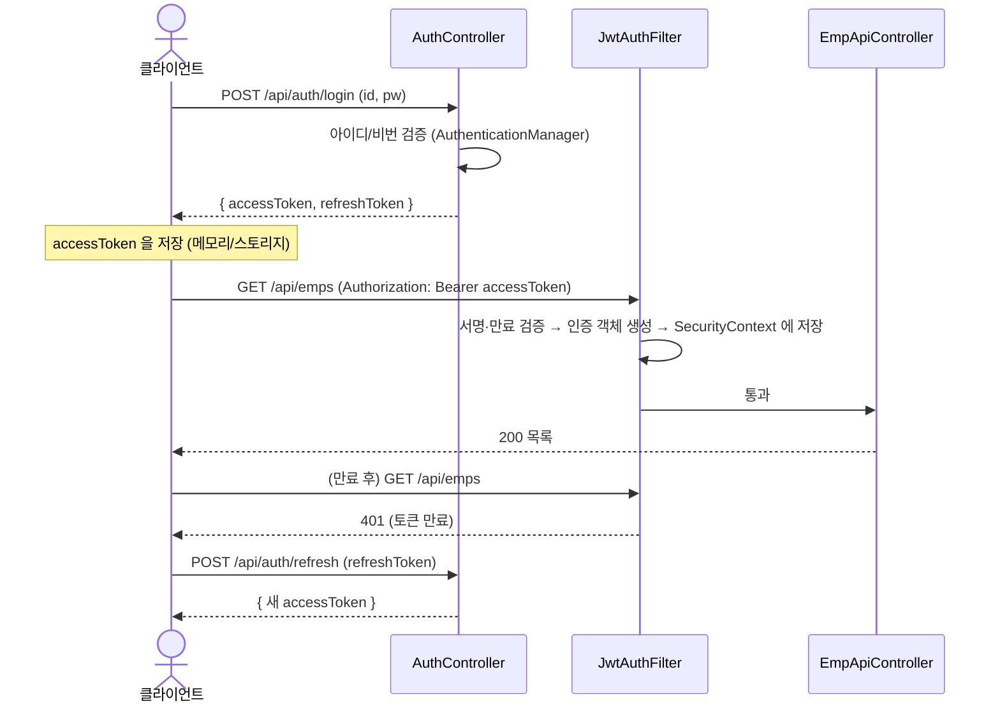

# Day 19. JWT 인증

| 항목 | 내용 |
|---|---|
| 선수학습 | Day 15(REST API), Day 17~18(시큐리티·필터 체인·`UserDetails`) |
| 이번 챕터 | 세션 방식의 한계 → JWT 구조 → 로그인→발급→검증 흐름 → `OncePerRequestFilter` 검증 필터 → stateless 설정 → Access/Refresh 개념 → 세션 vs JWT 선택 |
| 권장 진행 | 1일 |
| 의존성 | `implementation 'io.jsonwebtoken:jjwt-api:0.13.0'` + `runtimeOnly 'io.jsonwebtoken:jjwt-impl:0.13.0'` + `runtimeOnly 'io.jsonwebtoken:jjwt-gson:0.13.0'` |

> **Boot 4 주의**: jjwt 는 아직 Jackson 3 를 지원하지 않습니다. Spring Boot 4는 Jackson 3가 기본이므로,
> jjwt 의 JSON 처리는 **`jjwt-jackson` 대신 `jjwt-gson`** 을 씁니다(Gson 은 transitively 딸려옴).
> 3.x 자료의 `jjwt-jackson` 을 그대로 쓰면 Jackson 2가 함께 끌려 들어와 클래스패스가 지저분해집니다.

## 학습목표

- 세션 방식이 서버 확장·SPA·모바일에서 왜 부담이 되는지 설명한다.
- JWT의 3부분(Header.Payload.Signature)과 서명·만료의 의미를 안다.
- 로그인 → 토큰 발급 → `Authorization: Bearer` → 요청마다 검증하는 흐름을 그린다.
- `OncePerRequestFilter` 로 토큰을 검증해 `SecurityContext` 에 인증을 채운다.
- `/api/**` 를 stateless로 설정한다.
- Access/Refresh 토큰의 역할과 로그아웃(무효화) 문제를 안다.

---

## 1. 세션 방식의 한계

Day 17~18의 폼 로그인은 **서버가 세션(상태)을 저장**합니다.

| 상황 | 세션 방식의 부담 |
|---|---|
| 서버 여러 대(스케일 아웃) | 세션 공유 필요(스티키 세션 / Redis·JDBC 세션 외부화) |
| SPA(React 등)·모바일 앱 | 쿠키 기반이라 CORS·CSRF·크로스도메인 쿠키가 번거로움 |
| 마이크로서비스 | 서비스마다 세션 조회 → 결합 |

**JWT(JSON Web Token)** 는 서버가 상태를 **안 가집니다(stateless)**. 필요한 정보(사용자·권한·만료)를
토큰 안에 넣고 **서명**으로 위변조를 막습니다. 서버는 요청마다 토큰의 서명·만료만 검증하면 됩니다.

---

## 2. JWT 구조

`aaaa.bbbb.cccc` 세 부분(각각 Base64URL):

```
Header    {"alg":"HS256","typ":"JWT"}
Payload   {"sub":"admin","roles":["ADMIN"],"iat":1724800000,"exp":1724803600}
Signature HMACSHA256( base64(header) + "." + base64(payload), secretKey )
```

- **서명**: 비밀키(`secretKey`)로 만든 해시. 페이로드를 1글자만 바꿔도 서명이 안 맞음 → 위조 탐지.
- **암호화가 아님**: 페이로드는 누구나 디코딩해 읽을 수 있음(Base64). **민감정보 넣지 말 것.**
- `exp`(만료), `iat`(발급시각), `sub`(주체) 등은 표준 클레임.

---

## 3. 전체 흐름



---

## 4. 토큰 유틸 (jjwt)

```java
@Component
public class JwtProvider {

    private final SecretKey key;
    private final long accessExpMs;

    public JwtProvider(@Value("${jwt.secret}") String secret,
                       @Value("${jwt.access-exp-min:30}") long accessExpMin) {
        this.key = Keys.hmacShaKeyFor(secret.getBytes(StandardCharsets.UTF_8)); // 32바이트 이상
        this.accessExpMs = accessExpMin * 60_000;
    }

    public String createAccessToken(String username, Collection<String> roles) {
        Instant now = Instant.now();
        return Jwts.builder()
                .subject(username)
                .claim("roles", roles)
                .issuedAt(Date.from(now))
                .expiration(Date.from(now.plusMillis(accessExpMs)))
                .signWith(key)
                .compact();
    }

    public Jws<Claims> parse(String token) {          // 서명·만료 검증 포함, 실패 시 예외
        return Jwts.parser().verifyWith(key).build().parseSignedClaims(token);
    }
}
```

```yaml
jwt:
  secret: ${JWT_SECRET:this-is-a-dev-only-secret-please-change-32bytes+}
  access-exp-min: 30
  refresh-exp-day: 14
```

---

## 5. 로그인 API

```java
@RestController
@RequestMapping("/api/auth")
@RequiredArgsConstructor
public class AuthController {

    private final AuthenticationManager authenticationManager;   // @Bean 으로 노출 필요
    private final JwtProvider jwtProvider;

    @PostMapping("/login")
    public TokenResponse login(@RequestBody @Valid LoginRequest req) {
        Authentication auth = authenticationManager.authenticate(
                new UsernamePasswordAuthenticationToken(req.username(), req.password()));

        List<String> roles = auth.getAuthorities().stream()
                .map(GrantedAuthority::getAuthority).toList();   // ["ROLE_ADMIN"]

        String access = jwtProvider.createAccessToken(auth.getName(), roles);
        // refresh 토큰은 별도 저장(DB/Redis) 권장 — 여기선 개념만
        return new TokenResponse(access, /* refresh */ null);
    }
}
```

`AuthenticationManager` 빈 노출:
```java
@Bean
AuthenticationManager authenticationManager(AuthenticationConfiguration c) throws Exception {
    return c.getAuthenticationManager();
}
```
(`UserDetailsService` + `PasswordEncoder` 는 Day 17 그대로 재사용.)

---

## 6. 검증 필터

```java
@Component
@RequiredArgsConstructor
public class JwtAuthFilter extends OncePerRequestFilter {

    private final JwtProvider jwtProvider;

    @Override
    protected void doFilterInternal(HttpServletRequest req, HttpServletResponse res, FilterChain chain)
            throws ServletException, IOException {

        String header = req.getHeader(HttpHeaders.AUTHORIZATION);
        if (header != null && header.startsWith("Bearer ")) {
            String token = header.substring(7);
            try {
                Claims claims = jwtProvider.parse(token).getPayload();
                String username = claims.getSubject();
                List<String> roles = claims.get("roles", List.class);

                var authorities = roles.stream().map(SimpleGrantedAuthority::new).toList();
                var authentication = new UsernamePasswordAuthenticationToken(username, null, authorities);
                SecurityContextHolder.getContext().setAuthentication(authentication);
            } catch (JwtException e) {
                // 서명 불일치 / 만료 등 → 인증 세팅 안 함 → 뒤에서 401
                SecurityContextHolder.clearContext();
            }
        }
        chain.doFilter(req, res);
    }
}
```

---

## 7. stateless 설정 (`/api/**` 전용 체인)

```java
@Bean
@Order(1)
SecurityFilterChain apiChain(HttpSecurity http, JwtAuthFilter jwtAuthFilter) throws Exception {
    http
        .securityMatcher("/api/**")
        .csrf(csrf -> csrf.disable())                                   // 헤더 토큰이라 CSRF 불필요
        .sessionManagement(s -> s.sessionCreationPolicy(SessionCreationPolicy.STATELESS))
        .authorizeHttpRequests(auth -> auth
            .requestMatchers("/api/auth/**").permitAll()
            .anyRequest().authenticated())
        .addFilterBefore(jwtAuthFilter, UsernamePasswordAuthenticationFilter.class)
        .exceptionHandling(e -> e
            .authenticationEntryPoint((rq, rs, ex) -> rs.sendError(401))
            .accessDeniedHandler((rq, rs, ex) -> rs.sendError(403)));
    return http.build();
}

// Day 17 의 폼 로그인 체인은 @Order(2) 로 그대로 (화면용)
```

- `STATELESS` : 세션을 안 만들고 안 씀. `SecurityContext` 는 요청 단위(필터가 매번 채움).
- `/api/auth/login`, `/api/auth/refresh` 만 열고 나머지 API는 토큰 필수.
- 화면(`/emps` 등)은 Day 17 세션 체인이 계속 담당 → **한 앱에서 세션(화면) + JWT(API) 공존**.

---

## 8. Access / Refresh 토큰

| | Access | Refresh |
|---|---|---|
| 수명 | 짧게(15~30분) | 길게(1~2주) |
| 용도 | 매 API 요청에 첨부 | Access 만료 시 새 Access 재발급 |
| 저장 | 클라이언트(메모리 권장) | HttpOnly 쿠키 또는 안전 저장 + **서버 DB/Redis에도** |
| 탈취 시 | 곧 만료 | 서버에서 폐기(회전) 필요 |

**로그아웃/무효화 문제**: JWT는 stateless라 "이미 발급한 토큰"을 서버가 못 지웁니다.
- Access 는 짧으니 만료를 기다림.
- Refresh 는 DB에 저장했다가 로그아웃 시 삭제(그 이후 재발급 불가). "블랙리스트"(폐기된 jti 목록)도 방법.
- 강제 로그아웃이 중요하면 → 사실 세션이 더 단순. 트레이드오프.

---

## 9. 세션 vs JWT 선택

| 조건 | 권장 |
|---|---|
| 서버 렌더링(Thymeleaf) + 단일/소수 서버 | **세션** (단순, 즉시 무효화) |
| SPA/모바일 + REST + 다중 서버 | **JWT** (stateless, 크로스도메인 편함) |
| 즉시 강제 로그아웃·계정 정지가 핵심 | 세션 or 짧은 Access + 서버측 Refresh 관리 |
| 서드파티에 API 개방 | OAuth2 / JWT |

이 과정 미니 프로젝트는 **둘 중 하나를 선택**해 구현합니다(화면 위주면 세션, API 위주면 JWT).

---

## 자주 하는 실수

- **시크릿을 코드/깃에 하드코딩** → 환경변수/시크릿 매니저. HS256이면 32바이트 이상.
- **페이로드에 비밀번호·주민번호** → 누구나 디코딩 가능. 최소한(sub, roles, exp)만.
- **만료(`exp`) 안 넣음** → 탈취 시 영구 유효. 짧게.
- **CSRF 를 JWT API에서 켜둠** → 불필요(헤더 토큰). `/api/**` 는 `csrf().disable()` + STATELESS.
- **필터에서 예외를 그냥 던짐** → 500. 검증 실패면 인증만 비우고 통과 → 뒤에서 401.
- **화면 체인과 API 체인을 안 나눔** → 폼 로그인과 JWT가 충돌. `securityMatcher` + `@Order` 로 분리.
- **로그아웃하면 토큰이 무효일 거라 가정** → stateless는 서버가 못 지움. Refresh 관리·짧은 만료로 완화.

---

## 핵심 요약

| 요소 | 내용 |
|---|---|
| JWT | `Header.Payload.Signature`. 서명으로 위변조 방지, 암호화 아님, `exp` 필수 |
| 흐름 | 로그인 → 토큰 발급 → `Authorization: Bearer` → 요청마다 서명·만료 검증 |
| `JwtProvider` | jjwt 로 생성/파싱 |
| `JwtAuthFilter` | `OncePerRequestFilter` 로 토큰 검증 → `SecurityContext` 채움 |
| stateless | `/api/**` 전용 체인 + `SessionCreationPolicy.STATELESS` + `csrf().disable()` |
| Access/Refresh | 짧은 Access + 서버 관리 Refresh. 로그아웃은 Refresh 폐기 |
| 선택 | 화면·소수 서버 → 세션 / SPA·다중 서버 → JWT |

> 다음(Day 20): 지금까지를 모아 하나의 애플리케이션으로 — 미니 프로젝트.
