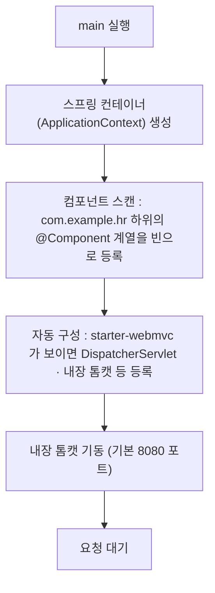

# Day 2. 스프링 부트 시작

| 항목 | 내용 |
|---|---|
| 선수학습 | Java(클래스·애노테이션), `Java 3.에노테이션`의 수동 DI 컨테이너, **[0_빌드도구.md](0_빌드도구.md)**(Gradle·의존성·`gradlew`) |
| 이번 챕터 | 스프링 부트가 없애 준 것 → `start.spring.io` 프로젝트 생성 → 프로젝트 구조 → `@SpringBootApplication` → 내장 톰캣 실행 → `application.yml` → 첫 컨트롤러 → DevTools |
| 권장 진행 | 1일 |
| 개발 환경 | JDK 17, **Spring Boot 4.0.x**, Gradle 8.14.x(Groovy), IntelliJ IDEA / VS Code — 버전 기준선은 [00_SpringBoot4_기준.md](../00_SpringBoot4_기준.md) |
| 결과물 | 브라우저에서 `http://localhost:8080/hello` 가 응답하는 프로젝트 |

## 학습목표

- 스프링 부트가 **"예전 스프링의 무엇을"** 자동화했는지 설명할 수 있다.
- 이 교안이 **Spring Boot 4.0.x** 를 쓰며, 온라인의 3.x 자료와 무엇이 다른지 안다.
- `start.spring.io`로 프로젝트를 만들고 IntelliJ/VS Code에서 실행할 수 있다.
- 스프링 부트 프로젝트의 **폴더 구조**와 각 위치의 역할을 안다.
- `@SpringBootApplication`이 붙은 `main` 클래스가 실행될 때 **무슨 일이 일어나는지** 설명할 수 있다.
- `application.yml`로 포트·앱 이름 같은 설정을 바꿀 수 있다.
- `@RestController` + `@GetMapping`으로 첫 요청을 처리하고, DevTools로 코드 수정을 바로 반영할 수 있다.

---

## 1. 스프링 부트가 없애 준 것

`Java 2. DB연결하기`에서 JDBC 드라이버 하나 추가하는 것도 일이었습니다. 예전 스프링(부트 이전)으로
웹 애플리케이션을 만들려면 이런 걸 **직접** 해야 했습니다.

| 예전에 직접 하던 일 | 스프링 부트에서는 |
|---|---|
| 톰캣(WAS)을 따로 설치하고 WAR 파일을 배포 | 톰캣이 **라이브러리로 내장**됨. `main()` 실행이 곧 서버 실행 |
| `web.xml`, `applicationContext.xml` 등 XML 설정 다수 | 애노테이션 + `application.yml` 몇 줄 |
| spring-webmvc, jackson, validation … 버전을 하나씩 맞춤 | **스타터(starter)** 하나 추가하면 궁합 맞는 버전이 세트로 딸려옴 |
| DispatcherServlet, ViewResolver, 메시지 컨버터를 손으로 등록 | **자동 구성(auto-configuration)** 이 기본값으로 등록해 줌 |

한 줄 요약: **"설정보다 관례(convention over configuration)"** — 흔한 선택은 부트가 알아서 해 두고,
필요한 것만 우리가 바꿉니다.

> `Java 3.에노테이션`에서 리플렉션으로 `@주입`을 처리하는 DI 컨테이너를 만들었죠. 스프링 부트가 하는 일도
> 결국 **"클래스를 스캔해서 객체를 만들고 연결하고, 서버를 띄우는 것"** 입니다. 규모가 커졌을 뿐입니다.

---

## 2. 프로젝트 생성 — start.spring.io

브라우저에서 [start.spring.io](https://start.spring.io) 에 접속해 아래처럼 고릅니다.
(IntelliJ 유료판은 `File > New > Project > Spring Initializr` 로 같은 화면을 씁니다.
**VS Code** 는 확장 설치·생성·실행 전 과정을 정리한 [00_VSCode_개발환경_세팅.pdf](../00_VSCode_개발환경_세팅.pdf) 참고.)

| 항목 | 선택 |
|---|---|
| Project | **Gradle - Groovy** |
| Language | **Java** |
| Spring Boot | **4.0.x** (기본으로 선택돼 있음 — 아래 2.1 참고) |
| Group | `com.example` |
| Artifact | `hr` |
| Package name | `com.example.hr` |
| Packaging | **Jar** |
| Java | **17** |
| Dependencies | **Spring Web**, **Thymeleaf**, **Lombok**, **Spring Boot DevTools** |

> MyBatis·MySQL 드라이버는 DB를 붙이는 **Day 9**에서 추가합니다. 오늘은 웹 요청 처리까지만.

**GENERATE** 버튼 → `hr.zip` 다운로드 → 압축 해제 → IntelliJ/VS Code에서 **폴더 자체를 Open**.
처음 열면 Gradle이 의존성을 내려받습니다(1~3분). 진행바가 끝나면 준비 완료.

### 2.1 버전 이야기 — 이 교안은 Spring Boot 4.0.x

Spring Boot **4.0** 이 2025년 11월에 나왔고, `start.spring.io` 와 IntelliJ/VS Code Initializr 의
**Spring Boot 드롭다운 기본값이 4.0.x** 입니다. 이 교안은 그 기본값을 그대로 씁니다 — 예전처럼
버전을 내리는 작업이 **필요 없습니다.**

- **Java 는 17 그대로.** Boot 4.0 최소 요구도 Java 17입니다(안 올라감).
- **Gradle 도 8.14.x 그대로.** Boot 4.0 은 Gradle 8.14 이상이면 됩니다.
- 바뀐 건 주로 **이름**입니다: 웹 스타터가 `spring-boot-starter-web` → **`spring-boot-starter-webmvc`**,
  테스트 목(mock) 애노테이션이 `@MockBean` → `@MockitoBean` 등. 개념·흐름은 3.x와 같습니다.

> **온라인 자료가 대부분 3.x 입니다.** 블로그·Stack Overflow 예제를 그대로 붙이면 `starter-web`,
> `@MockBean`, `com.fasterxml.jackson.*` 같은 옛 이름이 섞입니다. 3.x → 4.0 달라지는 점은
> [00_SpringBoot4_기준.md](../00_SpringBoot4_기준.md) 에 한 장으로 정리해 뒀습니다. 막히면 거기부터.

**Day 2 시점의 `build.gradle`** (Web + Thymeleaf + Lombok + DevTools):

```groovy
plugins {
    id 'java'
    id 'org.springframework.boot' version '4.0.8'
    id 'io.spring.dependency-management' version '1.1.7'
}

java {
    toolchain { languageVersion = JavaLanguageVersion.of(17) }
}

dependencies {
    implementation 'org.springframework.boot:spring-boot-starter-webmvc'     // ← 3.x 자료의 starter-web
    implementation 'org.springframework.boot:spring-boot-starter-thymeleaf'

    compileOnly 'org.projectlombok:lombok'
    annotationProcessor 'org.projectlombok:lombok'
    developmentOnly 'org.springframework.boot:spring-boot-devtools'
    runtimeOnly 'com.mysql:mysql-connector-j'                                 // Day 9에서 실제 사용

    testImplementation 'org.springframework.boot:spring-boot-starter-test'
    testRuntimeOnly 'org.junit.platform:junit-platform-launcher'
}

tasks.named('test') { useJUnitPlatform() }
```

- Initializr 가 만들어 준 것과 거의 같습니다. `mysql-connector-j` 만 미리 넣어 뒀습니다(Day 9 대비).
- **MyBatis**(`mybatis-spring-boot-starter:4.0.1`)·**검증**(`spring-boot-starter-validation`)·
  **시큐리티**(`spring-boot-starter-security`)는 각각 **Day 9 · 14 · 17** 에서 추가합니다.
- `wrapper` 는 `gradle/wrapper/gradle-wrapper.properties` 의 `distributionUrl` 이
  `gradle-8.14.3-bin.zip` (또는 8.14.x) 이면 됩니다.

### 2.2 Gradle이 쓰는 Java 버전 맞추기 (VS Code)

빌드하면 아래 오류가 나는 경우:

```
The supplied phased action failed with an exception.
BUG! exception in phase 'semantic analysis' in source unit '_BuildScript_'
Unsupported class file major version 69
```

**코드 오류가 아니라 Java 버전 문제입니다.** `_BuildScript_` = `build.gradle` 을 컴파일하는
단계이고, `major version 69` = **Java 25**. 즉 **Gradle이 Java 25로 돌고 있는데 Gradle 8.14.x
는 Java 24까지만 지원**해서 터진 것입니다. (최근 JDK 25가 깔리면서 그쪽을 잡음)

| class file major | Java |
|---|---|
| 61 | 17 |
| 65 | 21 |
| 68 | 24 |
| **69** | **25** ← 오류 |

**Gradle 빌드에는 JVM이 둘** 관여합니다. 이 오류는 (1)번에서 납니다.

| | 무엇을 실행 | 무엇으로 정해지나 |
|---|---|---|
| (1) 런처/데몬 JVM | Gradle 자체 + `build.gradle` 컴파일 | `JAVA_HOME`, IDE의 Gradle Java, `org.gradle.java.home` |
| (2) 툴체인 JVM | 내 앱 코드 컴파일·테스트 | `build.gradle` 의 `java { toolchain { … } }` |

> `build.gradle` 에 `toolchain { languageVersion = JavaLanguageVersion.of(17) }` 이 있어도
> 이 오류는 **안 막힙니다.** 툴체인이 쓰이기 전에 (1)에서 터지기 때문입니다.

**고치는 순서 (VS Code)**

1. **JDK 17 설치 경로 확인** — 예: `C:\Program Files\Java\jdk-17`.
   그 아래 `bin\java.exe` 가 있어야 합니다(`bin` 까지 넣지 말 것).
   ```
   & "C:\Program Files\Java\jdk-17\bin\java.exe" -version
   ```
2. **VS Code `settings.json`** (Ctrl+Shift+P → *Preferences: Open User Settings (JSON)*) 에 추가:
   ```jsonc
   "java.jdt.ls.java.home": "C:\\Program Files\\Java\\jdk-17",       // 자바 확장 자체
   "java.import.gradle.java.home": "C:\\Program Files\\Java\\jdk-17", // Gradle 동기화
   "java.configuration.runtimes": [
     { "name": "JavaSE-17", "path": "C:\\Program Files\\Java\\jdk-17", "default": true }
   ]
   ```
   경로 구분자는 `\\` 또는 `/`.
3. **데몬 종료** — 터미널에서 `.\gradlew --stop` (예전 Java 25 데몬이 재사용되는 것 방지).
4. **워크스페이스 새로고침** — Ctrl+Shift+P → **Java: Clean Java Language Server Workspace** → *Restart and delete*. 다시 열리면 Gradle 동기화가 새 JDK로 돕니다.
5. **확인**
   ```
   .\gradlew --version
   ```
   `Launcher JVM: 17.x` 로 나오면 해결. `25.x` 면 `JAVA_HOME` 이 아직 25입니다 →
   시스템 환경변수 `JAVA_HOME` 을 JDK 17로 바꾸거나, 프로젝트 루트 `gradle.properties` 에:
   ```properties
   org.gradle.java.home=C:/Program Files/Java/jdk-17
   ```
   (`C:\Users\<계정>\.gradle\gradle.properties` 에 25로 박힌 게 없는지도 확인)

> **JDK 25를 꼭 써야 하면** 반대로 wrapper 를 올립니다 — `gradle-wrapper.properties` 의
> `distributionUrl` 을 `gradle-9.1-bin.zip` 이상으로. 단 이 교안은 **JDK 17 + Gradle 8.14.x** 기준입니다.

---

## 3. 프로젝트 구조 둘러보기

```
hr
├── build.gradle              의존성·플러그인·자바 버전
├── settings.gradle           프로젝트 이름
├── gradlew, gradlew.bat      Gradle 실행 스크립트(설치 불필요)
└── src
    ├── main
    │   ├── java
    │   │   └── com/example/hr
    │   │       └── HrApplication.java     ← main() 이 여기 있음
    │   └── resources
    │       ├── static/                    CSS·JS·이미지 (그대로 서빙됨)
    │       ├── templates/                 Thymeleaf HTML (Day 8)
    │       └── application.properties     설정 파일 (→ yml로 바꿀 예정)
    └── test
        └── java/com/example/hr
            └── HrApplicationTests.java    기본 테스트 (Day 10)
```

기억할 것 세 가지:

- **`src/main/java`** 아래 `com.example.hr` 가 **기준 패키지**. 우리 코드는 전부 이 아래에 만든다
  (Day 1에서 정한 `controller/`, `service/`, `mapper/` …).
- **`src/main/resources`** 는 코드가 아닌 것(설정·정적 파일·SQL·템플릿).
- **`build.gradle`** 의 `dependencies { }` 블록이 곧 "이 프로젝트가 쓰는 라이브러리 목록".

`build.gradle` 의 핵심만 보면:

```groovy
dependencies {
    implementation 'org.springframework.boot:spring-boot-starter-webmvc'     // 웹 MVC + 내장 톰캣
    implementation 'org.springframework.boot:spring-boot-starter-thymeleaf'  // 템플릿 엔진
    compileOnly 'org.projectlombok:lombok'
    annotationProcessor 'org.projectlombok:lombok'
    developmentOnly 'org.springframework.boot:spring-boot-devtools'          // 개발용 자동 재시작
    testImplementation 'org.springframework.boot:spring-boot-starter-test'
}
```

버전 번호가 안 보이죠? 부트 플러그인이 **검증된 버전 세트**를 대신 관리합니다(심화 참고).
(`spring-boot-starter-web` 이라고 쓴 3.x 자료를 보면 **4.0에선 `-webmvc`** 입니다.)

---

## 4. `@SpringBootApplication` 과 main()

```java
package com.example.hr;

import org.springframework.boot.SpringApplication;
import org.springframework.boot.autoconfigure.SpringBootApplication;

@SpringBootApplication
public class HrApplication {
    public static void main(String[] args) {
        SpringApplication.run(HrApplication.class, args);
    }
}
```

`@SpringBootApplication` 은 애노테이션 3개를 합쳐 놓은 것입니다.

| 합쳐진 애노테이션 | 역할 |
|---|---|
| `@SpringBootConfiguration` | 이 클래스를 설정 클래스로 인식 (`@Configuration` 의 부트 버전) |
| `@EnableAutoConfiguration` | **자동 구성** 켜기 — 클래스패스에 있는 라이브러리를 보고 필요한 빈을 자동 등록 |
| `@ComponentScan` | **이 클래스가 있는 패키지와 그 하위**를 스캔해 `@Component`/`@Controller`/`@Service` 등을 빈으로 등록 |

`SpringApplication.run(...)` 이 실행되면 순서대로 이런 일이 일어납니다.



> **`@ComponentScan` 이 기준 패키지를 스캔**한다는 점이 중요합니다. 그래서 `HrApplication` 은 반드시
> `com.example.hr` **최상단**에 있어야 하고, 우리 코드는 그 **하위 패키지**에 둬야 스캔됩니다(자주 하는 실수 참고).

---

## 5. 내장 톰캣과 첫 실행

`HrApplication` 을 열고 `main()` 옆의 ▶ 버튼(또는 `Shift+F10`)을 누릅니다. 콘솔 로그를 읽어 봅시다.

```
Tomcat initialized with port 8080 (http)
...
Started HrApplication in 1.83 seconds (process running for 2.1)
Tomcat started on port 8080 (http) with context path ''
```

- `Tomcat started on port 8080` → 서버가 떴다는 뜻.
- `Started HrApplication in ... seconds` → 이 줄이 보이면 정상 기동 완료.

브라우저에서 `http://localhost:8080` 을 열면 **Whitelabel Error Page**(404)가 뜹니다.
아직 처리할 주소를 안 만들었을 뿐, 서버는 정상입니다. 7절에서 주소를 만듭니다.

멈추려면 콘솔의 ■(빨간 네모) 버튼.

---

## 6. `application.yml` 로 설정하기

스프링 부트는 기동할 때 `src/main/resources/` 에서 **이름이 `application` 인 설정 파일**을 스스로
찾아 읽습니다. **확장자는 상관없습니다** — `application.properties`, `application.yml`,
`application.yaml` 을 모두 인식해서 설정에 적용합니다. 파일명을 코드에 지정할 필요가 없습니다(관례 = 설정).

`src/main/resources/application.properties` 파일 이름을 **`application.yml`** 로 바꿉니다.
`key=value` 를 한 줄씩 쓰는 properties 보다, 계층 구조가 눈에 보이는 yml을 이 과정에서 씁니다.

| | `application.properties` | `application.yml` |
|---|---|---|
| 형식 | `server.port=8080` — 계층을 점(`.`)으로 잇고 `=`, 한 줄에 하나 | `server:` 아래 `  port: 8080` — 들여쓰기 계층에 `:` |
| 중복 키 | 같은 위치에 둘 다 있으면 `application.properties` 값이 `application.yml` 값을 이김 | |

> 형식만 비교해 보고 싶으면 `application.properties` 를 같은 폴더에 남겨 두고 열어 봐도 됩니다
> (이 챕터 예제 폴더에 비교용으로 함께 둡니다). 실무에선 **한 형식만** 씁니다.

```yaml
server:
  port: 8080          # 포트 변경은 여기서

spring:
  application:
    name: hr           # 로그·모니터링에 표시될 앱 이름

logging:
  level:
    org.springframework.web: INFO
    com.example.hr: DEBUG   # 우리 패키지는 자세히 (Day 3 로깅에서 이어서)
```

- **들여쓰기는 공백 2칸.** 탭(Tab) 문자를 쓰면 파싱 오류가 납니다.
- `키: 값` 의 콜론 뒤에는 **공백 한 칸**.
- 포트가 이미 쓰이는 중이면(`Port 8080 was already in use`) 여기서 `8090` 등으로 바꿉니다.

`spring.profiles` 로 개발/운영 설정을 나누는 방법은 Day 3·심화에서 다룹니다.

---

## 7. 첫 컨트롤러

`com.example.hr` 아래에 `controller` 패키지를 만들고 `HelloController` 를 추가합니다.

```java
package com.example.hr.controller;

import org.springframework.web.bind.annotation.GetMapping;
import org.springframework.web.bind.annotation.RequestParam;
import org.springframework.web.bind.annotation.RestController;

@RestController                                   // 이 클래스의 메서드 반환값을 그대로 응답 본문으로
public class HelloController {

    @GetMapping("/hello")                         // GET /hello 요청을 이 메서드가 처리
    public String hello(@RequestParam(defaultValue = "손님") String name) {
        return "안녕하세요, " + name + "님";
    }
}
```

저장하고(DevTools가 재시작), 브라우저에서:

- `http://localhost:8080/hello` → `안녕하세요, 손님님`
- `http://localhost:8080/hello?name=박지민` → `안녕하세요, 박지민님`

동작 원리(간단히):

1. 요청이 내장 톰캣 → `DispatcherServlet`(자동 구성으로 등록됨)에 도착
2. `DispatcherServlet` 이 주소(`/hello`)와 방식(GET)에 맞는 메서드를 찾음 → `HelloController.hello`
3. `@RequestParam` 이 쿼리스트링 `name` 값을 파라미터에 바인딩
4. 반환한 문자열을 `@RestController` 규칙에 따라 응답 본문으로 씀

> `@RestController` 는 "문자열·객체를 그대로 응답(주로 JSON)". HTML 화면을 그리는
> `@Controller` + 뷰(Thymeleaf)는 **Day 7~8**에서 다룹니다. 오늘은 요청이 도는 것만 확인.

객체를 반환하면 자동으로 JSON이 됩니다(자동 구성된 Jackson):

```java
@GetMapping("/ping")
public Map<String, Object> ping() {
    return Map.of("status", "ok", "time", java.time.LocalTime.now().toString());
}
// → {"status":"ok","time":"14:32:10.123"}
```

---

## 8. DevTools — 저장하면 바로 반영

`spring-boot-devtools` 가 있으면:

- **자동 재시작**: `src/main` 의 클래스를 저장하면 앱이 빠르게 재기동(전체 재시작보다 훨씬 빠름).
- **정적 리소스 즉시 반영**: `templates/`, `static/` 변경은 재시작 없이 반영.
- **캐시 비활성화**: 개발 중 Thymeleaf 템플릿 캐시 등을 자동으로 끔.

IntelliJ에서 자동 재시작이 안 되면 두 가지를 켭니다.

1. `Settings > Build, Execution, Deployment > Compiler` → **Build project automatically** 체크
2. `Settings > Advanced Settings` → **Allow auto-make to start ... even if the developed application is currently running** 체크

그래도 안 되면 코드 저장 후 `Ctrl+F9`(Build Project)를 눌러 수동 트리거합니다.

---

## 자주 하는 실수

- **`@SpringBootApplication` 클래스를 하위 패키지에 둠** → 컴포넌트 스캔 범위 밖의 코드는 빈으로 안 잡혀 404·`NoSuchBeanDefinitionException`. `HrApplication` 은 기준 패키지 **최상단**에 두고, 코드는 그 하위에.
- **`Port 8080 was already in use`** → 이전에 띄운 앱이 안 꺼졌거나 다른 프로그램이 8080 사용 중. 콘솔 ■로 종료하거나 `server.port` 를 바꾼다.
- **application.yml 들여쓰기에 탭 사용** → `ScannerException`. 공백 2칸만.
- **스타터 빠뜨림** → `@RestController` 를 import 못 함, 톰캣이 안 뜸. `build.gradle` 에 `spring-boot-starter-webmvc` 가 있는지 확인.
- **코드를 저장했는데 반영 안 됨** → DevTools 재시작이 안 걸린 것. 8절의 IntelliJ 설정 확인, 또는 앱 재시작.
- **`main` 을 두 개 만듦** → `@SpringBootApplication` 클래스는 프로젝트에 하나만.
- **3.x 자료를 그대로 붙임** → `spring-boot-starter-web`(→ `-webmvc`), `@MockBean`(→ `@MockitoBean`), `com.fasterxml.jackson.*`(→ `tools.jackson.*`) 같은 옛 이름이 섞임. 달라지는 점은 [00_SpringBoot4_기준.md](../00_SpringBoot4_기준.md).
- **wrapper 가 8.14 미만** → Boot 4.0 은 Gradle **8.14 이상**(또는 9.x) 필요. `gradle-wrapper.properties` 를 `gradle-8.14.3-bin.zip` 로.
- **`Unsupported class file major version 69`** (`_BuildScript_` 에서) → 코드가 아니라 **Gradle이 Java 25로 도는 것**. Gradle 8.14.x 는 Java 24까지만 지원. VS Code `settings.json` 의 `java.import.gradle.java.home`·`java.jdt.ls.java.home` 를 JDK 17로 + `gradlew --stop` + *Clean Java Language Server Workspace* (2.2).

---

## 핵심 요약

| 요소 | 역할 | 비고 |
|---|---|---|
| 버전 | Spring Boot **4.0.x** + JDK **17** + Gradle **8.14.x** | Initializr 기본값 그대로. 웹 스타터는 `spring-boot-starter-webmvc` (2.1). `major version 69` 오류 = Gradle이 Java 25로 도는 것 → VS Code에서 JDK 17로 (2.2) |
| 스타터(`spring-boot-starter-*`) | 궁합 맞는 라이브러리 묶음 | 버전은 부트 플러그인이 관리 |
| `@SpringBootApplication` | `@Configuration` + 자동 구성 + 컴포넌트 스캔 | 기준 패키지 최상단에 위치 |
| `SpringApplication.run()` | 컨테이너 생성 → 스캔 → 자동 구성 → 내장 톰캣 기동 | `main()` 실행 = 서버 실행 |
| 내장 톰캣 | 별도 설치·배포 불필요 | 기본 8080 포트 |
| `application.yml` | 포트·앱 이름·로깅 등 설정 | 공백 2칸 들여쓰기, 탭 금지 |
| `@RestController` + `@GetMapping` | 요청을 메서드로 매핑, 반환값을 응답 본문으로 | HTML 뷰는 Day 7~8 |
| DevTools | 저장 시 자동 재시작 | `developmentOnly` 의존성 |

> 다음(Day 3): 방금 `application.yml` 에 넣은 `logging.level` 을 제대로 다루는 **로깅 설정**.
> 경험자용(자동 구성 원리·fat jar·프로파일·Actuator)은 `1_스프링부트시작_심화.md`.
