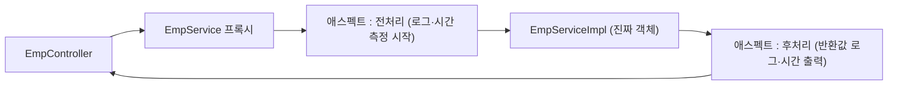

# Day 6. AOP

| 항목 | 내용 |
|---|---|
| 선수학습 | `Java 3.에노테이션`(리플렉션·애노테이션 처리), Day 4(빈·프록시), Day 3(로깅) |
| 이번 챕터 | 횡단 관심사 → 프록시로 끼워 넣기 → `@Aspect`·Advice·Pointcut → **실행 시간 로깅 애스펙트** → 스프링 AOP의 한계(내부 호출) → `@Transactional` 도 AOP |
| 권장 진행 | 1일 |
| 의존성 | `implementation 'org.springframework.boot:spring-boot-starter-aop'` |

## 학습목표

- 로깅·트랜잭션·권한처럼 **여러 곳에 흩어지는 코드(횡단 관심사)** 가 무엇인지 예를 들 수 있다.
- 스프링 AOP가 **프록시**로 "메서드 호출 전후에 코드를 끼워 넣는다"는 것을 설명할 수 있다.
- `@Aspect` + Advice(`@Around` 등) + Pointcut 표현식으로 애스펙트를 만들 수 있다.
- 서비스 메서드의 실행 시간·파라미터·반환값을 자동으로 로그에 남기는 애스펙트를 작성할 수 있다.
- 스프링 AOP가 **같은 클래스 내부 호출**에는 안 걸린다는 한계를 안다.
- `@Transactional`·`@Cacheable`·메서드 보안이 전부 AOP임을 안다.

---

## 1. 횡단 관심사(cross-cutting concern)

`EmpServiceImpl`, `DeptServiceImpl`, `OrderServiceImpl` … 서비스마다 이런 코드가 반복됩니다.

```java
public Long register(EmpForm form) {
    long start = System.currentTimeMillis();
    log.info("register 시작: {}", form);
    try {
        // ... 진짜 업무 로직 (딱 이 부분만 클래스마다 다름) ...
        return id;
    } finally {
        log.info("register 끝: {}ms", System.currentTimeMillis() - start);
    }
}
```

로깅·실행시간 측정·트랜잭션·권한 검사·재시도는 **"업무 로직과 무관하지만 여러 메서드에 똑같이 필요한 것"**
입니다. 이것을 **횡단 관심사**라 하고, 한곳에 모아 두는 기법이 **AOP**(Aspect-Oriented Programming)입니다.

> `Java 3.에노테이션`에서 리플렉션으로 애노테이션을 읽어 검증기를 만들었죠. AOP도 비슷합니다.
> 차이는 "필드를 검사"가 아니라 **"메서드 호출을 가로채서 전후에 코드를 실행"** 한다는 점입니다.

---

## 2. 어떻게 끼워 넣나 — 프록시

스프링은 AOP 대상 빈을 그대로 두지 않고, **프록시(대리 객체)** 로 감싸서 컨테이너에 등록합니다.



- `EmpController` 가 주입받는 `EmpService` 는 사실 **프록시**입니다.
- 프록시는 호출을 받아 **애스펙트 코드를 먼저/나중에 실행**하고, 중간에 진짜 객체를 호출합니다.
- 인터페이스가 있으면 **JDK 동적 프록시**, 없으면 **CGLIB**(클래스 상속 프록시)를 씁니다(부트 기본 CGLIB).

---

## 3. 용어

| 용어 | 뜻 |
|---|---|
| **Aspect** | 횡단 관심사를 담은 클래스 (`@Aspect`) |
| **Advice** | 언제 무엇을 할지. `@Before` / `@AfterReturning` / `@AfterThrowing` / `@After` / `@Around` |
| **Pointcut** | 어떤 메서드에 적용할지 고르는 표현식 |
| **JoinPoint** | 적용되는 지점(여기서는 "메서드 실행"). 메서드명·인자 등 정보 제공 |
| **Weaving** | 애스펙트를 대상에 엮는 과정 (스프링은 런타임에 프록시로) |

### Advice 종류

| 애노테이션 | 실행 시점 | 비고 |
|---|---|---|
| `@Before` | 대상 메서드 실행 전 | |
| `@AfterReturning` | 정상 반환 후 | 반환값 접근 가능 |
| `@AfterThrowing` | 예외 던진 후 | 예외 접근 가능 |
| `@After` | 정상/예외 무관 항상 (finally) | |
| `@Around` | 전·후 모두 감쌈. 직접 `proceed()` 호출 | 실행시간 측정·값 변경·재시도에 사용 |

---

## 4. 포인트컷 표현식

가장 많이 쓰는 `execution(...)`:

```
execution( [접근제어자] 반환타입 [패키지.클래스.]메서드이름(파라미터) )
```

| 표현식 | 의미 |
|---|---|
| `execution(* com.example.hr.service..*(..))` | `service` 패키지와 하위의 모든 메서드 |
| `execution(public * com.example.hr..*Service.*(..))` | 이름이 `*Service` 인 클래스의 public 메서드 |
| `execution(* com.example.hr.service.EmpServiceImpl.register(..))` | 딱 그 메서드 |
| `@annotation(com.example.hr.common.Timed)` | `@Timed` 가 붙은 메서드 |
| `within(com.example.hr.controller..*)` | `controller` 패키지 안의 타입 |

`..` = 0개 이상 패키지/파라미터, `*` = 하나.

재사용하려면 `@Pointcut` 으로 이름을 붙입니다.

```java
@Pointcut("execution(* com.example.hr.service..*(..))")
public void serviceLayer() {}
```

---

## 5. 실행 시간 로깅 애스펙트

```java
package com.example.hr.common;

import lombok.extern.slf4j.Slf4j;
import org.aspectj.lang.ProceedingJoinPoint;
import org.aspectj.lang.annotation.Around;
import org.aspectj.lang.annotation.Aspect;
import org.aspectj.lang.annotation.Pointcut;
import org.springframework.stereotype.Component;

@Slf4j
@Aspect
@Component            // 애스펙트도 빈이어야 동작
public class LoggingAspect {

    @Pointcut("execution(* com.example.hr.service..*(..))")
    public void serviceLayer() {}

    @Around("serviceLayer()")
    public Object logAndTime(ProceedingJoinPoint pjp) throws Throwable {
        String sig = pjp.getSignature().toShortString();     // EmpServiceImpl.register(..)
        long start = System.nanoTime();
        if (log.isDebugEnabled()) {
            log.debug("▶ {} args={}", sig, java.util.Arrays.toString(pjp.getArgs()));
        }
        try {
            Object result = pjp.proceed();                    // 진짜 메서드 호출
            long ms = (System.nanoTime() - start) / 1_000_000;
            log.debug("◀ {} {}ms → {}", sig, ms, brief(result));
            return result;
        } catch (Throwable e) {
            long ms = (System.nanoTime() - start) / 1_000_000;
            log.warn("✖ {} {}ms 예외: {}", sig, ms, e.toString());
            throw e;                                          // 반드시 다시 던진다
        }
    }

    private String brief(Object o) {
        String s = String.valueOf(o);
        return s.length() > 120 ? s.substring(0, 120) + "..." : s;
    }
}
```

`GET /api/emps` 한 번 호출하면 콘솔에:
```
▶ EmpServiceImpl.findAll(..) args=[]
◀ EmpServiceImpl.findAll(..) 3ms → [Emp(empId=201, empName=신입, ...)]
```

**포인트**: `EmpServiceImpl` 코드는 한 줄도 안 바뀝니다. 로깅·시간 측정이 애스펙트로 **분리**됐습니다.

### 특정 메서드만 재고 싶으면 — 커스텀 애노테이션

```java
@Retention(RUNTIME) @Target(METHOD)
public @interface Timed {}

@Around("@annotation(com.example.hr.common.Timed)")
public Object time(ProceedingJoinPoint pjp) throws Throwable { ... }
```
```java
@Timed
public List<Emp> heavyReport() { ... }
```

---

## 6. 스프링 AOP의 한계 — 내부 호출

```java
@Service
public class EmpServiceImpl implements EmpService {

    @Timed
    public void a() { b(); }      // 같은 클래스의 b() 를 this.b() 로 호출

    @Timed
    public void b() { ... }       // ← 이 @Timed 는 동작하지 않는다!
}
```

- `a()` 는 프록시를 통해 들어오므로 `@Timed` 가 걸린다.
- 그런데 `a()` 안에서 `b()` 를 부르는 건 `this.b()` — **프록시를 안 거치고** 진짜 객체에서 바로 호출.
  그래서 `b()` 의 `@Timed`(그리고 `@Transactional` 등)는 무시된다.

해결:
- 대상 메서드를 **다른 빈**으로 분리한다(가장 깔끔).
- `((EmpService) AopContext.currentProxy()).b()` (설정 필요, 권장 안 함).
- 자기 자신을 `ObjectProvider` 로 주입해 프록시로 호출.

> 이 한계는 **Day 13 트랜잭션**에서 다시 나옵니다: "한 서비스 메서드에서 같은 클래스의 다른
> `@Transactional` 메서드를 호출해도 새 트랜잭션이 안 열린다".

---

## 7. `@Transactional` 도 AOP다

우리가 Day 13에서 붙일 `@Transactional`, 캐시의 `@Cacheable`, Spring Security의 `@PreAuthorize` 는
전부 **AOP 어드바이스**입니다. 프록시가 메서드 호출을 가로채:

- `@Transactional` → 앞에서 트랜잭션 시작, 정상 반환 시 커밋, 예외 시 롤백
- `@Cacheable` → 캐시에 있으면 진짜 메서드 호출 없이 반환
- `@PreAuthorize` → 권한 없으면 진짜 메서드 호출 전에 차단

그래서 "AOP를 이해하면 이 애노테이션들이 왜 그렇게 동작하는지"가 한 번에 풀립니다.

---

## 자주 하는 실수

- **`@Aspect` 만 붙이고 `@Component` 안 붙임** → 빈이 아니라서 동작 안 함. `starter-aop` 도 확인.
- **`@Around` 에서 `proceed()` 를 안 부름** → 진짜 메서드가 실행되지 않아 항상 `null` 반환.
- **`@Around` 에서 예외를 잡고 안 던짐** → 호출자는 성공한 줄 안다. 로깅 후 `throw e`.
- **포인트컷이 너무 넓음** (`execution(* *(..))`) → 게터·프레임워크 내부까지 걸려 로그 폭증·성능 저하.
- **내부 호출에 애노테이션 AOP 기대** → 6절. 별도 빈으로 분리.
- **`private` 메서드에 어드바이스 기대** → 스프링 AOP는 public 메서드만(프록시 기반).

---

## 핵심 요약

| 개념 | 내용 |
|---|---|
| 횡단 관심사 | 로깅·시간측정·트랜잭션·권한 등 여러 메서드에 반복되는 것 |
| 동작 방식 | 대상 빈을 **프록시**로 감싸 호출 전후에 애스펙트 실행 |
| `@Aspect` + `@Component` | 애스펙트 클래스 (둘 다 필요) |
| Advice | `@Before`/`@AfterReturning`/`@AfterThrowing`/`@After`/`@Around` |
| Pointcut | `execution(* com.example.hr.service..*(..))`, `@annotation(...)` |
| `@Around` | `pjp.proceed()` 를 직접 호출, 시간측정·재시도에 사용 |
| 한계 | 같은 클래스 내부 호출·private 메서드에는 안 걸림 |
| 연결 | `@Transactional`·`@Cacheable`·`@PreAuthorize` = AOP |

> 다음(Day 7): 이제 웹 요청을 제대로 받는다 — Spring MVC 기초.
