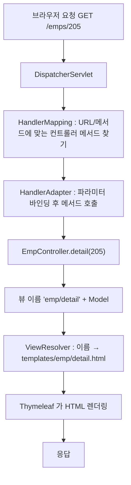

# Day 7. Spring MVC 기초

| 항목 | 내용 |
|---|---|
| 선수학습 | Day 2(첫 컨트롤러), Day 5(계층), HTML 폼·GET/POST |
| 이번 챕터 | `DispatcherServlet` 요청 흐름 → `@Controller` vs `@RestController` → URL 매핑 → 파라미터 바인딩(`@RequestParam`·`@PathVariable`·`@ModelAttribute`) → `Model` 과 뷰 이름 |
| 권장 진행 | 1일 |
| 결과물 | `/emps` 로 사원 목록 화면(간단한 HTML)이 뜨는 프로젝트. 본격 Thymeleaf 문법은 Day 8 |

## 학습목표

- 요청이 `DispatcherServlet` → 컨트롤러 → 뷰로 흐르는 과정을 설명할 수 있다.
- `@Controller`(뷰 이름 반환)와 `@RestController`(응답 본문 반환)의 차이를 안다.
- `@GetMapping`/`@PostMapping` 과 URL 패턴(`{id}`)으로 요청을 메서드에 매핑할 수 있다.
- 쿼리스트링·경로변수·폼 데이터를 `@RequestParam`/`@PathVariable`/`@ModelAttribute` 로 받을 수 있다.
- `Model` 에 데이터를 담아 뷰로 넘기고, 뷰 이름으로 화면을 고를 수 있다.
- redirect 와 PRG 패턴을 안다.

---

## 1. DispatcherServlet — 요청의 관문

스프링 MVC의 모든 HTTP 요청은 **하나의 서블릿**(`DispatcherServlet`)이 먼저 받습니다.
(Day 2에서 자동 구성으로 등록됐던 그것)



우리는 이 그림의 **`EmpController.detail(...)` 한 조각만** 작성합니다. 나머지는 프레임워크가 합니다.

---

## 2. `@Controller` vs `@RestController`

| | `@Controller` | `@RestController` |
|---|---|---|
| 메서드 반환값 | **뷰 이름**(문자열) → 템플릿을 찾아 렌더링 | **응답 본문** 그 자체(문자열은 text, 객체는 JSON) |
| 용도 | HTML 화면 | REST API |
| 관계 | | `@RestController` = `@Controller` + `@ResponseBody` |

```java
@Controller
public class EmpViewController {
    @GetMapping("/emps")
    public String list(Model model) {
        model.addAttribute("emps", empService.findAll());
        return "emp/list";               // → templates/emp/list.html
    }
}
```

`@Controller` 인데 특정 메서드만 JSON을 주고 싶으면 그 메서드에 `@ResponseBody` 를 붙입니다.

---

## 3. URL 매핑

```java
@Controller
@RequestMapping("/emps")                 // 클래스 공통 접두어
public class EmpViewController {

    @GetMapping                          // GET /emps
    public String list(Model model) { ... }

    @GetMapping("/{id}")                 // GET /emps/205
    public String detail(@PathVariable Long id, Model model) { ... }

    @GetMapping("/new")                  // GET /emps/new
    public String newForm(Model model) { ... }

    @PostMapping                         // POST /emps
    public String create(@ModelAttribute EmpForm form) { ... }

    @PostMapping("/{id}/delete")         // POST /emps/205/delete
    public String delete(@PathVariable Long id) { ... }
}
```

- `@GetMapping` / `@PostMapping` / `@PutMapping` / `@DeleteMapping` = `@RequestMapping(method=...)` 축약.
- HTML `<form>` 은 GET·POST만 보냅니다. 그래서 화면에서는 삭제도 `POST .../delete` 로 표현
  (REST API는 Day 15에서 `DELETE` 를 씁니다).

---

## 4. 파라미터 바인딩

### `@RequestParam` — 쿼리스트링 / 폼 필드

```java
// GET /emps?keyword=김&page=2
@GetMapping
public String list(@RequestParam(required = false) String keyword,
                   @RequestParam(defaultValue = "1") int page,
                   Model model) { ... }
```
- `required = false` 또는 `defaultValue` 를 주지 않으면, 값이 없을 때 **400 Bad Request**.
- 이름이 파라미터명과 같으면 `@RequestParam` 자체를 생략할 수도 있지만, **명시하는 편이 안전**.

### `@PathVariable` — URL 경로의 일부

```java
// GET /emps/205
@GetMapping("/{id}")
public String detail(@PathVariable Long id, Model model) { ... }

// GET /depts/5/emps/205  — 여러 개
@GetMapping("/{deptId}/emps/{empId}")
public String x(@PathVariable Long deptId, @PathVariable Long empId) { ... }
```

### `@ModelAttribute` — 여러 필드를 객체로

```java
// POST /emps   (폼: empName, email, deptId, salary, hireDate)
@PostMapping
public String create(@ModelAttribute EmpForm form) {   // 필드명이 일치하면 자동 채움
    Long id = empService.register(form);
    return "redirect:/emps/" + id;
}
```

- 폼 필드명 = DTO의 setter/필드명 이 맞으면 자동 바인딩. 타입 변환(문자열 → `Long`, `LocalDate`)도 자동.
- `@ModelAttribute` 는 **생략 가능**(단순 객체 파라미터는 기본이 이것). 명시하면 뷰에도 같은 이름으로 담김.
- 날짜 형식이 `yyyy-MM-dd` 가 아니면 `@DateTimeFormat(pattern = "...")` 을 DTO 필드에.

### 자주 쓰는 나머지

| 애노테이션 | 받는 것 |
|---|---|
| `@RequestHeader("User-Agent")` | 헤더 |
| `@CookieValue("JSESSIONID")` | 쿠키 |
| `@RequestBody` | JSON 본문 → 객체 (Day 15) |
| `HttpServletRequest`, `Model`, `RedirectAttributes` | 그냥 파라미터로 선언하면 주입 |

---

## 5. `Model` 과 뷰

`Model` 은 "컨트롤러 → 뷰로 넘길 데이터 봉투"입니다.

```java
@GetMapping("/{id}")
public String detail(@PathVariable Long id, Model model) {
    model.addAttribute("emp", empService.get(id));
    model.addAttribute("title", "사원 상세");
    return "emp/detail";        // src/main/resources/templates/emp/detail.html
}
```

뷰(`emp/detail.html`)에서 `${emp.empName}`, `${title}` 로 꺼내 씁니다(Day 8).

- 반환 문자열이 **뷰 이름**. `ViewResolver` 가 앞에 `templates/`, 뒤에 `.html` 을 붙여 파일을 찾음.
- `"redirect:/emps"` → 302 리다이렉트. `"forward:/other"` → 서버 내부 포워드.

---

## 6. redirect 와 PRG 패턴

폼을 `POST` 로 저장한 뒤 그 응답으로 바로 HTML을 그리면, 사용자가 **새로고침할 때마다 다시 저장**됩니다.

**PRG(Post-Redirect-Get)**: 저장(POST) → **리다이렉트(302)** → 결과 화면을 GET으로.

```java
@PostMapping
public String create(@ModelAttribute EmpForm form, RedirectAttributes ra) {
    Long id = empService.register(form);
    ra.addFlashAttribute("message", "등록되었습니다");   // 리다이렉트 후 1회만 살아있는 값
    return "redirect:/emps/" + id;
}
```

- `RedirectAttributes.addFlashAttribute(...)` : 리다이렉트 대상 화면에서 한 번 쓰고 사라지는 데이터.
- `addAttribute(...)` : 쿼리스트링으로 붙음(`?key=value`).

---

## 자주 하는 실수

- **`@Controller` 인데 문자열을 반환하며 화면이 안 뜸** → 그 문자열이 "뷰 이름"으로 해석됨.
  JSON/텍스트를 주려면 `@ResponseBody` 또는 `@RestController`.
- **`@RequestParam` 필수인데 값 안 옴 → 400** → `required = false` / `defaultValue` 추가.
- **`@PathVariable` 이름과 `{}` 이름 불일치** → `@PathVariable("empId") Long id`.
- **폼 필드명 ≠ DTO 필드명** → 바인딩 안 됨(값이 `null`). 이름을 맞춘다.
- **POST 후 그대로 뷰 렌더링** → 새로고침 재전송. redirect(PRG)로.
- **HTML form 으로 PUT/DELETE 시도** → 브라우저 form은 GET/POST만. 화면은 `POST .../delete`, API는 Day 15.

---

## 핵심 요약

| 요소 | 역할 |
|---|---|
| `DispatcherServlet` | 모든 요청의 관문. 매핑·바인딩·렌더링을 조율 |
| `@Controller` / `@RestController` | 뷰 이름 반환 / 응답 본문 반환 |
| `@GetMapping("/{id}")` 등 | URL + HTTP 메서드 → 컨트롤러 메서드 |
| `@RequestParam` | 쿼리스트링·폼 필드 |
| `@PathVariable` | URL 경로 변수 |
| `@ModelAttribute` | 여러 필드 → 객체(폼 바인딩) |
| `Model` | 뷰로 넘길 데이터 |
| `redirect:` + Flash | PRG 패턴, 저장 후 새로고침 재전송 방지 |

> 다음(Day 8): 이 `Model` 데이터를 실제 HTML로 그리는 **Thymeleaf** — 프로토타입을 서버 렌더링으로.
