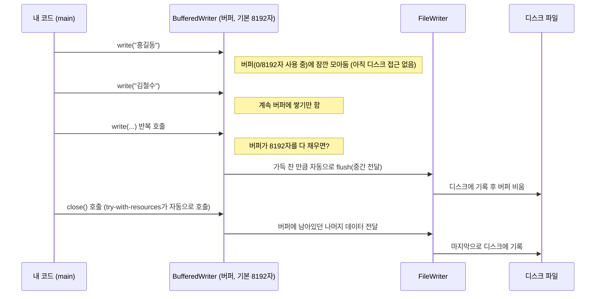
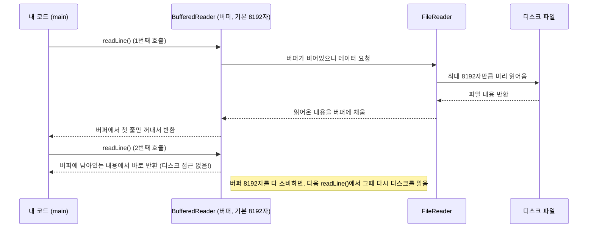

# 부록 7. 파일 입출력 (File I/O)

| 항목 | 내용 |
|---|---|
| 선수 학습 | 예외 처리(try-catch), String과 배열 기초 (Day 5), 컬렉션 (Day 16), 람다식·스트림 (부록4) |
| 이번 챕터 | 바이트/문자 스트림 개념, `FileWriter`·`FileReader`로 파일 읽고 쓰기, try-with-resources, `lines()`로 람다식 활용, `Path`/`Files`, 파일명 충돌 방지 |

## 학습목표
- 프로그램이 끝나도 데이터를 남기려면 왜 파일 입출력이 필요한지 설명할 수 있다
- 바이트 스트림과 문자 스트림의 차이를 구분할 수 있다
- `FileWriter`/`BufferedWriter`로 파일에 문자열을 쓸 수 있다
- `FileReader`/`BufferedReader`로 파일에서 문자열을 읽을 수 있다
- try-with-resources로 파일 자원을 안전하게 정리할 수 있다
- 사원 목록 데이터를 파일에 저장하고 다시 불러올 수 있다
- `BufferedReader.lines()`와 람다식/스트림을 결합해 파일 내용을 간결하게 처리할 수 있다
- `java.io.File`과 최신 `java.nio.file.Path`/`Files` API의 차이를 설명할 수 있다
- 파일 업로드 시 이름 충돌로 파일이 소실되지 않도록, 폴더 분산과 고유 파일명 생성을 적용할 수 있다

---

## 1. 문제 상황: 메모리는 프로그램이 끝나면 사라진다

지금까지 만든 데이터(`List`, 배열, 객체)는 전부 **메모리(RAM)** 위에만 존재합니다. `main` 메서드가 끝나거나 프로그램을 종료하면, 애써 만든 사원 목록도 전부 사라집니다.

```java
List<String> empNames = new ArrayList<>();
empNames.add("홍길동");
// 프로그램 종료 -> empNames에 담긴 데이터는 통째로 사라짐
```

프로그램이 꺼져도 데이터를 남기려면, 메모리가 아니라 **디스크(파일)** 에 저장해야 합니다. 자바는 이를 위해 **파일 입출력(File I/O)** 기능을 제공합니다.

---

## 2. 스트림(Stream)이란? — 바이트 스트림 vs 문자 스트림

자바에서 입출력은 데이터가 물처럼 순서대로 흐른다는 의미로 **스트림(Stream)** 이라고 부릅니다. 파일은 결국 바이트(byte)의 나열이지만, 텍스트 파일을 다룰 때 매번 바이트를 문자로 변환하면 번거로우므로 자바는 두 계열을 따로 제공합니다.

| 구분 | 최상위 클래스 | 단위 | 주로 쓰는 곳 |
|---|---|---|---|
| 바이트 스트림 | `InputStream` / `OutputStream` | byte | 이미지, 동영상 등 이진(binary) 파일 |
| 문자 스트림 | `Reader` / `Writer` | char(문자) | 텍스트(.txt, .csv 등) 파일 |

**설명**: 이번 챕터는 텍스트 파일을 다루므로 문자 스트림 계열인 `Reader`/`Writer`를 중심으로 다룹니다. `FileReader`/`FileWriter`가 바로 파일을 대상으로 하는 문자 스트림입니다.

---

## 3. 파일에 문자열 쓰기 — FileWriter, BufferedWriter

```java
import java.io.BufferedWriter;
import java.io.FileWriter;
import java.io.IOException;
import java.nio.charset.StandardCharsets;
import java.util.List;

public class EmpFileWriteExample {
    public static void main(String[] args) throws IOException {
        List<String> empNames = List.of("홍길동", "김철수", "이영희");

        try (BufferedWriter writer = new BufferedWriter(new FileWriter("emp_list.txt", StandardCharsets.UTF_8))) {
            for (String name : empNames) {
                writer.write(name);
                writer.newLine(); // 줄바꿈
            }
        }

        System.out.println("파일 저장 완료: emp_list.txt");
    }
}
```

**설명**: `FileWriter`는 문자열을 파일에 쓰는 기본 도구지만, 쓸 때마다 매번 디스크에 직접 접근하면 느립니다. `BufferedWriter`로 감싸면 내부 버퍼에 모아뒀다가 한꺼번에 디스크에 쓰기 때문에 훨씬 효율적입니다(빌더 패턴 챕터에서 이미 익숙한 "감싸서 성능·편의 기능을 더하는" 패턴입니다). `writer.newLine()`은 운영체제에 맞는 줄바꿈 문자를 자동으로 넣어줍니다.

---

## 4. 파일에서 문자열 읽기 — FileReader, BufferedReader

```java
import java.io.BufferedReader;
import java.io.FileReader;
import java.io.IOException;
import java.nio.charset.StandardCharsets;

public class EmpFileReadExample {
    public static void main(String[] args) throws IOException {
        try (BufferedReader reader = new BufferedReader(new FileReader("emp_list.txt", StandardCharsets.UTF_8))) {
            String line;
            while ((line = reader.readLine()) != null) { // 더 이상 읽을 줄이 없으면 null
                System.out.println("읽은 사원명: " + line);
            }
        }
    }
}
```

**출력 결과** (3장의 `EmpFileWriteExample`을 먼저 실행한 뒤)
```
읽은 사원명: 홍길동
읽은 사원명: 김철수
읽은 사원명: 이영희
```

**설명**: `readLine()`은 파일의 한 줄을 문자열로 반환하고, 더 이상 읽을 줄이 없으면 `null`을 반환합니다. `while ((line = reader.readLine()) != null)`은 파일 입출력에서 아주 자주 쓰이는 관용구로, "한 줄을 읽으면서 동시에 끝인지 확인"하는 패턴입니다.

---

## 4-1. 그림으로 보는 스트림과 버퍼의 동작

3~4장에서 `FileWriter`/`FileReader`를 `BufferedWriter`/`BufferedReader`로 "감쌌던" 이유가 정확히 무엇을 하는지, 순서대로 그림으로 살펴봅니다.

**쓰기: `write()`를 호출할 때마다 디스크에 바로 쓰지 않는다**



**읽기: 한 줄씩 요청해도 디스크는 미리 큰 덩어리로 읽어둔다**



**설명**: `write()`나 `readLine()`을 호출할 때마다 매번 디스크에 접근하면 매우 느립니다(디스크 접근은 메모리 접근보다 훨씬 느립니다). `BufferedWriter`는 여러 번의 `write()` 호출을 메모리 버퍼에 모아뒀다가 **한꺼번에** `FileWriter`에게 넘기고, `BufferedReader`는 반대로 `FileReader`를 통해 파일 내용을 **미리 큰 덩어리로** 읽어와 버퍼에 채워둔 뒤, `readLine()` 호출마다 그 버퍼에서 한 줄씩 꺼내줍니다. 결과적으로 디스크 접근 횟수가 크게 줄어들어 성능이 좋아집니다. 이것이 "버퍼링(buffering)"이라는 이름의 유래이자, `Buffered` 계열 클래스로 감싸는 이유입니다.

**버퍼는 정확히 얼마나 클까?**

| 클래스 | 기본 버퍼 크기 | 직접 크기를 지정하려면 |
|---|---|---|
| `BufferedWriter` | 8192자(char) | `new BufferedWriter(writer, 크기)` |
| `BufferedReader` | 8192자(char) | `new BufferedReader(reader, 크기)` |

**설명**: `new BufferedWriter(writer)`처럼 크기를 생략하면 내부적으로 8192자짜리 버퍼가 만들어집니다. 쓰기 쪽은 이 8192자가 다 차는 순간 (`close()`를 부르지 않아도) **자동으로** 그때까지 쌓인 내용을 `FileWriter`에게 넘기고 버퍼를 비웁니다. 읽기 쪽도 마찬가지로, 한 번 디스크에서 최대 8192자를 미리 읽어와 버퍼를 채워두고, 그 버퍼가 다 소비되면 그제서야 다음 8192자를 다시 디스크에서 읽어옵니다. 버퍼 크기는 두 번째 생성자 인자로 직접 지정할 수도 있지만(`new BufferedWriter(writer, 16384)`처럼), 대부분의 경우 기본값(8192자)으로 충분합니다.

---

## 4-2. 실제로 속도를 재보기

말로만 "버퍼를 쓰면 빠르다"고 하지 말고, 같은 내용을 버퍼 없이/버퍼로 각각 5만 줄 써보면서 직접 시간을 재봅니다. `EmpFileWriteExample`에 아래 메서드를 추가해서 `main()` 끝에서 호출합니다.

```java
public static void main(String[] args) throws IOException {
    // ... (기존 코드) ...

    compareWriteSpeed();
}

// 버퍼를 사용했을 때/안 했을 때 쓰기 속도를 실제로 재서 비교
private static void compareWriteSpeed() throws IOException {
    int lineCount = 50_000;

    // 1) 버퍼 없이 FileWriter로 직접 쓰기 -> write() 호출마다 매번 디스크에 접근
    long start1 = System.currentTimeMillis();
    try (FileWriter writer = new FileWriter("no_buffer.txt", StandardCharsets.UTF_8)) {
        for (int i = 0; i < lineCount; i++) {
            writer.write("사원" + i + "\n");
        }
    }
    long noBufferMs = System.currentTimeMillis() - start1;

    // 2) BufferedWriter로 감싸서 쓰기 -> 버퍼에 모았다가 한꺼번에 디스크에 접근
    long start2 = System.currentTimeMillis();
    try (BufferedWriter writer = new BufferedWriter(new FileWriter("with_buffer.txt", StandardCharsets.UTF_8))) {
        for (int i = 0; i < lineCount; i++) {
            writer.write("사원" + i);
            writer.newLine();
        }
    }
    long bufferMs = System.currentTimeMillis() - start2;

    System.out.println();
    System.out.println(lineCount + "줄 쓰기 속도 비교");
    System.out.println("버퍼 없이 (FileWriter만): " + noBufferMs + "ms");
    System.out.println("버퍼 사용 (BufferedWriter): " + bufferMs + "ms");
}
```

**실제 측정 결과** (5만 줄 기준, 같은 컴퓨터에서 3회 반복 실행 — 환경에 따라 절대값은 달라질 수 있음)

| 실행 | 버퍼 없이 (`FileWriter`만) | 버퍼 사용 (`BufferedWriter`) |
|---|---|---|
| 1회차 | 69ms | 17ms |
| 2회차 | 66ms | 25ms |
| 3회차 | 67ms | 15ms |

**설명**: 실제로 재보면 5만 줄 기준 버퍼 없이 쓰는 쪽이 버퍼를 쓰는 쪽보다 **3~4배 이상 느립니다.** `write()`를 5만 번 호출하는 것 자체는 똑같은데, 버퍼가 없으면 그 5만 번 모두가 각각 디스크(정확히는 운영체제의 파일 시스템) 접근으로 이어지고, 버퍼가 있으면 8192자씩 모아서 훨씬 적은 횟수만 디스크에 접근하기 때문입니다. 데이터 양이 더 많아질수록 이 차이는 더 커집니다.

---

## 5. try-with-resources로 자원 정리하기

`FileWriter`, `FileReader`, `BufferedWriter`, `BufferedReader`는 모두 `AutoCloseable`을 구현하고 있습니다.

```java
BufferedWriter writer = new BufferedWriter(new FileWriter("data.txt"));
writer.write("안녕");
// writer.close()를 깜빡하면 버퍼에 남은 "안녕"이 파일에 반영되지 않을 수 있음!
```

**설명**: `BufferedWriter`는 쓰기 성능을 위해 데이터를 버퍼에 모아뒀다가 버퍼가 차거나 `close()`/`flush()`가 호출될 때 실제로 디스크에 기록합니다. `close()`를 빠뜨리면 버퍼에 남아있던 데이터가 파일에 반영되지 않을 수 있습니다. `try (...)` 괄호 안에서 선언하면 블록이 끝날 때(정상 종료든 예외든) 자동으로 `close()`가 호출되어 이 문제를 원천 차단합니다.

```java
try (BufferedWriter writer = new BufferedWriter(new FileWriter("data.txt"))) {
    writer.write("안녕");
} // 여기서 자동으로 close() 호출 -> 버퍼 내용이 파일에 안전하게 기록됨
```

---

## 6. 종합 예제: 사원 정보를 파일에 저장하고 다시 불러오기 (HR 도메인)

실무에서는 2장에서 배운 DB를 주로 쓰지만, 설정 파일이나 간단한 데이터 백업처럼 DB 없이 파일만으로 데이터를 저장해야 할 때도 있습니다. 사원 정보를 담을 `Emp` 클래스를 만들고, **CSV(Comma-Separated Values)** 형식으로 저장했다가 다시 읽어봅니다.

```java
public class Emp {
    private String empId;
    private String empName;
    private int salary;

    public Emp(String empId, String empName, int salary) {
        this.empId = empId;
        this.empName = empName;
        this.salary = salary;
    }

    public String getEmpId() { return empId; }
    public String getEmpName() { return empName; }
    public int getSalary() { return salary; }
}
```

```java
import java.io.BufferedReader;
import java.io.BufferedWriter;
import java.io.FileReader;
import java.io.FileWriter;
import java.io.IOException;
import java.nio.charset.StandardCharsets;
import java.util.ArrayList;
import java.util.List;

public class EmpFileStore {
    // 사원 목록을 "사번,이름,급여" 형태로 한 줄씩 저장
    public static void save(List<Emp> employees, String fileName) throws IOException {
        try (BufferedWriter writer = new BufferedWriter(new FileWriter(fileName, StandardCharsets.UTF_8))) {
            for (Emp emp : employees) {
                writer.write(emp.getEmpId() + "," + emp.getEmpName() + "," + emp.getSalary());
                writer.newLine();
            }
        }
    }

    // 저장된 파일을 다시 읽어서 사원 목록으로 복원
    public static List<Emp> load(String fileName) throws IOException {
        List<Emp> result = new ArrayList<>();
        try (BufferedReader reader = new BufferedReader(new FileReader(fileName, StandardCharsets.UTF_8))) {
            String line;
            while ((line = reader.readLine()) != null) {
                String[] fields = line.split(","); // 콤마 기준으로 필드 단위로 쪼갬
                result.add(new Emp(fields[0], fields[1], Integer.parseInt(fields[2])));
            }
        }
        return result;
    }

    public static void main(String[] args) throws IOException {
        List<Emp> employees = List.of(
                new Emp("223", "홍길동", 3000000),
                new Emp("310", "김철수", 2800000)
        );

        save(employees, "employees.csv");
        System.out.println("저장 완료");

        List<Emp> loaded = load("employees.csv");
        for (Emp emp : loaded) {
            System.out.println("사번:" + emp.getEmpId() + " 이름:" + emp.getEmpName() + " 급여:" + emp.getSalary());
        }
    }
}
```

**출력 결과**
```
저장 완료
사번:223 이름:홍길동 급여:3000000
사번:310 이름:김철수 급여:2800000
```

**설명**: `save()`는 `Emp` 객체의 세 필드를 콤마로 이어붙인 한 줄(`"223,홍길동,3000000"`)로 만들어 파일에 씁니다. `load()`는 그 반대로, 한 줄씩 읽어 `split(",")`로 필드 단위(`String[]`)로 쪼갠 뒤 다시 `Emp` 객체로 조립합니다. 이렇게 "필드를 구분자로 이어붙여 저장하고, 같은 구분자로 다시 쪼개 객체로 복원하는" 방식이 CSV 형식의 기본 원리입니다. `String[]`을 직접 주고받는 대신 `Emp` 객체를 쓰면, `emp.getEmpName()`처럼 필드 이름이 코드에 드러나서 `fields[1]`보다 훨씬 읽기 쉽습니다.

---

## 7. 람다식으로 파일 내용 처리하기 (부록4 복습)

`BufferedReader`에는 `readLine()`을 직접 반복하는 대신, 파일의 모든 줄을 **`Stream<String>`으로 한 번에 얻는** `lines()` 메서드도 있습니다. 부록4(람다식)에서 배운 람다식·스트림 문법과 결합하면, "파일을 읽고 → 조건에 맞는 것만 걸러내고 → 원하는 형태로 바꾸는" 작업을 반복문 없이 표현할 수 있습니다.

```java
import java.io.BufferedReader;
import java.io.FileReader;
import java.io.IOException;
import java.nio.charset.StandardCharsets;
import java.util.List;
import java.util.stream.Collectors;

public class EmpFileStreamExample {
    public static void main(String[] args) throws IOException {
        // 6장의 EmpFileStore.save()를 그대로 재사용해서 데이터 파일을 준비
        List<Emp> employees = List.of(
                new Emp("223", "홍길동", 3000000),
                new Emp("310", "김철수", 2800000),
                new Emp("402", "이영희", 3500000)
        );
        EmpFileStore.save(employees, "employees.csv");

        try (BufferedReader reader = new BufferedReader(new FileReader("employees.csv", StandardCharsets.UTF_8))) {
            // lines(): 파일의 각 줄을 Stream<String>으로 반환
            List<String> highEarners = reader.lines()
                    .map(line -> line.split(","))                                          // 한 줄 -> 필드 배열
                    .map(fields -> new Emp(fields[0], fields[1], Integer.parseInt(fields[2]))) // 필드 배열 -> Emp 객체
                    .filter(emp -> emp.getSalary() >= 3000000)                               // 급여 300만원 이상만
                    .map(emp -> emp.getEmpName() + ": " + emp.getSalary() + "원")            // 출력용 문자열로 변환
                    .collect(Collectors.toList());

            highEarners.forEach(System.out::println);
        }
    }
}
```

**출력 결과**
```
홍길동: 3000000원
이영희: 3500000원
```

**설명**: `reader.lines()`가 반환하는 `Stream<String>`은 `readLine()`을 내부적으로 반복 호출하는 것과 동작 원리는 같지만(버퍼링도 동일하게 적용됩니다), `while` 반복문 없이 `map`/`filter`/`collect` 같은 스트림 연산을 이어붙일 수 있다는 점이 다릅니다. 첫 번째 `map(line -> line.split(","))`으로 각 줄을 필드 배열로 바꾸고, 두 번째 `map(fields -> new Emp(...))`으로 그 필드 배열을 `Emp` 객체로 조립합니다. 이렇게 `Emp` 객체로 만들어두면, 이후 `filter(emp -> emp.getSalary() >= 3000000)`처럼 `fields[2]`를 파싱하는 대신 `emp.getSalary()`로 바로 조건을 검사할 수 있어 코드가 훨씬 읽기 쉬워집니다. 마지막 `map(...)`으로 출력용 문자열로 바꿔서 `collect(Collectors.toList())`로 모았습니다. `highEarners.forEach(System.out::println)`은 부록4에서 배운 메서드 참조로, `name -> System.out.println(name)`과 동일합니다.

> ⚠️ **주의**: `reader.lines()`가 반환하는 스트림은 내부적으로 `reader`(파일)와 연결되어 있으므로, 스트림을 다 쓰기 전에 `reader`가 `close()`되면 안 됩니다. 위 예제처럼 try-with-resources 블록 **안에서** 스트림을 소비(`collect`, `forEach` 등)하고 끝내는 것이 안전합니다.

---

## 8. 더 최신 API: `java.nio.file.Path`와 `Files`

지금까지 쓴 `FileWriter`/`FileReader`, 그리고 방금 진단용으로 써본 `java.io.File`은 모두 자바 초창기(JDK 1.0~1.4)부터 있던 오래된 API입니다. Java 7부터는 `java.nio.file` 패키지에 **더 강력하고 안전한 파일 API**가 추가되었습니다: 경로를 표현하는 `Path`와, 실제 파일 작업을 담당하는 `Files`(유틸리티 클래스)입니다.

| 작업 | 옛날 방식 (`java.io.File`) | 최신 방식 (`java.nio.file.Path` / `Files`) |
|---|---|---|
| 경로 표현 | `new File("data/emp.txt")` | `Path.of("data", "emp.txt")` |
| 존재 확인 | `file.exists()` | `Files.exists(path)` |
| 폴더 생성 | `file.mkdirs()` (실패해도 `false`만 반환, 원인을 알 수 없음) | `Files.createDirectories(path)` (실패하면 예외를 던져서 원인이 드러남) |
| 파일 삭제 | `file.delete()` (`boolean`) | `Files.delete(path)` (예외) 또는 `Files.deleteIfExists(path)` |
| 절대경로 얻기 | `file.getAbsolutePath()` | `path.toAbsolutePath()` |
| 바이트로 파일 쓰기/읽기 | `FileOutputStream`/`FileInputStream` 직접 사용 | `Files.write(path, bytes)` / `Files.readAllBytes(path)` 한 줄로 끝 |

```java
import java.io.IOException;
import java.nio.file.Files;
import java.nio.file.Path;

public class PathFilesExample {
    public static void main(String[] args) throws IOException {
        Path dir = Path.of("data", "backup");   // 아직 존재하지 않는 경로
        System.out.println("존재하나요? " + Files.exists(dir)); // false

        Files.createDirectories(dir);            // data/backup 폴더를 한 번에 생성 (중간 폴더까지 다 만듦)
        System.out.println("존재하나요? " + Files.exists(dir)); // true

        Path file = dir.resolve("memo.txt");      // data/backup/memo.txt 경로 조합
        Files.writeString(file, "안녕하세요");     // 문자열을 바로 파일로 저장 (Java 11+)

        String content = Files.readString(file);  // 파일을 바로 문자열로 읽기 (Java 11+)
        System.out.println("읽은 내용: " + content);
    }
}
```

**설명**: `Path.of(...)`는 경로 "문자열"만 표현할 뿐 아직 실제로 존재하는지와는 무관합니다(`File`도 마찬가지). 실제 파일 시스템 작업은 전부 `Files` 클래스의 static 메서드로 합니다. `Files.createDirectories(dir)`는 `data` 폴더가 없어도 `data`와 `data/backup`을 한 번에 만들어줍니다(옛날 `mkdir()`은 부모 폴더가 없으면 실패하고, `mkdirs()`를 써야 중간 폴더까지 만들어졌던 것과 비교됩니다). `Files.writeString()`/`Files.readString()`(Java 11+)을 쓰면 3~4장에서 `BufferedWriter`/`BufferedReader`로 여러 줄 써야 했던 걸 한 줄로 끝낼 수 있습니다 — 다만 파일 전체를 문자열 하나로 다루므로, 아주 큰 파일에는 적합하지 않고 설정 파일처럼 작은 텍스트에 적합합니다.

---

## 9. 파일명 충돌 방지하기: 폴더 분산 + 고유한 저장 이름

**문제 상황**: 사용자들이 파일을 업로드하는 기능을 만든다고 합시다. 서로 다른 두 사용자가 우연히 같은 이름(`"사진.jpg"`)으로 파일을 올리면 어떻게 될까요? 받은 이름 그대로 저장하면, 나중에 업로드된 파일이 먼저 업로드된 파일을 **덮어써서 소실**됩니다.

```java
Files.write(Path.of("uploads", "사진.jpg"), user1Bytes); // 사용자1의 사진 저장
Files.write(Path.of("uploads", "사진.jpg"), user2Bytes); // 사용자2가 같은 이름으로 업로드 -> 사용자1의 사진이 사라짐!
```

**해결책**: (1) 폴더를 나눠서 충돌 확률을 낮추고, (2) 그래도 남는 충돌 가능성을 없애기 위해 **저장용 파일명 자체를 고유하게** 바꿉니다. 원래 이름은 잃어버리지 않도록 별도로 기록해둡니다(실무에서는 보통 2장에서 배운 DB에 "원본 파일명 ↔ 저장된 경로"를 매핑해서 저장합니다).

```java
import java.io.IOException;
import java.nio.file.Files;
import java.nio.file.Path;
import java.time.LocalDate;
import java.util.UUID;

public class FileUploadExample {
    // originalFileName: 사용자가 올린 원래 파일명 (예: "사진.jpg")
    // content: 업로드된 파일의 실제 바이트 데이터
    public static Path saveUploadedFile(String originalFileName, byte[] content) throws IOException {
        // 1) 날짜별 폴더로 분산 저장 -> 폴더 하나에 파일이 몰리는 것도 막고, 충돌 확률도 낮춤
        LocalDate today = LocalDate.now();
        Path dir = Path.of("uploads",
                String.valueOf(today.getYear()),
                "%02d".formatted(today.getMonthValue()),
                "%02d".formatted(today.getDayOfMonth()));
        Files.createDirectories(dir); // 폴더가 없으면 생성, 이미 있으면 그냥 넘어감

        // 2) 확장자는 유지하되, 저장용 파일명은 UUID로 새로 만들어 충돌을 원천 차단
        String ext = originalFileName.substring(originalFileName.lastIndexOf('.')); // ".jpg"
        String savedName = UUID.randomUUID() + ext; // 예: 3f2a1b0c-....jpg

        Path savedPath = dir.resolve(savedName);
        Files.write(savedPath, content); // 실제 저장

        System.out.println("원본 이름: " + originalFileName + " -> 저장된 경로: " + savedPath);
        return savedPath;
        // 실무라면 여기서 (originalFileName, savedPath)를 DB에 기록해서
        // 나중에 "원래 이름으로 다운로드"를 지원합니다.
    }

    public static void main(String[] args) throws IOException {
        // 서로 다른 두 사용자가 우연히 같은 이름("사진.jpg")으로 업로드해도 충돌하지 않음
        saveUploadedFile("사진.jpg", "첫 번째 사용자의 사진 데이터".getBytes());
        saveUploadedFile("사진.jpg", "두 번째 사용자의 사진 데이터".getBytes());
    }
}
```

**출력 결과** (연도/월/일은 실행하는 날짜에 따라 달라짐)
```
원본 이름: 사진.jpg -> 저장된 경로: uploads\2026\08\13\3f2a1b0c-7e21-4a3d-9b2a-6a1e2d9c4f10.jpg
원본 이름: 사진.jpg -> 저장된 경로: uploads\2026\08\13\a7c9e5f2-1d34-4b6a-8f0e-2c5b7a9d1e33.jpg
```

**설명**: `UUID.randomUUID()`는 실행할 때마다 거의 겹칠 확률이 없는(사실상 유일한) 문자열을 만들어줍니다. 원본 파일명이 완전히 같아도, 저장되는 실제 파일명(`savedName`)은 매번 다르므로 서로 덮어쓰지 않습니다. 날짜별 폴더(`uploads/2026/08/13/`)로 나누는 것은 필수는 아니지만, 한 폴더에 파일이 수만 개씩 쌓이면 파일 시스템 성능이 나빠지고 관리도 어려워지므로 실무에서 흔히 함께 씁니다.

---

## 자주 하는 실수

1. **close()/try-with-resources 없이 쓰기만 하고 끝냄**
   ```java
   BufferedWriter writer = new BufferedWriter(new FileWriter("data.txt"));
   writer.write("데이터");
   // writer.close() 누락! 버퍼에 남은 데이터가 파일에 반영되지 않을 수 있음
   ```

2. **존재하지 않는 파일을 읽으려고 시도**
   ```java
   new FileReader("없는파일.txt"); // FileNotFoundException 발생
   ```
   파일을 열기 전에 존재 여부를 확인하거나, try-catch로 예외를 처리해야 합니다.

3. **`readLine()`의 반환값이 `null`인지 확인하지 않고 그대로 사용**
   ```java
   String line = reader.readLine();
   System.out.println(line.length()); // 파일이 비어있으면 NullPointerException!
   ```

4. **상대 경로 혼동**
   ```java
   new FileWriter("emp_list.txt"); // 상대 경로: 실행 시점의 "현재 작업 디렉터리" 기준
   ```
   IDE에서 실행할 때와 터미널에서 직접 실행할 때 작업 디렉터리가 달라서, "분명 저장했는데 파일이 안 보인다"고 헷갈리는 경우가 흔합니다. 확실히 하려면 절대 경로를 쓰거나, 실행 위치를 먼저 확인하세요.

5. **인코딩(Charset)을 지정하지 않아서 한글이 깨짐**
   ```java
   new FileWriter("data.txt"); // Charset 생략 시 운영체제의 "기본 인코딩"을 사용
   ```
   `FileWriter`/`FileReader`에 `Charset`을 생략하면 **운영체제 기본 인코딩**(한글 Windows는 보통 MS949/CP949, macOS·Linux는 보통 UTF-8)을 사용합니다. 같은 컴퓨터 안에서 쓰고 읽을 때는 문제가 안 보이지만, 다른 운영체제에서 그 파일을 열거나 UTF-8을 기대하는 다른 프로그램(에디터, 다른 팀원의 PC 등)과 파일을 주고받으면 한글이 깨집니다. 항상 아래처럼 인코딩을 명시하는 것이 안전합니다.
   ```java
   new FileWriter("data.txt", StandardCharsets.UTF_8); // Java 11+ : Charset을 직접 지정
   ```

6. **하위 폴더를 먼저 만들지 않고 그 안에 파일을 쓰려고 시도**
   ```java
   Files.write(Path.of("uploads", "2026", "08", "13", "사진.jpg"), bytes);
   // NoSuchFileException 발생! uploads/2026/08/13 폴더가 아직 없음
   ```
   `Files.createDirectories(dir)`로 폴더를 먼저 만들어둔 뒤에 그 안에 파일을 써야 합니다.

7. **확장자가 없는 파일명에서 `lastIndexOf('.')` 결과를 그대로 사용**
   ```java
   String fileName = "README"; // 확장자 없음
   String ext = fileName.substring(fileName.lastIndexOf('.')); // lastIndexOf가 -1 반환 -> StringIndexOutOfBoundsException!
   ```
   확장자가 없는 파일이 업로드될 수도 있다는 걸 감안해서, `lastIndexOf('.')`가 `-1`인 경우(점을 못 찾은 경우)를 먼저 확인하고 분기 처리해야 합니다.

---

## 핵심 요약

| 항목 | 핵심 내용 |
|---|---|
| 파일 입출력이 필요한 이유 | 메모리의 데이터는 프로그램 종료 시 사라지므로, 남기려면 디스크(파일)에 저장 |
| 바이트 스트림 vs 문자 스트림 | `InputStream`/`OutputStream`(byte 단위) vs `Reader`/`Writer`(문자 단위) |
| `FileWriter` / `BufferedWriter` | 파일에 문자열을 씀, `Buffered`로 감싸면 성능 향상 |
| `FileReader` / `BufferedReader` | 파일에서 문자열을 읽음, `readLine()`은 끝에 도달하면 `null` 반환 |
| try-with-resources | 파일 스트림은 모두 `AutoCloseable`, 자동 `close()`로 데이터 유실 방지 |
| CSV 저장/파싱 | 한 줄에 `"필드,필드,필드"` 형태로 저장하고 `split(",")`로 복원 |
| `BufferedReader.lines()` | 파일의 각 줄을 `Stream<String>`으로 반환, `map`/`filter`/`collect` 등 람다식 기반 스트림 연산과 결합 가능 |
| 인코딩(Charset) 명시 | `FileWriter`/`FileReader`에 `StandardCharsets.UTF_8`을 직접 지정해 운영체제 기본 인코딩에 의존하지 않도록 함 |
| `Path` / `Files` | `java.io.File`을 대체하는 최신 API, `Files.createDirectories`/`Files.write`/`Files.readString` 등 예외 기반으로 더 안전 |
| 파일명 충돌 방지 | 날짜별 폴더로 분산 저장 + `UUID`로 저장용 파일명을 고유하게 생성, 원본 이름은 DB 등에 별도 기록 |
